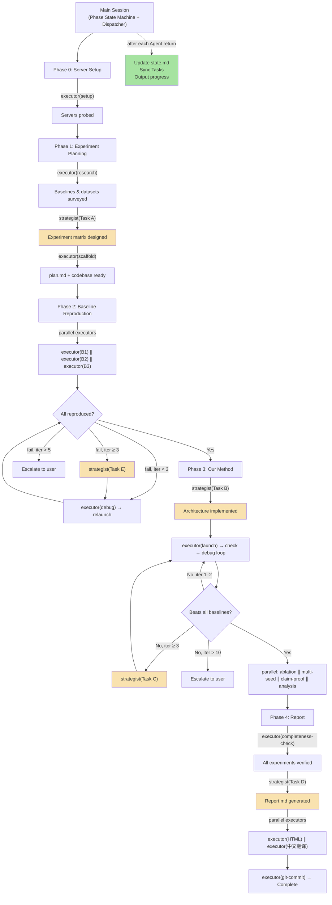
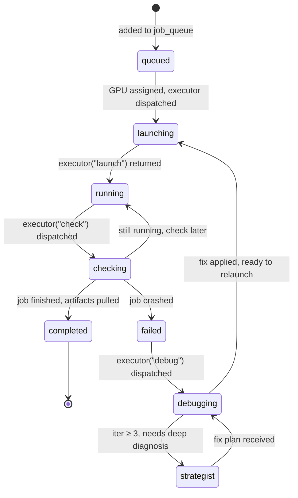
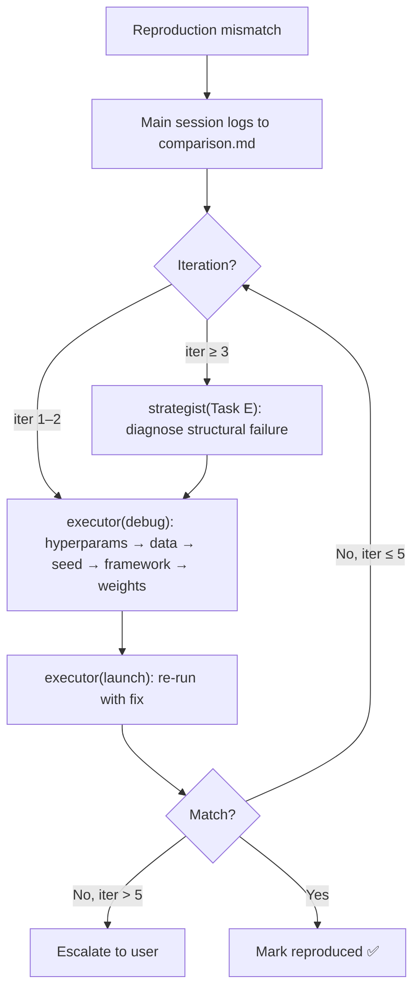
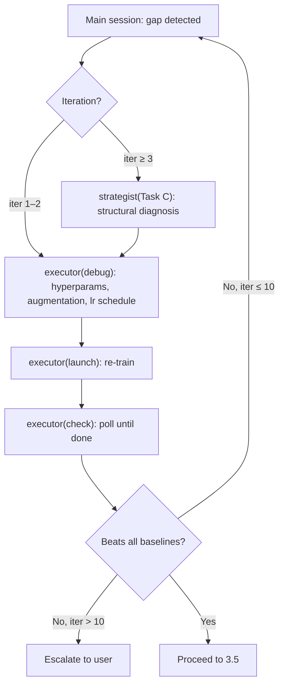

# PaperClaw Experiment AI — Full Experiment Execution Pipeline

Automate the complete experiment lifecycle: from remote server setup, through baseline reproduction and our method implementation, to polished experiment reports — all driven by a Proposal.md produced by the ideation skill.

## Core Principle

> **Reproduce first, innovate second, report thoroughly.**
>
> Every claimed number in the final report must be backed by a runnable script and a logged result.
> Every failure is an opportunity to learn — record it.
> Every claim in the Proposal must be proven by a dedicated experiment.

## Unified Project Principles

All experiment code on the remote server MUST follow these 7 principles. They are the authoritative source — agents reference them, not hardcoded directory layouts.

1. **Single project** — All methods (baselines + ours) live in one Python project with a shared `pyproject.toml` or `setup.py`, not in separate isolated folders.
2. **Common model interface** — All methods (baselines + ours) implement a shared base class or interface, registered via a model registry/factory pattern.
3. **Config-driven switching** — Switch between methods via config files (YAML/JSON), not by running scripts from different directories.
4. **Shared infrastructure** — Data loading, training loop, evaluation metrics, and logging are shared across all methods to ensure fair comparison.
5. **Unified entry points** — Single `train.py`, `eval.py`, etc. that work for any method via config. No separate per-method scripts.
6. **Adapt to existing codebases** — When baselines have official repos, extract and adapt their model code into the unified project's model module rather than running the cloned repo directly. If the project follows an existing codebase, respect that codebase's conventions.
7. **README.md** — Every experiment project must include a `README.md` documenting: project structure, how to install dependencies, how to run training/evaluation for each method, how to reproduce key results, and dataset preparation.

---

## Workflow Overview



> Yellow = strategist (opus). Green = main session sync point. All other = executor (sonnet).

All orchestration runs on the **local machine** (main session).
Compute-heavy training/evaluation is executed on **experiment servers** via SSH.

---

## Agent Architecture

The main session (this skill) is the **central dispatcher**. It drives a Phase state machine, dispatches executors and strategists, and synchronizes state after every return. Executors and strategists are stateless — they receive full context in their prompt and return structured results.

| Layer | Agent | Model | Role |
|-------|-------|-------|------|
| Dispatcher | **Main session** (this skill) | inherited | Phase state machine, dispatch decisions, Task sync, user feedback, state.md management |
| Worker | `paperclaw-experiment-executor` | sonnet | Stateless single-task execution — one invocation per task, returns immediately |
| Reasoner | `paperclaw-experiment-strategist` | opus | High-judgment reasoning — 5 trigger points requiring original analysis |

### Strategist Triggers (main session invokes directly)

| Phase.Step | Task | Condition |
|------------|------|-----------|
| 1.4 | Task A: Design experiment matrix + claim-proof table | After baseline/dataset research |
| 2.x | Task E: Diagnose baseline reproduction failure | Reproduction fails iter ≥ 3 |
| 3.1 | Task B: Implement core method architecture | After all baselines reproduced |
| 3.3 | Task C: Diagnose structural performance gap | Method underperforms iter ≥ 3 |
| 4.2 | Task D: Generate Report.md | After completeness check |

### Executor Task Types (main session dispatches)

| Task Type | When Used | Returns Immediately? |
|-----------|-----------|---------------------|
| `setup` | Phase 0 server probe | Yes |
| `research` | Phase 1 literature survey | Yes |
| `scaffold` | Phase 1 project structure | Yes |
| `integrate-baseline` | Phase 2 adapt baseline code | Yes |
| `launch` | Start any training/eval job | **Yes — fire and forget** |
| `check` | Poll running job status | Yes |
| `debug` | Fix code after failure | Yes (does not relaunch) |
| `reproduce` | End-to-end short job (< 30 min) | Waits for completion (45-min hard timeout) |
| `completeness-check` | Phase 4 verification | Yes |
| `format` | HTML conversion / Chinese translation | Yes |
| `git-commit` | Commit milestone | Yes |

---

## Main Dispatch Loop

The main session runs a **state-machine loop**. At the top of every iteration, it reads `state.md` to determine the current position — never relies on context memory.

```
loop:
  # 1. Ground truth: always read state.md
  read state.md → current_phase, active_jobs, job_queue, code_dirty_servers

  # 2. Handle active jobs (fire-and-poll)
  if active_jobs has running jobs:
    invoke executor("check", active_jobs)
    process results:
      - completed jobs → update results, release GPU, dequeue next job
      - failed jobs → add to debug queue (or trigger strategist if iter ≥ 3)
      - still running → no action
    update state.md → sync Tasks → output progress to user

  # 3. Handle debug queue
  if debug_queue is not empty:
    for each failed job:
      if iteration < 3:
        invoke executor("debug", error_info, history)
        if fix ready: invoke executor("launch", rerun)
      else:
        invoke strategist (Task C or Task E)
        invoke executor("debug", strategist fix plan)
        invoke executor("launch", rerun)
    update state.md → sync Tasks

  # 4. Fill idle GPUs (saturation)
  if job_queue has pending jobs AND idle GPUs available:
    for each (job, gpu) assignment:
      check code_dirty for target server
      if not code_dirty or job is read-only:
        invoke executor("launch", job, server, gpu)
    update state.md → sync Tasks

  # 5. Check phase completion
  if current phase is complete (all jobs done, no failures):
    execute phase-transition logic (see per-phase recipes below)
    update state.md → sync Tasks → output milestone to user
    if all phases done: break

  # 6. Wait if all GPUs busy and nothing else to do
  if active_jobs all running AND no actionable items:
    compute polling_interval = min(earliest_eta / 3, 30 min)
    output: "所有 GPU 满载运行中。最早完成预计 {eta}。每 {interval} 检查一次。"
    output: "你也可以关闭会话，稍后重新运行 skill 继续。"
    sync Tasks with current status
    sleep(polling_interval)
    continue loop
```

### Per-Phase Dispatch Recipes

**Phase 0 → Phase 1:**
```
invoke executor("setup", server_info)
update state.md with hardware/GPU slots
→ Phase 1
```

**Phase 1:**
```
invoke executor("research", "baselines and datasets")
invoke strategist(Task A, "design experiment matrix")
invoke executor("scaffold", plan.md)
invoke executor("launch" or "reproduce" per server, push codebase to all servers)
→ Phase 2
```

**Phase 2 (parallel baselines):**
```
for each baseline:
  add to job_queue: {type: reproduce/launch, baseline, server, gpu}
enter main loop → jobs are dispatched via saturation, checked, debugged
when all baselines reproduced → Phase 3
```

**Phase 3:**
```
invoke strategist(Task B, "implement method")
invoke executor("git-commit", "method architecture")
add training job to job_queue
enter main loop → launch, check, debug/strategist cycle
when beats all baselines:
  add ablation/seed/claim-proof/analysis jobs to job_queue (parallel)
  enter main loop → all dispatched via saturation
when all done → Phase 4
```

**Phase 4:**
```
invoke executor("completeness-check")
invoke strategist(Task D, "generate Report.md")
parallel: invoke executor("format", html) ∥ invoke executor("format", chinese)
invoke executor("git-commit", "final")
→ Complete
```

---

## Parallel Coordination Rules

### Read-Only vs Code-Modify Tasks

| Task Type | Modifies Codebase? | Can Run in Parallel? |
|-----------|-------------------|---------------------|
| `launch` (stable code) | No | ✅ Unlimited parallel on different GPUs |
| `check` | No | ✅ Always parallel |
| `reproduce` (stable code) | No | ✅ Unlimited parallel on different GPUs |
| `debug` | **Yes** | ⚠️ See code_dirty rules below |
| `integrate-baseline` | **Yes** | ⚠️ Sequential on same server |
| `scaffold` | **Yes** | N/A (runs once) |

### code_dirty Flag

The main session tracks a `code_dirty` flag per server in state.md:

1. When a `debug` or `integrate-baseline` executor modifies code and pushes to server X → set `code_dirty[X] = true`
2. While `code_dirty[X] = true`:
   - Do NOT dispatch new `launch` tasks to server X (the pushed code may affect running jobs)
   - Wait for all active jobs on server X to complete, then clear `code_dirty[X]`
   - Exception: if the code change only touches an independent module (different method's model file), the main session may judge it safe and keep `code_dirty[X] = false`
3. After all active jobs on server X complete and the new code is stable → set `code_dirty[X] = false`, resume dispatching to X

### Impact Assessment for Code Changes

Before setting `code_dirty`, the main session evaluates what was changed:

| Change Type | Impact | code_dirty? |
|-------------|--------|------------|
| Only one method's model file (e.g., `models/resnet.py`) | Cannot affect other methods running in memory | No — safe to push while other methods run |
| Shared infrastructure (data loader, training loop, eval, utils) | Could affect ALL running jobs | **Yes** — wait for all jobs on that server to finish |
| Config files only | No impact on running jobs | No |
| Dependencies (`pyproject.toml`, `requirements.txt`) | Doesn't affect running processes | No (but needs `pip install` on next launch) |

### File Isolation in Parallel

- Each parallel executor writes ONLY to its assigned output file (e.g., `results/baseline-bert.md`, `ablation/variant-A.md`)
- Shared files (`results.md`, `state.md`, `log.md`) are written ONLY by the main session after executors return
- Main session merges parallel executor results into shared files after all parallel tasks in a batch complete

---

## Task Feedback System

The main session updates Tasks after **every** Agent() return to provide real-time user visibility. Additionally, the main session outputs a **structured completion report** directly to the user after every significant action.

### When to Update Tasks

- Phase transition
- Job launched / completed / failed
- Strategist invoked / returned
- Entering wait-for-job state
- Blocker encountered (user input needed)

### Task Content Structure

```
Subject: paperclaw-experiment
Content format:
  Line 1: Current Phase + overall progress
  Lines 2+: One line per active/pending/completed job
  Last line: Next action or blocker

Example:
  "Phase 2: Baseline Reproduction (3/5 done)
   ✅ BERT-base: F1=85.1 (target 85.2) ✓
   ✅ ResNet-50: Acc=76.2 ✓
   ✅ DenseNet: Acc=75.8 ✓
   🔄 ViT-L: training on server-B GPU 0 (epoch 45/100, ~2h left)
   ⏳ EfficientNet: queued, waiting for GPU
   Next: checking running jobs in 30min"
```

### User-Facing Output (Completion Reports)

After **every** executor/strategist return, the main session outputs a structured completion report directly to the user. This is mandatory — the user must never be left wondering what just happened.

#### After job completion (executor "check" finds a finished job):
```
━━━ JOB COMPLETED ━━━━━━━━━━━━━━━━━━
Experiment: BERT-base reproduction (Dataset-A)
Server: server-A GPU 0 | Duration: 1h 42m
Results:
  F1 = 85.1 (target 85.2, gap -0.1 ✓)
  Acc = 92.3 (target 92.5, gap -0.2 ✓)
Artifacts:
  checkpoints/server-A/model_best.pt
  results/server-A/metrics.json
  (see results/README.md for full index)
━━━ OVERALL PROGRESS ━━━━━━━━━━━━━━━
Phase 2: 3/5 baselines done | Running: ViT-L (epoch 45/100) | Queued: EfficientNet
Next: checking running jobs in 30min
━━━━━━━━━━━━━━━━━━━━━━━━━━━━━━━━━━━
```

#### After job launch:
```
━━━ JOB LAUNCHED ━━━━━━━━━━━━━━━━━━━
Experiment: ViT-L reproduction (Dataset-A)
Server: server-B GPU 0 | Estimated: ~4h
Tmux: paperclaw-vit-l-datasetA
━━━ OVERALL PROGRESS ━━━━━━━━━━━━━━━
Phase 2: 2/5 baselines done | Running: BERT-base, ViT-L | Queued: DenseNet, EfficientNet
━━━━━━━━━━━━━━━━━━━━━━━━━━━━━━━━━━━
```

#### After job failure + debug:
```
━━━ JOB FAILED ━━━━━━━━━━━━━━━━━━━━━
Experiment: ResNet-50 reproduction (Dataset-A), attempt 2
Error: RuntimeError: CUDA out of memory (batch_size=64, GPU VRAM 16GB)
Fix: reduced batch_size 64→32, enabled gradient accumulation (accum_steps=2)
Code pushed to server-A
━━━ NEXT ━━━━━━━━━━━━━━━━━━━━━━━━━━━
Relaunching ResNet-50 training (server-A GPU 1)
━━━━━━━━━━━━━━━━━━━━━━━━━━━━━━━━━━━
```

#### After strategist return:
```
━━━ STRATEGIST COMPLETE ━━━━━━━━━━━━
Task: Task C — performance gap diagnosis (iter 3)
Diagnosis: attention layer head_dim miscalculation causing information loss
Fix plan: head_dim = hidden_size // num_heads (was hidden_size)
Hypothesis: expected F1 improvement of 2-3 points after fix
Output: experiment/log.md (diagnosis record)
━━━ NEXT ━━━━━━━━━━━━━━━━━━━━━━━━━━━
Executor applying fix, then relaunching training
━━━━━━━━━━━━━━━━━━━━━━━━━━━━━━━━━━━
```

#### Phase transition:
```
━━━ PHASE COMPLETE ━━━━━━━━━━━━━━━━━
Phase 2: Baseline Reproduction — all 5 baselines reproduced
  BERT-base:    F1=85.1 (target 85.2 ✓)
  ResNet-50:    Acc=76.2 (target 76.5 ✓)
  DenseNet:     Acc=75.8 (target 75.9 ✓)
  ViT-L:        Acc=78.1 (target 78.3 ✓)
  EfficientNet: Acc=77.5 (target 77.6 ✓)
Total time: 8h 23m
━━━ ENTERING PHASE 3 ━━━━━━━━━━━━━━━
Phase 3: Our Method Implementation
Next: invoking Strategist (Task B) to design method architecture
━━━━━━━━━━━━━━━━━━━━━━━━━━━━━━━━━━━
```

#### Periodic check (all jobs still running):
```
━━━ STATUS CHECK ━━━━━━━━━━━━━━━━━━━
Running:
  BERT-base @ server-A GPU 0: epoch 67/100, loss=0.23, ~55min remaining
  ViT-L @ server-B GPU 0: epoch 12/100, loss=1.42, ~3h remaining
Queued: DenseNet, EfficientNet
Next check: in 30 minutes
━━━━━━━━━━━━━━━━━━━━━━━━━━━━━━━━━━━
```

### Output Rules

1. **Always output after every Agent() return** — even if the result is "all jobs still running, no changes"
2. **Always include overall progress** — the user must always see the big picture (X/Y done, what's running, what's queued)
3. **Always include "Next"** — the user must always know what happens next
4. **Always list artifact paths** — when a job completes and artifacts are pulled, list the local paths and point to the README for full index

---

## Job Lifecycle

Every training/evaluation job follows a strict lifecycle managed by the main session:



### Job Duration and Dispatch Mode

| Estimated Duration | Dispatch Mode | Behavior |
|-------------------|---------------|----------|
| < 30 minutes | `reproduce` | Executor waits internally, returns with result |
| ≥ 30 minutes | `launch` + `check` | Executor returns immediately; main session polls |

The main session determines estimated duration from `plan.md` or previous run history.

### Long Job Wait Protocol

When all GPUs are busy and no actionable tasks remain:

1. Calculate `earliest_eta` = min ETA across all running jobs
2. `polling_interval` = min(`earliest_eta` / 3, 30 minutes)
3. Output status + ETA to user
4. Update Tasks with current job statuses
5. `sleep(polling_interval)` → dispatch `executor("check")` → return to main loop

The user can close the session at any time during wait. Resume Protocol handles reconnection.

---

## Resume Protocol

When starting a new session, check if `./experiment/state.md` exists:

1. **If exists** → Read state.md to determine current phase/step
2. **Read log.md** for recent events and context
3. **Check codebase exists** — If state.md shows phase ≥ 1, verify `./experiment/codebase/` exists. If missing, ask the user before proceeding.
4. **Early Tasks sync** — Immediately create/update Tasks from state.md's existing data (Current Phase, Current Step, job_queue, completed experiments) so the user sees current progress before slow SSH checks begin. This is a preliminary snapshot — it will be refined in step 8 after live server status is known.
5. **Sync server.md → state.md** — Re-read `./experiment/server.md` and compare all `## Connection <name>` blocks to the Servers table in state.md:
   - Any server whose name is absent from the Servers table is **new** → add a row with `Status: untested`. Run Phase 0 Steps 0.2–0.5 for those servers only. Then, if phase ≥ 1: push codebase and create `.venv`.
   - Any server in the Servers table but absent from server.md → removed by user. Remove from all state.md tables; cancel queued jobs for it.
   - This step also fires when the user explicitly says "I've updated server.md", etc.
6. **Check all known servers** via SSH:
   - Reachable? Dispatch `executor("check")` to detect active tmux sessions (`paperclaw-*`). If jobs are still running, add them back to `active_jobs` in state.md.
   - If SSH **unreachable**: retry once after 30 seconds. If still unreachable: mark `disconnected`.
   - If **no** servers reachable: ask user (wait / local-only / abort).
7. **Rebuild job state** — Compare `plan.md` experiment list against `results.md` to identify incomplete experiments. Add them to `job_queue` in state.md.
8. **Sync Tasks** — Update Tasks with current phase, active jobs, pending jobs, blockers (refines the preliminary snapshot from step 4 with live server data).
9. **Check for stopped state** — if `Status: stopped` in state.md, output:
   > "上次会话已停止，位于 Phase \<N\> Step \<X.Y\>。回复 "resume" 继续，或 "abort" 放弃当前实验状态。"
   Wait for user reply. On `resume`: set `Status: running` and continue. On `abort`: delete state.md, status.json, clear Tasks.
10. **Output resume summary** directly to the user:
   ```
   ━━━ RESUMING ━━━━━━━━━━━━━━━━━━━━━
   Previous session interrupted. Current state:
    Phase: 2
    Completed: BERT-base ✓, ResNet-50 ✓
    Running: ViT-L (tmux session active, epoch 67/100)
    Queued: DenseNet, EfficientNet
   ━━━━━━━━━━━━━━━━━━━━━━━━━━━━━━━━━━
   ```
11. **Parse user directive** — If the user provided instructions alongside the skill invocation (not a bare resume), parse and execute before entering the main loop:

   | User Directive | Action |
   |---|---|
   | Proposal.md method design changed | Re-read Proposal.md. Invoke strategist(Task B) to re-implement the method. Mark Phase 3 results as `needs-rerun` in state.md. |
   | Proposal.md claims changed | Re-read Proposal.md. Invoke strategist(Task A) to incrementally update the claim-proof table in plan.md. Add new claim-proof experiments to `job_queue`; remove experiments for deleted claims. |
   | Proposal.md baselines/datasets changed | Re-read Proposal.md. Diff against plan.md baseline/dataset tables. Add new entries to plan.md and `job_queue`; mark removed entries as `skipped`. |
   | "Add baseline X" / "Add dataset Y" | Add to plan.md. Dispatch executor(integrate-baseline) if needed. Add reproduction job to `job_queue`. |
   | "Remove / skip experiment X" | Remove from `job_queue`. Mark as `skipped` in results.md. |
   | "Re-run experiment X" | Reset experiment status in results.md. Add back to `job_queue`. |
   | "Change config/hyperparams for X" | Update config file locally. Mark affected experiments as `needs-rerun`. Add to `job_queue`. |
   | "Skip phase X" / "Jump to phase X" | Update `Current Phase` in state.md. Skip intermediate phases. |
   | No directive (bare resume) | No action — proceed directly. |

   **Decomposition rule**: When a directive (or combination of directive + rebuilt job_queue) produces multiple independent actions, the main session MUST add them as separate entries in `job_queue` and let the main dispatch loop handle parallel scheduling via saturation. NEVER combine multiple independent tasks into a single executor invocation — each executor call handles exactly one task.

   After executing the directive:
   - Update state.md with any plan changes
   - Sync Tasks
   - Output a directive summary:
     ```
     ━━━ DIRECTIVE APPLIED ━━━━━━━━━━━━
     Change: Proposal.md claims updated
     Action: Re-planned claim-proof experiments
       Added: 2 new claim-proof experiments
       Removed: 1 obsolete claim-proof experiment
       Unchanged: 3 existing experiments (results preserved)
     ━━━━━━━━━━━━━━━━━━━━━━━━━━━━━━━━━━
     ```

12. **Enter main dispatch loop** from the current phase — resume is treated identically to normal execution: read state.md, dispatch from job_queue via saturation, one executor per task. Do NOT bypass the loop by bundling multiple tasks into a single executor call.

If the user wants to restart a phase, they must explicitly say so.

### state.md, status.json, and Progress Tracking

> See `<ref-dir>/file-templates.md` for complete format templates.

**Key rules:**
- state.md sections: Servers, GPU Slots, Job Queue, Progress Tracking, Active Jobs, Server Details, Local Machine
- Status enum: `running | blocked | waiting-for-user | stopped | complete`
- **state.md is written ONLY by the main session** — never by executor subagents
- **After every state.md write**: immediately write `./experiment/status.json` and sync Tasks

---

## Stop Command

At any point during the session, the user can type `stop` or `stop: <reason>` to halt the skill. This is the only user-initiated interrupt that bypasses the normal autonomous loop.

### Detection

Check at the start of each main-loop iteration and after every user reply to `AskUserQuestion`. Match case-insensitively:
- `stop` — halt with no reason recorded
- `stop: <reason>` — halt and record the reason in log.md

### Stop Protocol

Execute all steps in order. SSH failures (server unreachable) are non-fatal — log and continue.

#### Step S.1: Kill All Remote Jobs

For each server in the `## Servers` table with `Status: connected`, run in parallel:

```bash
# Kill all paperclaw tmux sessions on a server
ssh -p <Port> <Host> \
  "tmux list-sessions 2>/dev/null | grep '^paperclaw-' | awk -F: '{print \$1}' \
   | xargs -r -I{} tmux kill-session -t {}"
```

If SSH is unreachable for a server, log `kill failed: <server>` and continue.

Record which sessions were killed (or failed) for the log entry.

#### Step S.2: Update state.md

Set in the header block:
```
- Status: stopped
- Blocker: stopped by user
- Last Action: User issued stop command at <ISO-timestamp>
```

Mark all entries in `## Active Jobs` with `Status: killed`.
Mark all entries in `## Job Queue` with `Status: cancelled`.

#### Step S.3: Write status.json

Sync status.json as normal (`"status": "stopped"`, all active jobs `"killed"`, job queue `"cancelled"`).

#### Step S.4: Append to log.md

```markdown
### <ISO-timestamp> | phase=<N> | type=decision | Skill stopped by user

- Reason: <reason from "stop: <reason>", or "none">
- Active jobs killed: <comma-separated session IDs, or "none">
- Kill failures: <comma-separated server names where SSH unreachable, or "none">
- Queued jobs cancelled: <count>
```

#### Step S.5: Update Tasks

Update the `paperclaw-experiment` task:
```
STOPPED: Skill halted at Phase <N> Step <X.Y> — reply "resume" to continue or "abort" to discard state
```

#### Step S.6: Output Confirmation

```
已停止。
- 已终止 tmux sessions: <list, or "无">
- 终止失败 (SSH 不通): <list, or "无">
- 已取消排队 jobs: <count>
- 状态已保存: Phase <N>, Step <X.Y>

如需继续，输入 "resume"。如需放弃当前实验状态，输入 "abort"。
```

#### Step S.7: Enter Dormant State

Exit the main dispatch loop. Do not dispatch any more executor or strategist agents. Wait for explicit user instruction:
- `resume` → run Resume Protocol from step 1
- `abort` → confirm with user, then delete `./experiment/state.md`, `./experiment/status.json`, and clear all `paperclaw-*` Tasks
- Any other instruction → respond normally as a regular assistant (the skill is dormant, not active)

### Limitations

- **Claude Code session cannot be terminated by the skill** — the session remains open; the skill simply stops its loop.
- **Unreachable servers** — If SSH is down at stop time, those tmux jobs cannot be killed and will continue running until they finish or the server is rebooted. This is logged.

---

## Working Files

All internal files live under `./experiment/`:

| File/Dir | Type | Purpose |
|----------|------|---------|
| `codebase/` | **Git-tracked directory** | All experiment code and configs — the local source of truth. Edits always happen here; code is pushed to remote before each job. |
| `server.md` | User-editable | Multi-server config: only user-written Connection blocks (Host, Port, Working Directory, Activation, Password, Note) |
| `status.json` | Overwrite | Machine-readable mirror of state.md core data; updated atomically every time state.md is written |
| `plan.md` | Overwrite | Experiment plan (datasets, baselines, metrics, schedule) |
| `comparison.md` | Append-only | Baseline reproduction log (iterations, errors, fixes) |
| `ours.md` | Append-only | Our method implementation log (iterations, errors, fixes) |
| `state.md` | Overwrite | Current phase, step, blockers, progress tracking, job queue, server hardware/scheduling data |
| `log.md` | Append-only | Timestamped event log across all phases |
| `results.md` | Overwrite | Running experiment result tables (human-readable summary) |
| `checkpoints/<server-name>/` | **Gitignored directory** | Model checkpoints pulled from remote after training; `README.md` and `README_zh.md` index all files |
| `results/<server-name>/` | **Gitignored directory** | Raw outputs pulled from remote after eval; `README.md` and `README_zh.md` index all files |
| `figures/<server-name>/` | **Gitignored directory** | Figures pulled from remote after analysis jobs; `README.md` and `README_zh.md` index all files |

Final outputs in project root (`./`):

| File | Format | Language | Audience |
|------|--------|----------|----------|
| `./Report.md` | Markdown | English | Detailed report for paper writing |
| `./Report_zh.md` | Markdown | Chinese | Chinese translation for paper writing |
| `./Report.html` | HTML | English | Polished report for user review |
| `./Report_zh.html` | HTML | Chinese | Polished report for user review |

### Iteration Log Entry Template & log.md Event Format

> See `<ref-dir>/file-templates.md` for the iteration log entry template (used in comparison.md and ours.md) and the log.md event format.

---

## Phase 0: Server Setup & Hardware Probe

### Goal

Establish reliable connections to all configured experiment servers, probe their **live** hardware state, and record per-server scheduling capacity.

> **Multi-server design**: Multiple servers can be configured in `server.md`. The file is entirely user-owned — the skill never writes to it. Each `## Connection <name>` block contains only user-provided fields (`Host`, `Port`, `Working Directory`, and optionally `Activation`, `Password`, `Note`). All skill-generated data (hardware specs, software environment, scheduling capacity, connection status) is written exclusively to `state.md`.

### Steps

#### Step 0.1: Read or Initialize Server Configuration

1. Check if `./experiment/server.md` exists and contains `## Connection` blocks.
   - **If yes**: Parse all `## Connection <name>` blocks. Extract `Host` (format: `user@hostname`), `Port`, `Working Directory`, `Activation` (default: `source <workdir>/.venv/bin/activate`), `Password` (optional), and `Note` (optional) for each server. Do NOT ask the user for credentials already present.
   - **If no (or no Connection blocks found)**: Prompt the user with `AskUserQuestion`:
     1. SSH host (format: `user@hostname` or `user@IP`)
     2. SSH port (default 22)
     3. Working directory on the server (e.g., `/home/user/experiments`)
     4. SSH password (optional — leave blank if using key-based auth)
     Then write `./experiment/server.md` with the first `## Connection main` block (see Appendix G for format). Ask: "Would you like to add more servers? If so, please add `## Connection <name>` blocks to `./experiment/server.md` following the format in Appendix G, then confirm." **Wait for the user to confirm, then re-read server.md and proceed to Step 0.2 with all parsed servers.**

> **Sudo password**: Do NOT ask upfront. Ask only when a specific command requires it. Never store in any file — session memory only. Redact in logs as `<REDACTED>`.

> **Adding servers later**: The user can add new `## Connection <name>` blocks to `server.md` at any time and say "I've updated server.md" or "server info is updated." The skill will re-run Steps 0.2–0.5 for any server absent from the Servers table in state.md.

#### Step 0.2: Test SSH Connections & Detect Local Servers (All Servers)

For each server parsed in Step 0.1:

**Local server detection**: Before SSH-testing, check if the server is the local machine. A server is local if the hostname part of `Host` (everything after `@`) is `localhost`, `127.0.0.1`, or matches the output of `hostname -f` / `hostname`. If local:
- Resolve `Working Directory` to an absolute path: `realpath <workdir>`. If the user provided a relative path, resolve it and use the absolute path in all subsequent commands.
- Mark `Local?: yes` in state.md Servers table.
- SSH test still runs normally (`ssh localhost` works and is used for all commands for consistency).

```bash
# Without password (key-based auth):
ssh -o ConnectTimeout=10 -o StrictHostKeyChecking=accept-new -p <Port> <Host> "echo 'Connection OK'"

# With password field set:
sshpass -p '<Password>' ssh -o ConnectTimeout=10 -o StrictHostKeyChecking=accept-new -p <Port> <Host> "echo 'Connection OK'"
```

- **Success**: Update the `Status` field to `connected` in state.md Servers table.
- **Failure**: Update `Status` to `disconnected` in state.md, log the error, and continue with remaining servers. Report all failures to the user at the end of Phase 0, but do NOT stop — proceed with connected servers.

If **no** servers are reachable: ask user (wait / abort).

#### Step 0.3: Probe Hardware (All Connected Servers)

For each connected server, run a **live** hardware probe. This captures the actual free resources at probe time, which is important when the server is shared with other users:

```bash
ssh <server> "echo '=== GPU ==='; nvidia-smi --query-gpu=index,name,memory.total,memory.used,memory.free,utilization.gpu --format=csv,noheader 2>/dev/null || echo 'No GPU'; \
  echo '=== CPU ==='; lscpu | grep -E 'Model name|^CPU\(s\)|Core|Thread'; nproc; \
  echo '=== RAM ==='; free -h | head -2; free -m | grep Mem; \
  echo '=== DISK ==='; df -h <workdir>; \
  echo '=== LOAD ==='; uptime; \
  echo '=== USERS ==='; who | wc -l; \
  echo '=== SOFTWARE ==='; python3 --version 2>/dev/null; nvcc --version 2>/dev/null; head -4 /etc/os-release"
```

> **Shared server awareness**: The probe captures `memory.free` (not just total), current RAM usage, and logged-in user count. Record these as the **baseline free resources** at probe time. All scheduling decisions use **live** resource checks (Appendix F), not static capacity — because other users may be running jobs at any time.

#### Step 0.4: Check Working Directories (All Connected Servers)

```bash
ssh <server> "test -d <workdir> && test -w <workdir> && echo 'OK' || echo 'FAIL'; ls -A <workdir> | head -5"
```

If a workdir is not empty, ask the user: proceed (preserve existing files) or choose a different directory?

#### Step 0.5: Write Hardware/Capacity Sections to state.md

For each connected server, write/overwrite the `### Hardware - <name>`, `### Software Environment - <name>`, and `### Scheduling Capacity - <name>` subsections under `## Server Details` in state.md. Do NOT modify server.md — it is entirely user-owned.

Per-server scheduling capacity (see Appendix F and G):
- Number of GPUs, per-GPU total memory (MiB), and **free memory at probe time**
- Total CPU cores/threads; current load average
- Total RAM (MiB); RAM in use at probe time
- Available disk space
- Logged-in user count at probe time (for shared-server awareness)

#### Step 0.6: Probe Local Hardware & Initialize Local Directories

**a) Detect local specs** (`system_profiler` on macOS, `/proc/cpuinfo` on Linux) and write/overwrite the `## Local Machine` section in `state.md`.

**b) Create local artifact directories** (gitignored; used as pull targets after remote jobs):
```bash
mkdir -p ./experiment/checkpoints
mkdir -p ./experiment/results
mkdir -p ./experiment/figures
```

**c) Ensure the PaperClaw `.gitignore`** contains entries for large gitignored artifacts. Append if missing:
```
experiment/codebase/data/
experiment/codebase/.venv/
experiment/codebase/__pycache__/
experiment/checkpoints/
experiment/results/
experiment/figures/
```

### Completion Criteria

- [x] All servers in server.md tested; `Status` updated in state.md Servers table for each
- [x] Hardware + Scheduling Capacity written to state.md for each connected server
- [x] At least one server connected and working directory is writable

---

## Phase 1: Read Proposal → Experiment Plan

### Goal

Parse the Proposal.md and generate a comprehensive, actionable experiment plan.

### Prerequisites

- `./Proposal.md` must exist (output of paperclaw-ideation-AI)
- If not found: ask the user for the path

### Steps

#### Step 1.1: Parse Proposal.md

Read and extract:
1. **Research question** and core claims
2. **Proposed method** architecture and key components
3. **Datasets** (name, source, size, task)
4. **Baseline methods** (name, paper, venue)
5. **Evaluation metrics** (accuracy, F1, BLEU, etc.)
6. **Ablation study** plans
7. **Analysis experiments** (visualization, case study, efficiency)

#### Step 1.2: Research Baseline Methods

For each baseline method in the Proposal:
1. Search for the paper, extract reported results, find official code repository
2. Check reproducibility: clear instructions? pre-trained models?

**Additionally**, mine each baseline's own comparison tables:
3. What methods did *they* compare against?
4. What datasets did *they* use that we haven't included?
5. Identify gaps: any SOTA method (published ≤ 2 years, top venue) appearing in ≥ 2 comparison tables but missing from our plan?

**Augment** the plan with missing SOTA methods and benchmark datasets. Flag augmented entries as `[Added]`.

Build a **Baseline Reference Table**:

```markdown
| Method | Venue | Year | GitHub | Dataset1-Metric | Dataset2-Metric | Reproducibility | Source |
|--------|-------|------|--------|-----------------|-----------------|-----------------|--------|
| MethodA | NeurIPS'24 | 2024 | url | 85.3 | 72.1 | High | Proposal |
| MethodC | ICLR'24 | 2024 | url | 86.1 | 73.4 | High | [Added] from MethodA table |
```

#### Step 1.3: Research Datasets

For each dataset: find download source, verify availability, check size, note preprocessing.

Build a **Dataset Reference Table**:

```markdown
| Dataset | Task | Size | Source | Download | Preprocessing |
|---------|------|------|--------|----------|---------------|
```

#### Step 1.4: Design Experiment Matrix *(strategist)*

Extract all explicit and implicit claims from Proposal.md. Each claim must map to at least one experiment:

```markdown
## Main Experiments
| Experiment | Datasets | Methods | Metrics | Purpose |
|------------|----------|---------|---------|---------|

## Ablation Studies
| Experiment | Variants | Dataset | Purpose |
|------------|----------|---------|---------|

## Claim-Proof Experiments
| Claim (from Proposal) | Experiment Design | Dataset | Metric | Expected Result |
|-----------------------|-------------------|---------|--------|-----------------|

## Analysis Experiments
| Experiment | Type | Dataset | Purpose |
|------------|------|---------|---------|
```

> **Rule**: Every non-trivial claim must have a Claim-Proof row. If untestable, flag it in plan.md.
>
> **Output rule**: The strategist writes all four tables directly into `./experiment/plan.md` under an `## Experiment Matrix` section. Do NOT create separate files (e.g., `experiment_matrix.md`).

#### Step 1.5: Finalize plan.md

The executor supplements the strategist's experiment matrix (already in plan.md from Step 1.4) with:
- Estimated compute budget (GPU hours)
- Execution order and dependencies
- Risk assessment and fallback plans

#### Step 1.6: Initialize Experiment Codebase Locally

`./experiment/codebase/` is the single source of truth for all experiment code. It is tracked by the PaperClaw git repo. **Remote servers have no git** — they are stateless compute mirrors.

**a) Scaffold locally (minimal stub)** — The executor creates a minimal stub project in `./experiment/codebase/` using Write/Edit tools (not SSH):
- `pyproject.toml` (or `setup.py`) with common dependencies (torch, numpy, scipy, scikit-learn, pandas, matplotlib, tqdm)
- `train.py` and `eval.py` as stubs that print `"Not implemented — layout decided at Step 3.1"` and exit
- `README.md` placeholder noting structure will be finalized at Step 3.1

> **Do NOT scaffold the model registry, shared training loop, or concrete directory structure here.** The full unified project layout (module names, base classes, entry point logic) is decided by the strategist at Step 3.1 based on the project domain and any existing codebase conventions. The strategist will replace these stubs with the real structure.

Also create `./experiment/codebase/.gitignore`:
```
/data/
.venv/
__pycache__/
*.pyc
/checkpoints/
/results/
/figures/
/wandb/
.env
```

Write an initial `README.md` (English) documenting the project structure, installation, and basic usage. Also write `README_zh.md` as a Chinese translation of `README.md`. Both files are maintained in sync — whenever `README.md` is updated, update `README_zh.md` accordingly.

**b) Local git commit** (PaperClaw repo, not a new git init):
```bash
git add experiment/codebase/
git commit -m "chore: initialize experiment codebase scaffold"
```

**c) Push to all connected servers** (see Appendix H push command) — run in parallel for all connected servers:
```bash
rsync -az \
  --exclude='data/' --exclude='checkpoints/' --exclude='results/' \
  --exclude='figures/' --exclude='outputs/' --exclude='wandb/' --exclude='.env' \
  --exclude='.venv/' --exclude='__pycache__/' --exclude='*.pyc' --exclude='.git/' \
  -e "ssh -p <port>" \
  ./experiment/codebase/ \
  <user>@<host>:<workdir>/
```

> **Push rule**: Push is always **local → remote**. The initial push at Step 1.6c is an intentional exception — all servers need the scaffold before any job can be assigned. For all subsequent pushes (Phases 2–3), push only to the server receiving the next job. Never mass-push to all servers when fixing a bug for one. Never edit code directly on the remote; all edits happen locally in `./experiment/codebase/` using Write/Edit tools.

#### Step 1.7: Create results.md

Initialize `./experiment/results.md` with empty experiment tables (headers + reported baseline values, reproduced and ours rows set to `-`).

Each table must be preceded by an HTML comment anchor in the form `<!-- table: <id> -->` so external programs can locate specific tables by ID. Use stable, descriptive IDs (e.g., `main_results`, `ablation_component`, `claim_efficiency`). Example:

```markdown
<!-- table: main_results -->
| Method | Dataset-A F1 | Dataset-B Acc | Reported | Reproduced | Ours |
|--------|-------------|---------------|----------|------------|------|
```

Git commit locally: `docs(experiment): generate experiment plan`

### Completion Criteria

- [x] plan.md contains baselines, datasets, experiment matrix, claim-proof table
- [x] results.md initialized with all table headers
- [x] Codebase pushed to all connected servers
- [x] All [Added] methods/datasets flagged for user review

---

## Phase 2: Baseline Reproduction

### Goal

Reproduce all baseline methods and verify results match reported numbers (within tolerance: ±2% relative or ±1 absolute point).

### Steps

#### Step 2.0: Create Virtual Environment

```bash
ssh <server> "cd <workdir> && python3 -m venv .venv"
```

**Critical**: ALL subsequent Python commands MUST activate the venv first:
```bash
ssh <server> "cd <workdir> && source .venv/bin/activate && <command>"
```

Install common dependencies (torch, numpy, scipy, scikit-learn, pandas, matplotlib, tqdm, wandb, etc.).

#### Step 2.1: Download Datasets

For each dataset in plan.md: create `data/<dataset>/`, download, verify integrity. Git commit after datasets are ready.

#### Step 2.2: Setup Baseline Code

For each baseline:
- **Option A**: Clone official repo as reference → extract and adapt model code into the unified project's model module, conforming to the common model interface. Write a config file for the baseline. If following an existing codebase, respect its conventions.
- **Option B**: Implement from paper if no code available, as a model class in the unified project conforming to the common interface.

Git commit after each baseline code setup.

#### Step 2.3: Run Baselines (Parallel via Main Dispatch Loop)

Use the project's unified training and evaluation entry points with each baseline's config file.

**Main session adds all baseline jobs to `job_queue` in state.md, then enters the main dispatch loop.** The loop handles GPU assignment, executor dispatch, and saturation automatically:

- Each baseline is an independent job → can run in parallel on different GPUs/servers
- Main session dispatches `executor("launch")` for long jobs or `executor("reproduce")` for short jobs (< 30 min)
- After each `executor("check")` return: process completed/failed jobs, fill freed GPU slots

**Parallel coordination**: All baselines share the same stable codebase at this point, so parallel launch is always safe (no `code_dirty` concern — code modification only happens during debug).

> **Important**: Jobs that share the same GPU or write to the same files are NOT independent — run them sequentially. Only parallelize truly independent experiments (different methods, different datasets, different GPUs).

#### Step 2.4: Compare Results

Compare reproduced results against reported numbers.

If results DO NOT match:



> **Strategist trigger at iter ≥ 3**: If a baseline fails to reproduce after 2 executor-level debug attempts, the main session invokes the strategist (Task E) to diagnose structural issues (paper ambiguity, framework differences, etc.) before the executor applies the fix.

#### Step 2.5: Log Each Iteration

Append to `./experiment/comparison.md` using the **Iteration Log Entry** template (see Working Files section).

#### Step 2.6: Update results.md

After each successful reproduction, update the "reproduced" rows in results.md.

Git commit locally after each baseline reproduced: `docs(results): reproduce <method> on <dataset>`

#### Step 2.7: Git Commit Milestones

All commits are **local** (PaperClaw repo). Remote servers have no git. After each milestone, edit/fix code in `./experiment/codebase/` locally then commit:
```bash
git add experiment/codebase/
git commit -m "<message>"   # see Appendix C for message formats
```
Key milestones:
- Dataset preparation complete
- Each baseline code integrated
- Each baseline successfully reproduced

### Completion Criteria

- [x] ALL baselines reproduced within tolerance
- [x] comparison.md has complete iteration logs
- [x] results.md updated with all reproduced numbers
- [x] If any baseline failed after 5 iterations: user decision recorded

---

## Phase 3: Our Method Implementation

### Goal

Implement the proposed method, achieve SOTA results on all datasets, conduct ablation + claim-proof + analysis experiments.

### Steps

#### Step 3.1: Implement Core Method *(strategist)*

Based on Proposal.md method design, the **strategist writes all files locally** into `./experiment/codebase/` using Write/Edit tools:
1. **Design and create the full unified project layout** — decide the concrete directory structure based on the project domain and any existing codebase conventions. Replace the stub scaffold from Step 1.6 with the real structure: model registry/factory, shared data loading, shared training loop, shared evaluation, and working unified entry points (`train.py`, `eval.py`).
2. Implement our method as a new model class in the unified project's model module, conforming to the common model interface
3. Implement model architecture (PyTorch, type hints, docstrings, ≤400 lines/file)
4. Write a config file for our method (config-driven hyperparameters, checkpoint saving, seed setting)
5. Ensure the unified entry points (`train.py`, `eval.py`) work with our method's config
6. Update `./experiment/codebase/README.md` with our method's usage instructions

After strategist returns, executor makes a local git commit:
```bash
git add experiment/codebase/
git commit -m "feat(method): implement core method architecture"
```

#### Step 3.2: Initial Training & Debugging

Main session dispatches `executor("launch")` to push codebase and start training on each dataset. Debug common issues via `executor("debug")` tasks: shape mismatches, NaN/Inf loss, OOM, non-convergence. All fixes are made locally by the executor, then pushed before the main session dispatches a relaunch.

After training runs successfully: main session dispatches `executor("git-commit")` + pulls artifacts via `executor("check")`.

#### Step 3.3: Iterative Performance Improvement

**Target**: Beat ALL baselines on ALL datasets.



> **Main session drives the iteration loop**: Each iteration is a separate cycle of dispatch → check → evaluate. The main session updates state.md and Tasks between iterations, giving the user visibility into progress.

Improvement priority: hyperparameters → architecture → training strategy → loss function → ensemble.

Git commit after each significant improvement: `feat(method): improve <component> (+X.X on <dataset>)`

#### Step 3.4: Log Each Iteration

Append to `./experiment/ours.md` using the **Iteration Log Entry** template (see Working Files section).

#### Step 3.5: Ablation Studies (Resource-Aware Parallel)

Once our method beats all baselines:
1. **Component ablation** — Remove each key component one at a time
2. **Hyperparameter sensitivity** — Vary key hyperparameters
3. **Module replacement** — Replace our components with alternatives

**Parallel scheduling**: Ablation variants are independent and the codebase is stable at this point — the main session adds all variants to `job_queue` and dispatches them in parallel via the main dispatch loop. Each variant gets its own tmux session (`paperclaw-ablation-<variant>`). No `code_dirty` concerns since all variants use the same stable code with different configs.

Record results in ours.md and results.md. Git commit: `feat(ablation): complete component ablation study`

#### Step 3.6: Multi-Seed Runs (Resource-Aware Parallel)

Run final config with 3–5 seeds (42, 123, 456, 789, 1024). Report **mean ± std** in results.md.

**Parallel scheduling**: Different seeds are independent and use stable code — main session adds all seed runs to `job_queue` and dispatches in parallel via the main dispatch loop. Each gets its own tmux session (`paperclaw-seed-<seed>`).

Git commit: `feat(method): complete multi-seed runs (mean±std reported)`

#### Step 3.7: Claim-Proof Experiments (Resource-Aware Parallel)

Run all claim-proof experiments from the Claim-Proof table in plan.md. Independent claim-proof experiments use stable code — main session adds all to `job_queue` and dispatches in parallel via the main dispatch loop.
1. Implement measurement/comparison code
2. Run experiment
3. Check if result supports the claim
4. **If result contradicts a claim** → do NOT stop or escalate immediately. Instead:
   - Add a `⚠️ CLAIM CONTRADICTION` entry to ours.md and log.md with full details
   - Add a "Contradictions" section to results.md listing all contradicted claims
   - Continue running remaining experiments
   - Contradictions will be surfaced to the user during the Phase 4 completeness check

Record in ours.md with verdict (Supported / Partially Supported / Contradicted). Update results.md "Claim Verification" section.

Git commit per claim: `feat(claim-proof): verify claim "<claim_summary>"`

#### Step 3.8: Analysis Experiments

Conduct analysis from plan.md: efficiency, visualization (t-SNE, attention maps), case studies, scalability. After each analysis job completes, pull figures using the Appendix H pull command (figures land in `./experiment/figures/`).

Git commit: `feat(analysis): complete <analysis_type> experiments`

#### Step 3.9: Update results.md & README.md

Fill in all remaining rows: ours main results, ablation tables, analysis tables, figure references.

Update `./experiment/codebase/README.md` locally with final reproduction commands for all methods.

Git commit locally: `docs(results): update results for all experiments`

### Completion Criteria

- [x] Our method beats all baselines on all main metrics (Step 3.3)
- [x] All ablation studies done (Step 3.5)
- [x] Multi-seed runs complete, mean±std reported (Step 3.6)
- [x] All claim-proof experiments done; contradictions logged in results.md (Step 3.7)
- [x] All analysis experiments done (Step 3.8)
- [x] results.md fully populated (Step 3.9)
- [x] ours.md has complete iteration history

---

## Phase 4: Completeness Check & Report Generation

### Goal

Verify all experiments are complete, then generate four report files.

### Steps

#### Step 4.1: Final Pull & Completeness Check

**Final pull from all connected servers** (Appendix H pull commands) before checking completeness. This ensures all checkpoints, results, and figures are local. Log total sizes pulled in log.md and update `Last Pull` in state.md.

Then verify plan.md against results.md:
- All main comparison results present
- All baseline reproductions within tolerance
- Our method beats all baselines (flag exceptions)
- All ablation / claim-proof / analysis experiments completed
- results.md fully populated (no `-` or `TBD` remaining)
- comparison.md and ours.md have complete iteration logs

If incomplete → go back to the relevant phase.

**Claim Contradiction Check**: Read the "Contradictions" section of results.md (populated in Step 3.7).
- If one or more claims are contradicted → surface all contradictions to the user via `AskUserQuestion` **before** generating the report:
  > "The following claims from Proposal.md were contradicted by experiments: [list]. How would you like to proceed? (a) Revise the Proposal claims and continue to report generation; (b) Re-run specific experiments; (c) Proceed to report generation as-is (contradictions will be documented)."
- Record the user's decision in log.md, then proceed accordingly:
  - **(a)**: Update the affected claim text in Proposal.md, clear the "Contradictions" section in results.md, proceed to Step 4.2.
  - **(b)**: Add the specific re-run experiments back to the Job Queue in state.md, set `Current Phase: 3` / `Current Step: 3.7`, resume from Step 3.7 for those experiments only. After they complete, return to Step 4.1.
  - **(c)**: Proceed to Step 4.2 as-is; the report's Claim Verification section will document each contradiction with a `⚠️ CONTRADICTED` verdict.

#### Step 4.2: Generate Report.md *(strategist)*

Write a comprehensive English report to **`./Report.md`** (project root, NOT `./experiment/`) following `references/report-template.md`. Required sections:

1. **Method Design** — Must be written at top-venue paper level of detail. A reader must be able to **reimplement the method from scratch** using only this report. Include: problem formulation with notation, architecture (with Mermaid diagram), key components with **full mathematical formulations** (equations, variable definitions, tensor shapes), complete algorithm pseudocode (forward pass, training step, inference), all loss functions with equations and weighting, training pipeline with every hyperparameter, and implementation details in a comprehensive table. Every design choice must include its motivation.
2. **Datasets** — Per-dataset: task, size, source, citation, preprocessing
3. **Comparison Methods** — Per-baseline: venue, core idea, key difference, citation
4. **Experimental Results** — Main comparison, ablation, claim verification, analysis (each with table + analysis)
5. **Conclusion** — Performance highlights, robustness, efficiency, key takeaways
6. **Execution Log** — Baseline reproduction summary, our method development summary
7. **Appendix** — Server config, software environment, reproduction commands

Every claim from the Proposal must appear in section 4 with a pass/fail verdict.

#### Step 4.3: Generate `./Report.html`

Convert `./Report.md` to styled HTML at **`./Report.html`** (project root) using `references/report-html-template.html` as base. Requirements: academic serif typography, responsive layout, sortable tables, collapsible `<details>` sections, Mermaid rendering via CDN, print-friendly. `lang="en"`.

#### Step 4.4: Generate `./Report_zh.md`

Write Chinese Markdown translation to **`./Report_zh.md`** (project root). Rules:
- Keep numbers, method names, dataset names, math notation, citations in English
- Table and section structure identical to `./Report.md`
- Technical terms with English in parentheses: "消融实验 (Ablation Study)"
- All file/code paths unchanged

#### Step 4.5: Generate `./Report_zh.html`

Write Chinese HTML version to **`./Report_zh.html`** (project root) using same template. Change `lang="zh-CN"`, use Chinese fonts (`PingFang SC`, `Microsoft YaHei`). Same translation rules as `./Report_zh.md`.

#### Step 4.6: Final Git Commit

Update `./experiment/codebase/README.md` locally with final reproduction commands for all methods. Then commit everything to the PaperClaw repo:

```bash
git add experiment/codebase/ experiment/server.md experiment/plan.md experiment/results.md \
        experiment/comparison.md experiment/ours.md experiment/state.md experiment/log.md \
        Report.md Report_zh.md Report.html Report_zh.html
git commit -m "feat(experiment): complete experiment pipeline — all phases done"
```

### Completion Criteria

- [x] Report.md covers all 7 sections per template
- [x] Report.html renders correctly with Mermaid diagrams
- [x] Report_zh.md and Report_zh.html are complete translations
- [x] All 4 output files exist in project root
- [x] Final git commit made

---

## Appendix

### A. Auto-Pilot Decision Making

This skill operates autonomously by default. Decisions are logged to `./experiment/log.md`.

**ALWAYS ask** (never auto-decide). For items 2–8, before calling `AskUserQuestion` also write a `BLOCKED` todo entry with the exact reply options so the user can respond without reading the full conversation:

1. Server credentials and connection setup (Phase 0.1)
2. SSH unreachable during resume → todo: `BLOCKED: All servers unreachable — reply: "wait" / "local-only mode" / "abort"`
3. Baseline reproduction fails after 5 iterations → todo: `BLOCKED: <method> -X% after 5 iters — reply: "skip" / "retry with hint: <your suggestion>" / "accept gap"`
4. Our method cannot beat a baseline after 10 total iterations → todo: `BLOCKED: Our method below <baseline> after 10 iters — reply: "keep trying" / "diagnose: <your hypothesis>" / "accept result"`
5. Non-empty working directory found on server → todo: `BLOCKED: <server>:<workdir> not empty — reply: "proceed (keep files)" / "use different dir: <path>"`
6. Dataset requires registration/login → todo: `BLOCKED: <dataset> requires login — reply: "credentials: <user> <pass>" / "skip dataset"`
7. Plan.md ready for review before execution
8. Sudo is required for a specific command → todo: `BLOCKED: sudo needed for <command> on <server> — reply: "password: <sudo password>" / "skip command"`

**Auto-decide and log**:
1. Hyperparameter adjustments during reproduction
2. Bug fixes in baseline code
3. Architecture refinements
4. Optimization strategy choices
5. Git commit timing and messages

Decision log format (same `### title` pattern as log.md, `type=decision`):

```markdown
### 2026-03-20T09:00:00Z | phase=2 | type=decision | Reduce Batch Size for BERT

- Context: <what led to this>
- Options: 1. <A>  2. <B>
- Decision: <chosen>
- Rationale: <why>
```

### B. SSH & Rsync Command Patterns

All remote commands use the `Host` (format: `user@hostname`), `Port`, `Working Directory`, `Activation`, and `Password` (if present) fields from the server's `## Connection <name>` block in server.md.

**Password handling**: If a `Password` field is set, prefix every `ssh` and `rsync` command with `sshpass -p '<Password>'`. If no `Password` field, use key-based auth (no prefix).

**Sanitize all IDs before use in shell commands.** Method names, dataset names, and other strings from Proposal.md may contain spaces, parentheses, or special characters that break shell commands. Always sanitize first:

```bash
# Sanitize any string before using in tmux session names, rsync paths, or SSH commands
# Example: "BERT-base (NeurIPS'23)" → "BERT-base-NeurIPS-23"
safe_id=$(echo "${raw_name}" | tr -cs 'a-zA-Z0-9_-' '-' | sed 's/-\+/-/g' | sed 's/^-//;s/-$//')
```

```bash
# Simple command  (Host = user@hostname; prefix with sshpass if Password is set)
ssh -o ConnectTimeout=30 -p <Port> <Host> "cd '<Working Directory>' && <command>"

# With venv  (use the Activation field, not a hardcoded path)
ssh -o ConnectTimeout=30 -p <Port> <Host> "cd '<Working Directory>' && <Activation> && <command>"

# Long-running training (use tmux, NOT nohup)
# For LOCAL servers: prefix with nice/taskset/ulimit (see Appendix F.1)
# ALWAYS use sanitized safe_id, never raw method/dataset names
# Set gpu_index from the GPU Slots assignment (F.3); use "" for CPU-only jobs
ssh -p <Port> <Host> "tmux new-session -d -s paperclaw-<safe_id> 'cd <workdir> && <Activation> && CUDA_VISIBLE_DEVICES=<gpu_index> python train.py --config <config> 2>&1 | tee train.log; tmux wait-for -S paperclaw-<safe_id>-done'"

# CPU-only job (evaluation, analysis, data download) — no GPU slot consumed
ssh -p <Port> <Host> "tmux new-session -d -s paperclaw-<safe_id> 'cd <workdir> && <Activation> && CUDA_VISIBLE_DEVICES="" python eval.py --config <config> 2>&1 | tee eval.log; tmux wait-for -S paperclaw-<safe_id>-done'"

# Check training status
ssh <server> "tmux capture-pane -t paperclaw-<safe_id> -p | tail -50"
ssh <server> "cd <workdir> && tail -50 train.log"

# Check if a tmux session is running
ssh <server> "tmux has-session -t paperclaw-<safe_id> 2>/dev/null && echo 'RUNNING' || echo 'FINISHED'"

# Kill a stuck session
ssh <server> "tmux kill-session -t paperclaw-<safe_id>"

# List all paperclaw sessions
ssh <server> "tmux list-sessions 2>/dev/null | grep '^paperclaw-' || echo 'No active sessions'"
```

See **Appendix H** for the canonical PUSH and PULL rsync commands used before/after every job.

**Tmux session lifecycle:**
1. Start: `tmux new-session -d -s paperclaw-<id> '<command>; tmux wait-for -S paperclaw-<id>-done'`
2. Monitor: `tmux has-session -t paperclaw-<id>` to check if still running, or `tmux capture-pane` to read output
3. Auto-cleanup: When the command finishes, the session closes automatically (since the shell command was the only process). The `tmux wait-for -S` signal lets the local side know it's done.
4. **Never leave orphaned sessions.** If a session is no longer needed (e.g., after error recovery), kill it explicitly with `tmux kill-session`.

**Polling interval:** The main session's dispatch loop calls `executor("check")` periodically: every **5 minutes** for jobs expected to finish within 1 hour; every **15–30 minutes** for longer jobs. After each check return, the main session fills any freed GPU slots with queued jobs. If a session disappears unexpectedly (not due to normal completion), immediately dispatch `executor("check")` to read `tail -100 train.log` for the cause. If `train.log` shows no new output for **30+ minutes** during an active training run, treat the job as stuck: capture the last output, kill the session, and apply the relevant fix from Appendix D before restarting.

Timeout handling: use `tmux` for all long-running jobs (training, evaluation, dataset download), `ConnectTimeout=30` for short commands, retry 3× on SSH drop.

### C. Git Strategy

All commits happen **locally** in the PaperClaw repo. Remote servers have no git — they are stateless compute mirrors. The local git log is the complete history of the experiment.

```bash
# Template for all experiment commits
git add experiment/codebase/ [other changed files]
git commit -m "<message>"
```

| Milestone | Commit Message |
|-----------|---------------|
| Codebase scaffold | `chore: initialize experiment codebase scaffold` |
| Baseline integrated | `feat(baseline): integrate <method> into unified project` |
| Baseline reproduced | `feat(baseline): reproduce <method> (metric=XX.X)` |
| Our method implemented | `feat(method): implement core method architecture` |
| Training working | `feat(method): initial training working on <dataset>` |
| Each improvement | `feat(method): improve <component> (+X.X on <dataset>)` |
| Ablation done | `feat(ablation): complete component ablation study` |
| Multi-seed done | `feat(method): complete multi-seed runs (mean±std)` |
| Claim-proof done | `feat(claim-proof): verify claim "<summary>"` |
| Analysis done | `feat(analysis): complete <type> experiments` |
| Plan ready | `docs(experiment): generate experiment plan` |
| Results updated | `docs(results): update results for <method/dataset>` |
| Report generated | `docs(report): generate experiment reports (EN + CN)` |
| All done | `feat(experiment): complete experiment pipeline` |

**Rule**: Never squash or amend experiment commits. The local git log is the full, traceable history of every code change and result.

### D. Error Recovery

| Error | Action |
|-------|--------|
| SSH connection lost | Wait 30s → retry 3× → ask user. Training preserved via `tmux` — check `tmux has-session -t paperclaw-<id>` on reconnect. |
| Training crash | Check `tail -100 train.log`. Common fixes: reduce batch size, check data path, verify GPU. Resume from latest checkpoint. |
| Out of disk | `df -h && du -sh <workdir>/*`. Clean old checkpoints, cached data. Ask user if still insufficient. |
| Out of GPU memory | Reduce batch size → gradient accumulation → mixed precision (fp16/bf16) → gradient checkpointing. |
| OOM on a co-located GPU (second job on same GPU) | This job was placed alongside another job. Check if the co-located job finished or grew in VRAM. If both jobs are still running: reduce batch size of the new job first. If still OOM: move the new job to a different GPU or server. Update `Est. VRAM` in the Job Queue upward (use `Actual VRAM × 1.2`) so future co-location checks are more conservative. |
| Machine unresponsive (OOM kill / CPU saturated) | SSH will likely timeout. Wait 2 min, retry. If reachable: check `dmesg | tail -30` for OOM kills, `tmux list-sessions` for surviving jobs. Reduce max concurrent jobs in server.md by 1. Restart killed jobs from checkpoint. If unreachable after 3 retries: ask user to hard-reboot, then resume per Resume Protocol. |

### E. Tool Reference

| Tool | Primary Use |
|------|-------------|
| `AskUserQuestion` | Server credentials, escalation decisions |
| `Bash` | SSH commands, git operations, scp transfers |
| `Read` | Proposal.md, plan.md, results.md, comparison.md, ours.md |
| `Write` / `Edit` | All working files, report files |
| `WebSearch` / `WebFetch` | Paper search, repo discovery, dataset sources |

| `Agent` | Dispatch strategist/executor sub-agents |

### F. Resource-Aware Parallel Scheduling

> **Full scheduling rules** (thresholds, live checks, saturation loop, monitoring, parallelism matrix, job queue management, adaptive capacity): see `<ref-dir>/resource-scheduling.md`.
### G. Server Configuration Format (server.md)

> **Full server.md format** (connection block fields, examples, add/remove rules): see `<ref-dir>/server-config.md`.

`./experiment/server.md` is entirely **user-owned**. The skill never writes to it. All hardware, scheduling, and status data is stored exclusively in `state.md`.

---

## Key Interaction Principles

1. **Reproduce before innovate** — Never skip baseline reproduction
2. **Log everything** — Every iteration, every failure, every fix
3. **Git frequently** — Commit at every milestone; all commits are local (PaperClaw repo); never squash experiment commits
4. **Venv always** — Never install packages globally on the server
5. **Numbers must match** — Reproduced baselines within tolerance before proceeding
6. **Beat all baselines** — Our method must win on all datasets before reporting
7. **Prove every claim** — Every non-trivial claim must have a dedicated claim-proof experiment
8. **Expand comparison coverage** — Mine baselines' comparison tables to add SOTA methods and datasets
9. **Track progress** — Main session updates state.md and Tasks after every executor/strategist return
10. **Reports serve two audiences** — HTML for quick review, MD (EN + CN) for paper writing
11. **Never store sudo passwords** — Sudo password in session memory only; SSH passwords may be stored in server.md by the user's choice
12. **Ask when stuck** — 5 iterations for baselines (with strategist from iter 3), 10 for our method, then escalate
13. **Local is source of truth** — All code lives in `./experiment/codebase/`; never edit code on remote; push before each job, pull after
14. **Check RAM/CPU/disk before every launch** — For GPU co-location: do a soft pre-check; if it fails, skip that GPU
15. **Saturate remote servers** — Fill all available server capacity via job_queue and the main dispatch loop
16. **Main session is the dispatcher** — state.md is ground truth; read it at every loop iteration; never rely on context memory
17. **Fire-and-poll for long jobs** — Jobs > 30 min use launch + check pattern; executor never blocks waiting
18. **code_dirty gates parallel launches** — Code modifications block new launches on the affected server until running jobs complete
19. **Task feedback always current** — Users should always be able to see what's happening via the Task display
20. **Protect the local machine** — Local server (`Local?: yes`) gets `nice -n 19`, `taskset`, `ulimit`, and conservative RAM/CPU thresholds; Claude Code must not be starved
21. **Push is targeted** — Push codebase only to the server receiving the next job; never mass-push to all servers during a debug cycle
22. **Pipeline prep eagerly** — While jobs run, set up venvs and download datasets on idle servers in parallel
23. **Pull raw, compute local** — After every job, pull all raw output files (JSON, CSV, logs) to local machine; compute all metrics (mean, std, aggregation) locally from the pulled files; never run metric aggregation scripts on the remote server
24. **server.md is user-only** — Never write to server.md; it is entirely user-owned; all skill-generated server data (hardware, status, scheduling) lives in state.md
25. **Stop is graceful** — Respond to `stop` (or `stop: <reason>`) immediately: kill all `paperclaw-*` tmux sessions on all reachable servers, save stopped state, update Tasks, output confirmation, then enter dormant state. Do not dispatch any new executor or strategist subagents after receiving stop.

---

### H. File Classification & Rsync Commands

> **Full file classification table and canonical push/pull rsync commands**: see `<ref-dir>/file-sync.md`.

Key rules: push codebase before each job (targeted, not mass-push); pull checkpoints/results/figures after each job; local server exceptions apply when working directory is `./experiment/codebase/`.

---


## Reference Files

These files are co-located with this skill. Try paths in order until one succeeds:
- **Project install:** `.claude/skills/paperclaw-experiment-AI/references/`
- **Global install:** `~/.claude/skills/paperclaw-experiment-AI/references/`

Load on demand:
- `<ref-dir>/domain.md` — target venue standards, experiment expectations, and resource estimates
- `<ref-dir>/reproduction-guide.md` — common reproduction pitfalls, tolerance table, and when-to-give-up criteria
- `<ref-dir>/report-template.md` — Report.md section structure and writing guide (7 required sections)
- `<ref-dir>/report-html-template.html` — HTML/CSS template for Report.html and Report_zh.html
- `<ref-dir>/file-templates.md` — state.md, status.json, Task Sync, Progress Tracking, Iteration Log, and log.md event formats
- `<ref-dir>/resource-scheduling.md` — F.1–F.7: scheduling thresholds, live checks, saturation loop, monitoring, parallelism matrix, job queue, adaptive capacity
- `<ref-dir>/server-config.md` — server.md format: connection block fields, examples, add/remove rules
- `<ref-dir>/file-sync.md` — file classification table, canonical push/pull rsync commands, local server exceptions
