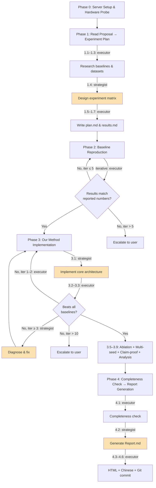
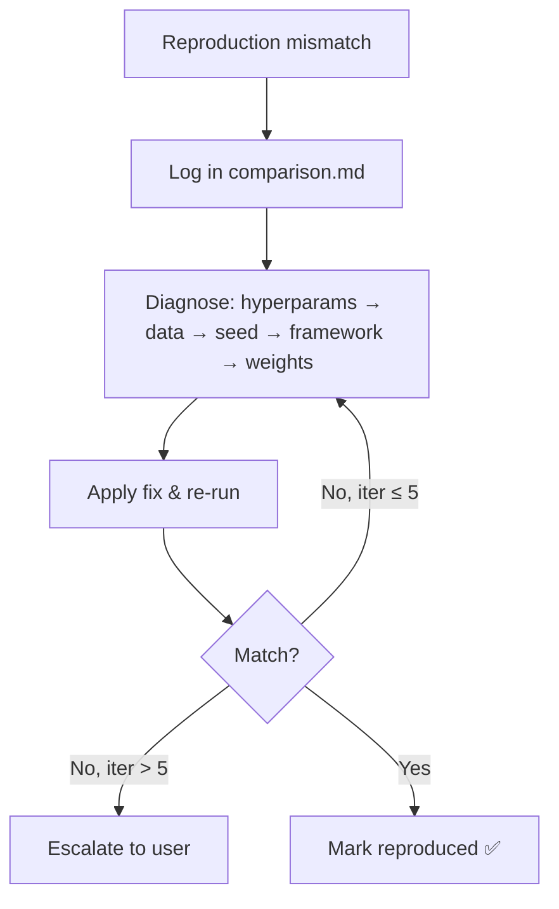
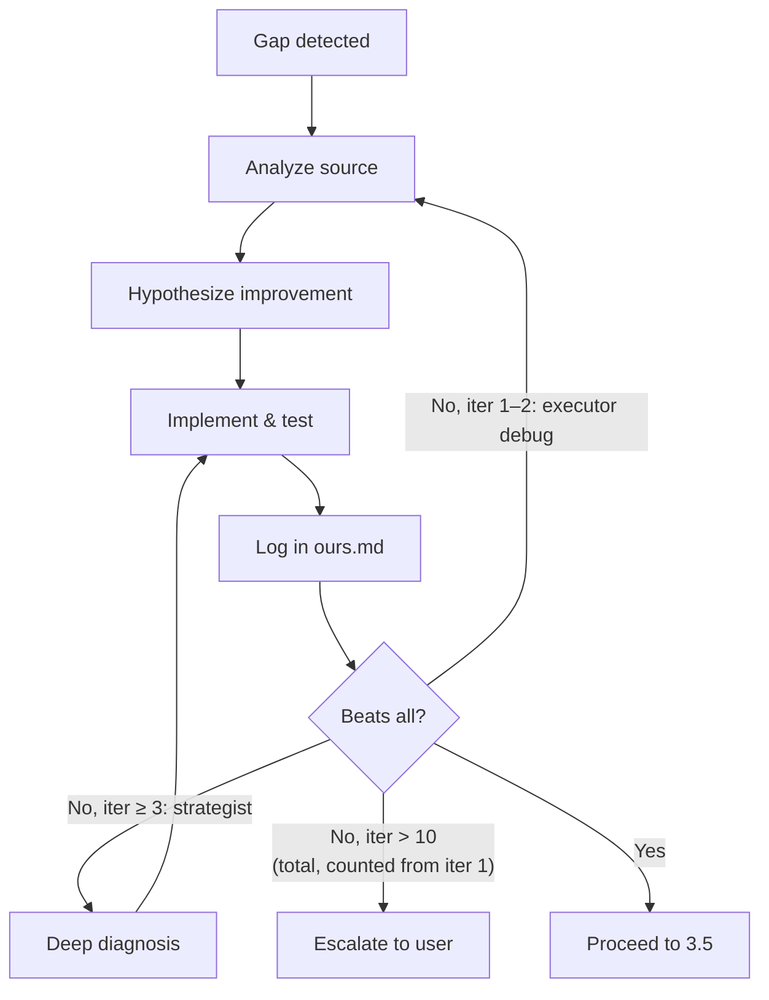

# PaperClaw Experiment AI — Full Experiment Execution Pipeline

Automate the complete experiment lifecycle: from remote server setup, through baseline reproduction and our method implementation, to polished experiment reports — all driven by a Proposal.md produced by the ideation skill.

## Core Principle

> **Reproduce first, innovate second, report thoroughly.**
>
> Every claimed number in the final report must be backed by a runnable script and a logged result.
> Every failure is an opportunity to learn — record it.
> Every claim in the Proposal must be proven by a dedicated experiment.

---

## Workflow Overview



> Yellow nodes = strategist (opus). All other nodes = executor (sonnet).

All phases run on the **local machine** (where Claude Code is running).
Compute-heavy training/evaluation is executed on the **experiment server** via SSH.

---

## Agent Architecture

This skill dispatches work to two dedicated agents. The entry model of the current session does not matter — routing is determined by agent definitions.

| Agent | Model | Role |
|-------|-------|------|
| `paperclaw-experiment-executor` | sonnet | Default: all execution, SSH, research, debugging, logging, git, translation |
| `paperclaw-experiment-strategist` | opus | High-judgment only: 4 tasks requiring original reasoning |

### Strategist Triggers

| Phase.Step | Task |
|------------|------|
| 1.4 | Design full experiment matrix + claim-proof table |
| 3.1 | Implement core method architecture from Proposal.md |
| 3.3 (iter ≥ 3, i.e., starting from iteration 3) | Diagnose structural performance gap and form fix hypothesis |
| 4.2 | Generate Report.md (full synthesis of all results) |

Everything else → executor. After strategist returns, resume with executor.

---

## Resume Protocol

When starting a new session, check if `./experiment/state.md` exists:

1. **If exists** → Read state.md to determine current phase/step
2. **Read log.md** for recent events and context
3. **Check remote server** via SSH: reachable? running processes? latest checkpoint?
   - If SSH **unreachable**: do NOT escalate immediately. Retry once after 30 seconds.
   - If still unreachable: ask user via `AskUserQuestion` with three options:
     1. **Wait** — user will restore server access; resume after confirmation
     2. **Local-only mode** — skip all remote operations; continue with local files (plan.md, results.md, report generation only)
     3. **Abort** — save state and exit cleanly
   - Record the decision in log.md and proceed accordingly.
4. **Resume** from the last incomplete step recorded in state.md
5. **If Phase 2/3** → also read comparison.md / ours.md for iteration history

If the user wants to restart a phase, they must explicitly say so.

### state.md Format

```markdown
---
updated: <timestamp>
---

# Experiment State

- **Current Phase**: <0-4>
- **Current Step**: <e.g., 2.3>
- **Status**: [running / blocked / waiting-for-user / complete]
- **Blocker**: <description or "none">
- **Last Action**: <brief description>
- **Server**: <connected / disconnected>

## Progress Tracking

- **Total Experiments**: <N> (baselines: <N>, ablations: <N>, claim-proofs: <N>, analysis: <N>)
- **Completed**: <N>
- **Remaining**: <N>
- **Current Job**: <description>
- **Job Started**: <timestamp>
- **Estimated Time Per Job**: <minutes>
- **Estimated Remaining Time**: <H hours M minutes>
```

**Update state.md** at: phase start, step start/end, blockers, user input requests, job start/finish.

### Progress Tracking & ETA

When a job finishes, update `Estimated Time Per Job` with a running average:

```
avg = (previous_avg * completed_count + this_job_time) / (completed_count + 1)
remaining_time = remaining_experiments * avg
```

When the user asks progress, report:

```
📊 Experiment Progress
━━━━━━━━━━━━━━━━━━━━━
Phase: <name>  |  Step: <step>

Progress: <completed>/<total> experiments
  ├── Baselines:    <X>/<N>
  ├── Ablations:    <X>/<N>
  ├── Claim proofs: <X>/<N>
  └── Analysis:     <X>/<N>

Current job: <description> (running <elapsed>)
Avg time/job: ~<M>min  |  Est. remaining: ~<H>h <M>m
```

---

## Working Files

All internal files live under `./experiment/`:

| File | Type | Purpose |
|------|------|---------|
| `server.md` | Overwrite | Server connection info, hardware specs |
| `plan.md` | Overwrite | Experiment plan (datasets, baselines, metrics, schedule) |
| `comparison.md` | Append-only | Baseline reproduction log (iterations, errors, fixes) |
| `ours.md` | Append-only | Our method implementation log (iterations, errors, fixes) |
| `state.md` | Overwrite | Current phase, step, blockers, progress tracking |
| `log.md` | Append-only | Timestamped event log across all phases |
| `results.md` | Overwrite | Running experiment result tables |
| `figures/` | Directory | Visualization outputs downloaded from server (PNG, 300dpi) |

Final outputs in project root (`./`):

| File | Format | Language | Audience |
|------|--------|----------|----------|
| `Report.md` | Markdown | English | Detailed report for paper writing |
| `Report_cn.md` | Markdown | Chinese | Chinese translation for paper writing |
| `Report.html` | HTML | English | Polished report for user review |
| `Report_cn.html` | HTML | Chinese | Polished report for user review |

### Iteration Log Entry Template

Used in both `comparison.md` and `ours.md`:

```markdown
## <Title> — Iteration <N>

**Date**: <timestamp>  |  **Status**: [Success / Partial / Failed / Improved / Regressed]

### Configuration
- Command: `<full command>`
- Key params: <hyperparameters or changes made>

### Results
| Dataset | Metric | Target/Previous | Actual | Δ |
|---------|--------|-----------------|--------|---|

### Issues & Fix
- **Issue**: <description>
- **Fix**: <what was changed and why>

### Git Commit
- `<hash>`: `<message>`
```

### log.md Event Format

```markdown
### [<timestamp>] <Event Title>

**Phase**: <N>  |  **Type**: [milestone / decision / error / user-input / resume]
**Details**: <what happened>
```

Log events for: phase start/end, reproduction complete, iteration start/end, errors, user decisions, session resume, git commits.

---

## Phase 0: Server Setup & Hardware Probe

### Goal

Establish a reliable connection to the experiment server and record its capabilities.

### Steps

#### Step 0.1: Ask for Server Info

Prompt the user with `AskUserQuestion`:
1. SSH host (e.g., `user@hostname` or IP)
2. SSH port (default 22)
3. Working directory on the server (e.g., `/home/user/experiments`)

> **Sudo password**: Do NOT ask upfront. Most experiment workflows do not need sudo. If a command fails because sudo is required, ask the user for the password at that specific point only, then proceed. Never store sudo password in any file — session memory only. Redact credentials in all logs with `<REDACTED>`.

#### Step 0.2: Test SSH Connection

```bash
ssh -o ConnectTimeout=10 -o StrictHostKeyChecking=accept-new <user>@<host> -p <port> "echo 'Connection OK'"
```

If connection fails: report error, ask for corrected credentials, retry (max 3 attempts).

#### Step 0.3: Probe Hardware

```bash
ssh <server> "nvidia-smi --query-gpu=name,memory.total,driver_version --format=csv,noheader 2>/dev/null || echo 'No GPU'; \
  lscpu | grep -E 'Model name|Core|Thread'; free -h | head -2; df -h <workdir>; \
  python3 --version 2>/dev/null; nvcc --version 2>/dev/null; head -4 /etc/os-release"
```

#### Step 0.4: Check Working Directory

```bash
ssh <server> "test -d <workdir> && test -w <workdir> && echo 'OK' || echo 'FAIL'; ls -A <workdir> | head -5"
```

If not empty, ask the user: proceed (preserve existing files) or choose a different directory?

#### Step 0.5: Write server.md

Write `./experiment/server.md` with sections:
- **Connection**: host, port, user, workdir
- **Hardware**: GPU table, CPU, memory, storage
- **Software Environment**: OS, Python, CUDA, driver version

#### Step 0.6: Probe Local Hardware

Detect local machine specs (`system_profiler` on macOS) and append a "Local Machine" section to `server.md`.

### Completion Criteria

- [x] SSH connection confirmed
- [x] Hardware specs recorded in server.md
- [x] Working directory is writable

---

## Phase 1: Read Proposal → Experiment Plan

### Goal

Parse the Proposal.md and generate a comprehensive, actionable experiment plan.

### Prerequisites

- `./ideation/Proposal.md` must exist (output of paperclaw-ideation-AI)
- Fallback: check `./Proposal.md`, then ask the user for the path

### Steps

#### Step 1.1: Parse Proposal.md

Read and extract:
1. **Research question** and core claims
2. **Proposed method** architecture and key components
3. **Datasets** (name, source, size, task)
4. **Baseline methods** (name, paper, venue)
5. **Evaluation metrics** (accuracy, F1, BLEU, etc.)
6. **Ablation study** plans
7. **Analysis experiments** (visualization, case study, efficiency)

#### Step 1.2: Research Baseline Methods

For each baseline method in the Proposal:
1. Search for the paper, extract reported results, find official code repository
2. Check reproducibility: clear instructions? pre-trained models?

**Additionally**, mine each baseline's own comparison tables:
3. What methods did *they* compare against?
4. What datasets did *they* use that we haven't included?
5. Identify gaps: any SOTA method (published ≤ 2 years, top venue) appearing in ≥ 2 comparison tables but missing from our plan?

**Augment** the plan with missing SOTA methods and benchmark datasets. Flag augmented entries as `[Added]`.

Build a **Baseline Reference Table**:

```markdown
| Method | Venue | Year | GitHub | Dataset1-Metric | Dataset2-Metric | Reproducibility | Source |
|--------|-------|------|--------|-----------------|-----------------|-----------------|--------|
| MethodA | NeurIPS'24 | 2024 | url | 85.3 | 72.1 | High | Proposal |
| MethodC | ICLR'24 | 2024 | url | 86.1 | 73.4 | High | [Added] from MethodA table |
```

#### Step 1.3: Research Datasets

For each dataset: find download source, verify availability, check size, note preprocessing.

Build a **Dataset Reference Table**:

```markdown
| Dataset | Task | Size | Source | Download | Preprocessing |
|---------|------|------|--------|----------|---------------|
```

#### Step 1.4: Design Experiment Matrix *(strategist)*

Extract all explicit and implicit claims from Proposal.md. Each claim must map to at least one experiment:

```markdown
## Main Experiments
| Experiment | Datasets | Methods | Metrics | Purpose |
|------------|----------|---------|---------|---------|

## Ablation Studies
| Experiment | Variants | Dataset | Purpose |
|------------|----------|---------|---------|

## Claim-Proof Experiments
| Claim (from Proposal) | Experiment Design | Dataset | Metric | Expected Result |
|-----------------------|-------------------|---------|--------|-----------------|

## Analysis Experiments
| Experiment | Type | Dataset | Purpose |
|------------|------|---------|---------|
```

> **Rule**: Every non-trivial claim must have a Claim-Proof row. If untestable, flag it in plan.md.

#### Step 1.5: Write plan.md

Merge research (1.1–1.3) with the strategist's experiment matrix (1.4) into `./experiment/plan.md`. Include:
- Estimated compute budget (GPU hours)
- Execution order and dependencies
- Risk assessment and fallback plans

#### Step 1.6: Initialize Git Repository

On the remote server: `git init`, create `.gitignore` (exclude `__pycache__/`, `.venv/`, `data/`, `*.pt`, `*.pth`, `wandb/`, `.env`, credentials, etc.), initial commit.

#### Step 1.7: Create results.md

Initialize `./experiment/results.md` with empty experiment tables (headers + reported baseline values, reproduced and ours rows set to `-`).

Git commit locally: `docs(experiment): generate experiment plan`

### Completion Criteria

- [x] plan.md contains baselines, datasets, experiment matrix, claim-proof table
- [x] results.md initialized with all table headers
- [x] Git repo initialized on server
- [x] All [Added] methods/datasets flagged for user review

---

## Phase 2: Baseline Reproduction

### Goal

Reproduce all baseline methods and verify results match reported numbers (within tolerance: ±2% relative or ±1 absolute point).

### Steps

#### Step 2.0: Create Virtual Environment

```bash
ssh <server> "cd <workdir> && python3 -m venv .venv"
```

**Critical**: ALL subsequent Python commands MUST activate the venv first:
```bash
ssh <server> "cd <workdir> && source .venv/bin/activate && <command>"
```

Install common dependencies (torch, numpy, scipy, scikit-learn, pandas, matplotlib, tqdm, wandb, etc.).

#### Step 2.1: Download Datasets

For each dataset in plan.md: create `data/<dataset>/`, download, verify integrity. Git commit after datasets are ready.

#### Step 2.2: Setup Baseline Code

For each baseline:
- **Option A**: Clone official repo → `baselines/<method>/`, install dependencies
- **Option B**: Implement from paper if no code available

Git commit after each baseline code setup.

#### Step 2.3: Adapt and Run

Adapt baseline code to use our datasets. Write unified evaluation script (`eval_baseline.py`). Run training/evaluation.

#### Step 2.4: Compare Results

Compare reproduced results against reported numbers.

If results DO NOT match:



#### Step 2.5: Log Each Iteration

Append to `./experiment/comparison.md` using the **Iteration Log Entry** template (see Working Files section).

#### Step 2.6: Update results.md

After each successful reproduction, update the "reproduced" rows in results.md.

Git commit locally after each baseline reproduced: `docs(results): reproduce <method> on <dataset>`

#### Step 2.7: Git Commit Milestones

Commit on remote server after each major milestone (see Git Strategy for message format):
- Each baseline successfully reproduced
- Dataset preparation complete
- Unified evaluation pipeline ready

### Completion Criteria

- [x] ALL baselines reproduced within tolerance
- [x] comparison.md has complete iteration logs
- [x] results.md updated with all reproduced numbers
- [x] If any baseline failed after 5 iterations: user decision recorded

---

## Phase 3: Our Method Implementation

### Goal

Implement the proposed method, achieve SOTA results on all datasets, conduct ablation + claim-proof + analysis experiments.

### Steps

#### Step 3.1: Implement Core Method *(strategist)*

Based on Proposal.md method design:
1. Create `ours/` directory structure
2. Implement model architecture (PyTorch, type hints, docstrings, ≤400 lines/file)
3. Write `ours/train.py` (config-driven, logging, checkpoint saving, seed setting)
4. Write `ours/eval.py` (consistent metrics with baselines, parseable output)

Git commit on remote: `feat(ours): implement core method architecture`

#### Step 3.2: Initial Training & Debugging

Run on each dataset. Debug common issues: shape mismatches, NaN/Inf loss, OOM, non-convergence.

Git commit after training runs successfully: `feat(ours): initial training working on <dataset>`

#### Step 3.3: Iterative Performance Improvement

**Target**: Beat ALL baselines on ALL datasets.



Improvement priority: hyperparameters → architecture → training strategy → loss function → ensemble.

Git commit after each significant improvement: `feat(ours): improve <component> (+X.X on <dataset>)`

#### Step 3.4: Log Each Iteration

Append to `./experiment/ours.md` using the **Iteration Log Entry** template (see Working Files section).

#### Step 3.5: Ablation Studies

Once our method beats all baselines:
1. **Component ablation** — Remove each key component one at a time
2. **Hyperparameter sensitivity** — Vary key hyperparameters
3. **Module replacement** — Replace our components with alternatives

Record results in ours.md and results.md. Git commit: `feat(ablation): complete component ablation study`

#### Step 3.6: Multi-Seed Runs

Run final config with 3–5 seeds (42, 123, 456, 789, 1024). Report **mean ± std** in results.md.

Git commit: `feat(ours): complete multi-seed runs (mean±std reported)`

#### Step 3.7: Claim-Proof Experiments

Run all claim-proof experiments from the Claim-Proof table in plan.md:
1. Implement measurement/comparison code
2. Run experiment
3. Check if result supports the claim
4. **If result contradicts a claim** → do NOT stop or escalate immediately. Instead:
   - Add a `⚠️ CLAIM CONTRADICTION` entry to ours.md and log.md with full details
   - Add a "Contradictions" section to results.md listing all contradicted claims
   - Continue running remaining experiments
   - Contradictions will be surfaced to the user during the Phase 4 completeness check

Record in ours.md with verdict (Supported / Partially Supported / Contradicted). Update results.md "Claim Verification" section.

Git commit per claim: `feat(claim-proof): verify claim "<claim_summary>"`

#### Step 3.8: Analysis Experiments

Conduct analysis from plan.md: efficiency, visualization (t-SNE, attention maps), case studies, scalability. Download figures via scp to `./experiment/figures/`.

Git commit: `feat(analysis): complete <analysis_type> experiments`

#### Step 3.9: Update results.md

Fill in all remaining rows: ours main results, ablation tables, analysis tables, figure references.

Git commit locally: `docs(results): update results for all experiments`

### Completion Criteria

- [x] Our method beats all baselines on all main metrics (Step 3.3)
- [x] All ablation studies done (Step 3.5)
- [x] Multi-seed runs complete, mean±std reported (Step 3.6)
- [x] All claim-proof experiments done; contradictions logged in results.md (Step 3.7)
- [x] All analysis experiments done (Step 3.8)
- [x] results.md fully populated (Step 3.9)
- [x] ours.md has complete iteration history

---

## Phase 4: Completeness Check & Report Generation

### Goal

Verify all experiments are complete, then generate four report files.

### Steps

#### Step 4.1: Completeness Check

Verify plan.md against results.md:
- All main comparison results present
- All baseline reproductions within tolerance
- Our method beats all baselines (flag exceptions)
- All ablation / claim-proof / analysis experiments completed
- results.md fully populated (no `-` or `TBD` remaining)
- comparison.md and ours.md have complete iteration logs

If incomplete → go back to the relevant phase.

**Claim Contradiction Check**: Read the "Contradictions" section of results.md (populated in Step 3.7).
- If one or more claims are contradicted → surface all contradictions to the user via `AskUserQuestion` **before** generating the report:
  > "The following claims from Proposal.md were contradicted by experiments: [list]. How would you like to proceed? (a) Revise the Proposal claims and continue to report generation; (b) Re-run specific experiments; (c) Proceed to report generation as-is (contradictions will be documented)."
- Record the user's decision in log.md, then proceed accordingly.

#### Step 4.2: Generate Report.md *(strategist)*

Write a comprehensive English report to **`./Report.md`** (project root, NOT `./experiment/`) following `references/report-template.md`. Required sections:

1. **Method Design** — Overview, architecture (with Mermaid diagram), key components, training pipeline, implementation details
2. **Datasets** — Per-dataset: task, size, source, citation, preprocessing
3. **Comparison Methods** — Per-baseline: venue, core idea, key difference, citation
4. **Experimental Results** — Main comparison, ablation, claim verification, analysis (each with table + analysis)
5. **Conclusion** — Performance highlights, robustness, efficiency, key takeaways
6. **Execution Log** — Baseline reproduction summary, our method development summary
7. **Appendix** — Server config, software environment, reproduction commands

Every claim from the Proposal must appear in section 4 with a pass/fail verdict.

#### Step 4.3: Generate Report.html

Convert Report.md to styled HTML using `references/report-html-template.html` as base. Requirements: academic serif typography, responsive layout, sortable tables, collapsible `<details>` sections, Mermaid rendering via CDN, print-friendly. `lang="en"`.

#### Step 4.4: Generate Report_cn.md

Chinese Markdown translation of Report.md. Rules:
- Keep numbers, method names, dataset names, math notation, citations in English
- Table and section structure identical to Report.md
- Technical terms with English in parentheses: "消融实验 (Ablation Study)"
- All file/code paths unchanged

#### Step 4.5: Generate Report_cn.html

Chinese HTML version using same template. Change `lang="zh-CN"`, use Chinese fonts (`PingFang SC`, `Microsoft YaHei`). Same translation rules as Report_cn.md.

#### Step 4.6: Final Git Commit

```bash
git add experiment/ Report.md Report_cn.md Report.html Report_cn.html
git commit -m "feat(experiment): complete experiment pipeline — all phases done"
```

### Completion Criteria

- [x] Report.md covers all 7 sections per template
- [x] Report.html renders correctly with Mermaid diagrams
- [x] Report_cn.md and Report_cn.html are complete translations
- [x] All 4 output files exist in project root
- [x] Final git commit made

---

## Appendix

### A. Auto-Pilot Decision Making

This skill operates autonomously by default. Decisions are logged to `./experiment/log.md`.

**ALWAYS ask** (never auto-decide):
1. Server credentials and connection setup (Phase 0.1)
2. SSH unreachable during resume (offer: wait / local-only / abort)
3. Baseline reproduction fails after 5 iterations
4. Our method cannot beat a baseline after 10 total iterations
5. Non-empty working directory found on server
6. Dataset requires registration/login to download
7. Plan.md ready for review before execution
8. Sudo is required for a specific command (ask at that moment only; do NOT ask upfront)

**Auto-decide and log**:
1. Hyperparameter adjustments during reproduction
2. Bug fixes in baseline code
3. Architecture refinements
4. Optimization strategy choices
5. Git commit timing and messages

Decision log format:

```markdown
### [<timestamp>] <Decision Title>

**Phase**: <N>  |  **Context**: <what led to this>
**Options**: 1. <A>  2. <B>
**Decision**: <chosen>  |  **Rationale**: <why>
```

### B. SSH Command Patterns

All remote commands follow these patterns:

```bash
# Simple command
ssh -o ConnectTimeout=30 <user>@<host> -p <port> "cd <workdir> && <command>"

# With venv
ssh -o ConnectTimeout=30 <user>@<host> -p <port> "cd <workdir> && source .venv/bin/activate && <command>"

# Long-running training
ssh <server> "cd <workdir> && source .venv/bin/activate && nohup python train.py > train.log 2>&1 &"

# Check training status
ssh <server> "cd <workdir> && tail -50 train.log"

# File transfer
scp -P <port> <user>@<host>:<workdir>/results/* ./experiment/figures/
```

Timeout handling: use `nohup` for training, `ConnectTimeout=30` for short commands, retry 3× on SSH drop.

### C. Git Strategy

#### Remote Server Git (experiment code)

| Milestone | Commit Message |
|-----------|---------------|
| Init | `chore: initialize experiment repository` |
| Dataset ready | `feat(data): download and verify <dataset>` |
| Baseline code setup | `feat(baseline): setup <method> code` |
| Baseline reproduced | `feat(baseline): reproduce <method> (metric=XX.X)` |
| Our method initial | `feat(ours): implement core method architecture` |
| Training working | `feat(ours): initial training working on <dataset>` |
| Each improvement | `feat(ours): improve <component> (+X.X on <dataset>)` |
| Ablation done | `feat(ablation): complete component ablation study` |
| Multi-seed done | `feat(ours): complete multi-seed runs (mean±std)` |
| Claim-proof done | `feat(claim-proof): verify claim "<summary>"` |
| Analysis done | `feat(analysis): complete <type> experiments` |
| All done | `feat: complete all experiments` |

#### Local Git (working files)

| Milestone | Commit Message |
|-----------|---------------|
| Plan ready | `docs(experiment): generate experiment plan` |
| Baseline reproduced | `docs(results): reproduce <method> on <dataset>` |
| Ours beats baseline | `docs(results): ours beats <method> on <dataset> (+X.X)` |
| Ablation done | `docs(results): complete ablation study` |
| Claim proof done | `docs(results): verify claim "<short>"` |
| Analysis done | `docs(results): complete <type> analysis` |
| Results updated | `docs(results): update results for <method/dataset>` |
| Report generated | `docs(report): generate experiment reports (EN + CN)` |

**Rule**: Never squash or amend local experiment commits. The git log is the full history of the experiment, useful for tracing decisions and writing the paper.

### D. Error Recovery

| Error | Action |
|-------|--------|
| SSH connection lost | Wait 30s → retry 3× → ask user. Training preserved via `nohup`. |
| Training crash | Check `tail -100 train.log`. Common fixes: reduce batch size, check data path, verify GPU. Resume from latest checkpoint. |
| Out of disk | `df -h && du -sh <workdir>/*`. Clean old checkpoints, cached data. Ask user if still insufficient. |
| Out of GPU memory | Reduce batch size → gradient accumulation → mixed precision (fp16/bf16) → gradient checkpointing. |

### E. Tool Reference

| Tool | Primary Use |
|------|-------------|
| `AskUserQuestion` | Server credentials, escalation decisions |
| `Bash` | SSH commands, git operations, scp transfers |
| `Read` | Proposal.md, plan.md, results.md, comparison.md, ours.md |
| `Write` / `Edit` | All working files, report files |
| `WebSearch` / `WebFetch` | Paper search, repo discovery, dataset sources |
| `TodoWrite` | Phase/step progress tracking |
| `Agent` | Dispatch strategist/executor sub-agents |

---

## Key Interaction Principles

1. **Reproduce before innovate** — Never skip baseline reproduction
2. **Log everything** — Every iteration, every failure, every fix
3. **Git frequently** — Commit at every milestone; never squash local experiment commits
4. **Venv always** — Never install packages globally on the server
5. **Numbers must match** — Reproduced baselines within tolerance before proceeding
6. **Beat all baselines** — Our method must win on all datasets before reporting
7. **Prove every claim** — Every non-trivial claim must have a dedicated claim-proof experiment
8. **Expand comparison coverage** — Mine baselines' comparison tables to add SOTA methods and datasets
9. **Track progress** — Update state.md at every job boundary; report ETA when asked
10. **Reports serve two audiences** — HTML for quick review, MD (EN + CN) for paper writing
11. **Never store secrets** — Sudo password in session memory only
12. **Ask when stuck** — 5 iterations for baselines, 10 for our method, then escalate
13. **Download results locally** — Keep `experiment/figures/` synced for reports

---

## Reference Files

These files are co-located with this skill. Try paths in order until one succeeds:
- **Project install:** `.claude/skills/paperclaw-experiment-AI/references/`
- **Global install:** `~/.claude/skills/paperclaw-experiment-AI/references/`

Load on demand:
- `<ref-dir>/domain.md` — target venue standards, experiment expectations, and resource estimates
- `<ref-dir>/reproduction-guide.md` — common reproduction pitfalls, tolerance table, and when-to-give-up criteria
- `<ref-dir>/report-template.md` — Report.md section structure and writing guide (7 required sections)
- `<ref-dir>/report-html-template.html` — HTML/CSS template for Report.html and Report_cn.html
