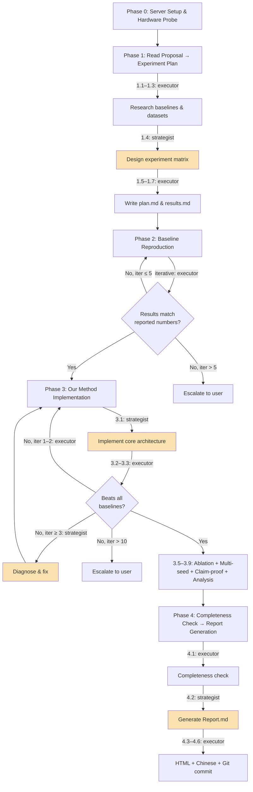
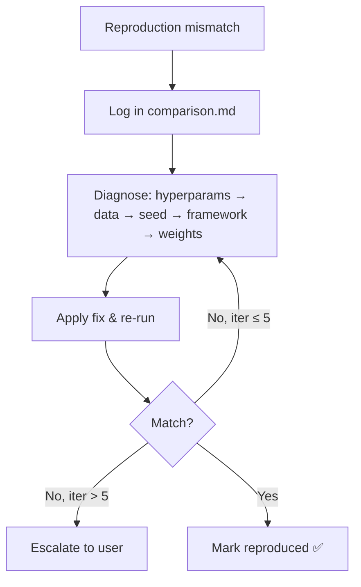
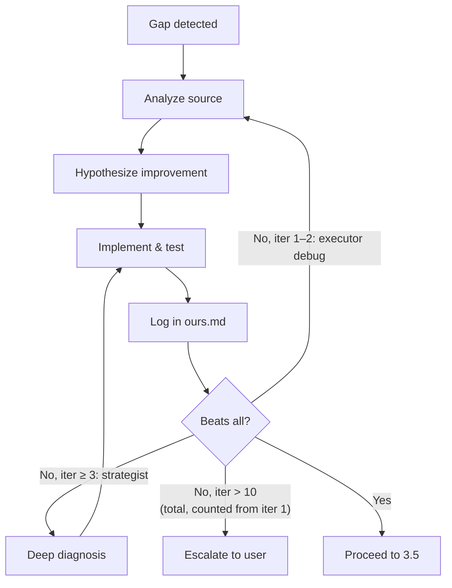

# PaperClaw Experiment AI — Full Experiment Execution Pipeline

Automate the complete experiment lifecycle: from remote server setup, through baseline reproduction and our method implementation, to polished experiment reports — all driven by a Proposal.md produced by the ideation skill.

## Core Principle

> **Reproduce first, innovate second, report thoroughly.**
>
> Every claimed number in the final report must be backed by a runnable script and a logged result.
> Every failure is an opportunity to learn — record it.
> Every claim in the Proposal must be proven by a dedicated experiment.

## Unified Project Principles

All experiment code on the remote server MUST follow these 7 principles. They are the authoritative source — agents reference them, not hardcoded directory layouts.

1. **Single project** — All methods (baselines + ours) live in one Python project with a shared `pyproject.toml` or `setup.py`, not in separate isolated folders.
2. **Common model interface** — All methods (baselines + ours) implement a shared base class or interface, registered via a model registry/factory pattern.
3. **Config-driven switching** — Switch between methods via config files (YAML/JSON), not by running scripts from different directories.
4. **Shared infrastructure** — Data loading, training loop, evaluation metrics, and logging are shared across all methods to ensure fair comparison.
5. **Unified entry points** — Single `train.py`, `eval.py`, etc. that work for any method via config. No separate per-method scripts.
6. **Adapt to existing codebases** — When baselines have official repos, extract and adapt their model code into the unified project's model module rather than running the cloned repo directly. If the project follows an existing codebase, respect that codebase's conventions.
7. **README.md** — Every experiment project must include a `README.md` documenting: project structure, how to install dependencies, how to run training/evaluation for each method, how to reproduce key results, and dataset preparation.

---

## Workflow Overview



> Yellow nodes = strategist (opus). All other nodes = executor (sonnet).

All phases run on the **local machine** (where Claude Code is running).
Compute-heavy training/evaluation is executed on the **experiment server** via SSH.

---

## Agent Architecture

This skill dispatches work to two dedicated agents. The entry model of the current session does not matter — routing is determined by agent definitions.

| Agent | Model | Role |
|-------|-------|------|
| `paperclaw-experiment-executor` | sonnet | Default: all execution, SSH, research, debugging, logging, git, translation |
| `paperclaw-experiment-strategist` | opus | High-judgment only: 4 tasks requiring original reasoning |

### Strategist Triggers

| Phase.Step | Task |
|------------|------|
| 1.4 | Design full experiment matrix + claim-proof table |
| 3.1 | Implement core method architecture from Proposal.md |
| 3.3 (iter ≥ 3, i.e., starting from iteration 3) | Diagnose structural performance gap and form fix hypothesis |
| 4.2 | Generate Report.md (full synthesis of all results) |

Everything else → executor. After strategist returns, resume with executor.

---

## Resume Protocol

When starting a new session, check if `./experiment/state.md` exists:

1. **If exists** → Read state.md to determine current phase/step
2. **Read log.md** for recent events and context
3. **Check codebase exists** — If state.md shows phase ≥ 1, verify `./experiment/codebase/` exists. If missing, ask the user before proceeding (something went wrong in a previous session).
4. **Detect server.md changes** — Re-read `./experiment/server.md` and compare to the Servers table in state.md:
   - Any server whose `Status:` is `untested` or whose name is absent from the Servers table is **new**. Run Phase 0 Steps 0.2–0.5 for those servers only (skip Step 0.1). Then, if phase ≥ 1: **push the current codebase** to the new server (Appendix H push command) and create its `.venv` — so it is ready to receive jobs from the saturation loop.
   - Any server that was in the Servers table but whose `## Connection - Server <name>` block is now **absent from server.md** has been removed by the user. Remove it from the Servers table and GPU Slots in state.md; cancel any queued jobs assigned to it; log the removal.
   - Servers still present are handled by Step 5 below.
   - This step also fires when the user explicitly says "I've updated server.md", "I removed a server", "I added a server", etc.
5. **Check all known servers** (Status was `connected` or `disconnected`) via SSH:
   - Reachable? Check for active tmux sessions (`tmux list-sessions 2>/dev/null | grep '^paperclaw-'`). If a training job is still running in a `paperclaw-*` session, resume monitoring it instead of restarting. Check latest checkpoint.
   - Update `Status:` in the Connection block and in the Servers table in state.md.
   - If SSH **unreachable**: do NOT escalate immediately. Retry once after 30 seconds.
   - If still unreachable: mark `disconnected` and continue with remaining connected servers.
   - If **no** servers are reachable (including any newly probed from Step 4): ask user via `AskUserQuestion` with three options:
     1. **Wait** — user will restore server access; resume after confirmation
     2. **Local-only mode** — skip all remote operations; continue with local files (plan.md, results.md, report generation only)
     3. **Abort** — save state and exit cleanly
   - Record the decision in log.md and proceed accordingly.
6. **Resume** from the last incomplete step recorded in state.md
7. **If Phase 2/3** → also read comparison.md / ours.md for iteration history

If the user wants to restart a phase, they must explicitly say so.

### state.md Format

```markdown
---
updated: <timestamp>
---

# Experiment State

- **Current Phase**: <0-4>
- **Current Step**: <e.g., 2.3>
- **Status**: [running / blocked / waiting-for-user / complete]
- **Blocker**: <description or "none">
- **Last Action**: <brief description>

## Servers

| Name | Host | Status | GPUs | Free RAM (at last check) | Last Checked | Local? | Last Pull |
|------|------|--------|------|--------------------------|--------------|--------|-----------|
| main | gpu1.example.com | connected | 4× A100 80G | 120G / 512G | <timestamp> | no | <timestamp> |
| gpu2 | gpu2.example.com | disconnected | — | — | <timestamp> | no | never |
| local | localhost | connected | 1× RTX 3090 | 18G / 32G | <timestamp> | **yes** | <timestamp> |

## GPU Slots

| Server | GPU | Model | VRAM Total | VRAM Free | Util% | Jobs | Last Checked |
|--------|-----|-------|------------|-----------|-------|------|--------------|
| main   | 0   | A100  | 81920 MiB  | 70000 MiB | 12%   | paperclaw-bert | <timestamp> |
| main   | 1   | A100  | 81920 MiB  | 81920 MiB | 0%    | —    | <timestamp> |
| local  | 0   | RTX3090 | 24576 MiB | 8000 MiB | 78%  | paperclaw-gpt2, paperclaw-roberta | <timestamp> |

## Job Queue

| Priority | Experiment | Est. VRAM | Est. Time | Server | GPU | Status |
|----------|-----------|-----------|-----------|--------|-----|--------|
| 1 | Baseline-A / Dataset-X | 12000 MiB | 2h | — | — | queued |
| 2 | Baseline-B / Dataset-X | 8000 MiB | 1.5h | main | 1 | running |

## Progress Tracking

- **Total Experiments**: <N> (baselines: <N>, ablations: <N>, claim-proofs: <N>, analysis: <N>)
- **Completed**: <N>
- **Remaining**: <N>
- **Estimated Time Per Job**: <minutes>
- **Estimated Remaining Time**: <H hours M minutes>

## Active Jobs

| Session ID | Server | GPU | Experiment | Est. VRAM | Actual VRAM | Started | Status |
|------------|--------|-----|-----------|-----------|-------------|---------|--------|
| paperclaw-baseline-bert | main | 0 | Baseline BERT on Dataset A | 12000 MiB | 11200 MiB | <timestamp> | running |
| paperclaw-baseline-gpt2 | local | 0 | Baseline GPT-2 on Dataset B | 8000 MiB | — | <timestamp> | running |
```

**Update state.md** at: phase start, step start/end, blockers, user input requests, job start/finish, concurrent job launch/completion.

### Progress Tracking & ETA

When a job finishes, update `Estimated Time Per Job` with a running average:

```
avg = (previous_avg * completed_count + this_job_time) / (completed_count + 1)
remaining_time = remaining_experiments * avg
```

When the user asks progress, report:

```
📊 Experiment Progress
━━━━━━━━━━━━━━━━━━━━━
Phase: <name>  |  Step: <step>

Progress: <completed>/<total> experiments
  ├── Baselines:    <X>/<N>
  ├── Ablations:    <X>/<N>
  ├── Claim proofs: <X>/<N>
  └── Analysis:     <X>/<N>

Current job: <description> (running <elapsed>)
Avg time/job: ~<M>min  |  Est. remaining: ~<H>h <M>m
```

---

## Working Files

All internal files live under `./experiment/`:

| File/Dir | Type | Purpose |
|----------|------|---------|
| `codebase/` | **Git-tracked directory** | All experiment code and configs — the local source of truth. Edits always happen here; code is pushed to remote before each job. |
| `server.md` | Partial-overwrite | Multi-server config: user-editable Connection blocks + skill-written Hardware/Scheduling sections |
| `plan.md` | Overwrite | Experiment plan (datasets, baselines, metrics, schedule) |
| `comparison.md` | Append-only | Baseline reproduction log (iterations, errors, fixes) |
| `ours.md` | Append-only | Our method implementation log (iterations, errors, fixes) |
| `state.md` | Overwrite | Current phase, step, blockers, progress tracking, job queue |
| `log.md` | Append-only | Timestamped event log across all phases |
| `results.md` | Overwrite | Running experiment result tables (human-readable summary) |
| `checkpoints/` | **Gitignored directory** | Model checkpoints pulled from remote after training (`checkpoints/<server-name>/`) |
| `results/` | **Gitignored directory** | Raw outputs pulled from remote after eval (`results/<server-name>/`) |
| `figures/` | **Gitignored directory** | Figures pulled from remote after analysis jobs |

Final outputs in project root (`./`):

| File | Format | Language | Audience |
|------|--------|----------|----------|
| `Report.md` | Markdown | English | Detailed report for paper writing |
| `Report_cn.md` | Markdown | Chinese | Chinese translation for paper writing |
| `Report.html` | HTML | English | Polished report for user review |
| `Report_cn.html` | HTML | Chinese | Polished report for user review |

### Iteration Log Entry Template

Used in both `comparison.md` and `ours.md`:

```markdown
## <Title> — Iteration <N>

**Date**: <timestamp>  |  **Status**: [Success / Partial / Failed / Improved / Regressed]

### Configuration
- Command: `<full command>`
- Key params: <hyperparameters or changes made>

### Results
| Dataset | Metric | Target/Previous | Actual | Δ |
|---------|--------|-----------------|--------|---|

### Issues & Fix
- **Issue**: <description>
- **Fix**: <what was changed and why>

### Git Commit
- `<hash>`: `<message>`
```

### log.md Event Format

```markdown
### [<timestamp>] <Event Title>

**Phase**: <N>  |  **Type**: [milestone / decision / error / user-input / resume]
**Details**: <what happened>
```

Log events for: phase start/end, reproduction complete, iteration start/end, errors, user decisions, session resume, git commits.

---

## Phase 0: Server Setup & Hardware Probe

### Goal

Establish reliable connections to all configured experiment servers, probe their **live** hardware state, and record per-server scheduling capacity.

> **Multi-server design**: Multiple servers can be configured in `server.md`. The user owns the `## Connection - Server <name>` blocks; the skill owns the `## Hardware - Server <name>`, `## Software Environment - Server <name>`, and `## Scheduling Capacity - Server <name>` blocks. Inside each Connection block, the skill auto-updates only the four designated skill-managed fields: `SSH shorthand`, `Note`, `Status`, and `Activation` (if missing). All other Connection content (Host, Port, User, Working Directory, TIP) is user-owned and never overwritten by the skill.

### Steps

#### Step 0.1: Read or Initialize Server Configuration

1. Check if `./experiment/server.md` exists and contains `## Connection - Server` blocks.
   - **If yes**: Parse all `## Connection - Server <name>` blocks. Extract `Host`, `Port`, `User`, `Working Directory`, `Activation` (default: `source <workdir>/.venv/bin/activate`), `Status`, and `TIP` for each server. Do NOT ask the user for credentials already present.
   - **If no (or no Connection blocks found)**: Prompt the user with `AskUserQuestion`:
     1. SSH host (e.g., `user@hostname` or IP)
     2. SSH port (default 22)
     3. SSH username
     4. Working directory on the server (e.g., `/home/user/experiments`)
     Then write the first `## Connection - Server main` block into `server.md` (see Appendix G for full format, including auto-filled `SSH shorthand`, `Note`, `Status`). Ask: "Would you like to add more servers? If so, please add `## Connection - Server <name>` blocks to `./experiment/server.md` following the format in Appendix G, then confirm." **Wait for the user to confirm, then re-read server.md and proceed to Step 0.2 with all parsed servers.**

> **Sudo password**: Do NOT ask upfront. Ask only when a specific command requires it. Never store in any file — session memory only. Redact in logs as `<REDACTED>`.

> **Adding servers later**: The user can add new `## Connection - Server <name>` blocks to `server.md` at any time and say "I've updated server.md" or "server info is updated." The skill will re-run Steps 0.2–0.5 for any server whose `status:` is `untested` or missing.

#### Step 0.2: Test SSH Connections & Detect Local Servers (All Servers)

For each server parsed in Step 0.1:

**Local server detection**: Before SSH-testing, check if the server is the local machine. A server is local if its `Host` is `localhost`, `127.0.0.1`, or matches the output of `hostname -f` / `hostname`. If local:
- Resolve `Working Directory` to an absolute path: `realpath <workdir>`. If the user provided a relative path, resolve it and update the Connection block's `SSH shorthand` accordingly.
- Mark `Local?: yes` in state.md Servers table.
- SSH test still runs normally (`ssh localhost` works and is used for all commands for consistency).

```bash
ssh -o ConnectTimeout=10 -o StrictHostKeyChecking=accept-new <user>@<host> -p <port> "echo 'Connection OK'"
```

- **Success**: Update `- status: connected` in that server's Connection block.
- **Failure**: Update `- status: disconnected`, log the error, and continue with remaining servers. Report all failures to the user at the end of Phase 0, but do NOT stop — proceed with connected servers.

If **no** servers are reachable: ask user (wait / abort).

#### Step 0.3: Probe Hardware (All Connected Servers)

For each connected server, run a **live** hardware probe. This captures the actual free resources at probe time, which is important when the server is shared with other users:

```bash
ssh <server> "echo '=== GPU ==='; nvidia-smi --query-gpu=index,name,memory.total,memory.used,memory.free,utilization.gpu --format=csv,noheader 2>/dev/null || echo 'No GPU'; \
  echo '=== CPU ==='; lscpu | grep -E 'Model name|^CPU\(s\)|Core|Thread'; nproc; \
  echo '=== RAM ==='; free -h | head -2; free -m | grep Mem; \
  echo '=== DISK ==='; df -h <workdir>; \
  echo '=== LOAD ==='; uptime; \
  echo '=== USERS ==='; who | wc -l; \
  echo '=== SOFTWARE ==='; python3 --version 2>/dev/null; nvcc --version 2>/dev/null; head -4 /etc/os-release"
```

> **Shared server awareness**: The probe captures `memory.free` (not just total), current RAM usage, and logged-in user count. Record these as the **baseline free resources** at probe time. All scheduling decisions use **live** resource checks (Appendix F), not static capacity — because other users may be running jobs at any time.

#### Step 0.4: Check Working Directories (All Connected Servers)

```bash
ssh <server> "test -d <workdir> && test -w <workdir> && echo 'OK' || echo 'FAIL'; ls -A <workdir> | head -5"
```

If a workdir is not empty, ask the user: proceed (preserve existing files) or choose a different directory?

#### Step 0.5: Update Connection Block Fields + Write Hardware/Capacity Sections

For each connected server, update the following fields **inside** the `## Connection - Server <name>` block:
- `SSH shorthand`: set to `ssh -p <Port> <User>@<Host>`
- `Note`: set to `<N>× <GPU name> | <OS> | Python <version> | CUDA <version> | <K> users active at last probe` (preserve any `<!--user-note-->` suffix if present)
- `Status`: set to `connected` or `disconnected`
- `Activation`: if missing, set the default: `source <Working Directory>/.venv/bin/activate`

Then write/overwrite the `## Hardware - Server <name>`, `## Software Environment - Server <name>`, and `## Scheduling Capacity - Server <name>` sections. Do NOT modify any other user-written content in the Connection block.

Per-server scheduling capacity (see Appendix F and G):
- Number of GPUs, per-GPU total memory (MiB), and **free memory at probe time**
- Total CPU cores/threads; current load average
- Total RAM (MiB); RAM in use at probe time
- Available disk space
- Logged-in user count at probe time (for shared-server awareness)

#### Step 0.6: Probe Local Hardware & Initialize Local Directories

**a) Detect local specs** (`system_profiler` on macOS, `/proc/cpuinfo` on Linux) and write/overwrite a `## Local Machine` section in `server.md`.

**b) Create local artifact directories** (gitignored; used as pull targets after remote jobs):
```bash
mkdir -p ./experiment/checkpoints
mkdir -p ./experiment/results
mkdir -p ./experiment/figures
```

**c) Ensure the PaperClaw `.gitignore`** contains entries for large gitignored artifacts. Append if missing:
```
experiment/codebase/data/
experiment/codebase/.venv/
experiment/codebase/__pycache__/
experiment/checkpoints/
experiment/results/
experiment/figures/
```

### Completion Criteria

- [x] All servers in server.md tested; `status:` updated for each
- [x] Hardware + Scheduling Capacity written for each connected server
- [x] At least one server connected and working directory is writable

---

## Phase 1: Read Proposal → Experiment Plan

### Goal

Parse the Proposal.md and generate a comprehensive, actionable experiment plan.

### Prerequisites

- `./Proposal.md` must exist (output of paperclaw-ideation-AI)
- If not found: ask the user for the path

### Steps

#### Step 1.1: Parse Proposal.md

Read and extract:
1. **Research question** and core claims
2. **Proposed method** architecture and key components
3. **Datasets** (name, source, size, task)
4. **Baseline methods** (name, paper, venue)
5. **Evaluation metrics** (accuracy, F1, BLEU, etc.)
6. **Ablation study** plans
7. **Analysis experiments** (visualization, case study, efficiency)

#### Step 1.2: Research Baseline Methods

For each baseline method in the Proposal:
1. Search for the paper, extract reported results, find official code repository
2. Check reproducibility: clear instructions? pre-trained models?

**Additionally**, mine each baseline's own comparison tables:
3. What methods did *they* compare against?
4. What datasets did *they* use that we haven't included?
5. Identify gaps: any SOTA method (published ≤ 2 years, top venue) appearing in ≥ 2 comparison tables but missing from our plan?

**Augment** the plan with missing SOTA methods and benchmark datasets. Flag augmented entries as `[Added]`.

Build a **Baseline Reference Table**:

```markdown
| Method | Venue | Year | GitHub | Dataset1-Metric | Dataset2-Metric | Reproducibility | Source |
|--------|-------|------|--------|-----------------|-----------------|-----------------|--------|
| MethodA | NeurIPS'24 | 2024 | url | 85.3 | 72.1 | High | Proposal |
| MethodC | ICLR'24 | 2024 | url | 86.1 | 73.4 | High | [Added] from MethodA table |
```

#### Step 1.3: Research Datasets

For each dataset: find download source, verify availability, check size, note preprocessing.

Build a **Dataset Reference Table**:

```markdown
| Dataset | Task | Size | Source | Download | Preprocessing |
|---------|------|------|--------|----------|---------------|
```

#### Step 1.4: Design Experiment Matrix *(strategist)*

Extract all explicit and implicit claims from Proposal.md. Each claim must map to at least one experiment:

```markdown
## Main Experiments
| Experiment | Datasets | Methods | Metrics | Purpose |
|------------|----------|---------|---------|---------|

## Ablation Studies
| Experiment | Variants | Dataset | Purpose |
|------------|----------|---------|---------|

## Claim-Proof Experiments
| Claim (from Proposal) | Experiment Design | Dataset | Metric | Expected Result |
|-----------------------|-------------------|---------|--------|-----------------|

## Analysis Experiments
| Experiment | Type | Dataset | Purpose |
|------------|------|---------|---------|
```

> **Rule**: Every non-trivial claim must have a Claim-Proof row. If untestable, flag it in plan.md.
>
> **Output rule**: The strategist writes all four tables directly into `./experiment/plan.md` under an `## Experiment Matrix` section. Do NOT create separate files (e.g., `experiment_matrix.md`).

#### Step 1.5: Finalize plan.md

The executor supplements the strategist's experiment matrix (already in plan.md from Step 1.4) with:
- Estimated compute budget (GPU hours)
- Execution order and dependencies
- Risk assessment and fallback plans

#### Step 1.6: Initialize Experiment Codebase Locally

`./experiment/codebase/` is the single source of truth for all experiment code. It is tracked by the PaperClaw git repo. **Remote servers have no git** — they are stateless compute mirrors.

**a) Scaffold locally (minimal stub)** — The executor creates a minimal stub project in `./experiment/codebase/` using Write/Edit tools (not SSH):
- `pyproject.toml` (or `setup.py`) with common dependencies (torch, numpy, scipy, scikit-learn, pandas, matplotlib, tqdm)
- `train.py` and `eval.py` as stubs that print `"Not implemented — layout decided at Step 3.1"` and exit
- `README.md` placeholder noting structure will be finalized at Step 3.1

> **Do NOT scaffold the model registry, shared training loop, or concrete directory structure here.** The full unified project layout (module names, base classes, entry point logic) is decided by the strategist at Step 3.1 based on the project domain and any existing codebase conventions. The strategist will replace these stubs with the real structure.

Also create `./experiment/codebase/.gitignore`:
```
/data/
.venv/
__pycache__/
*.pyc
/checkpoints/
/results/
/figures/
/wandb/
.env
```

Write an initial `README.md` documenting the project structure, installation, and basic usage.

**b) Local git commit** (PaperClaw repo, not a new git init):
```bash
git add experiment/codebase/
git commit -m "chore: initialize experiment codebase scaffold"
```

**c) Push to all connected servers** (see Appendix H push command) — run in parallel for all connected servers:
```bash
rsync -az \
  --exclude='/data/' --exclude='.venv/' --exclude='__pycache__/' \
  --exclude='/checkpoints/' --exclude='/results/' --exclude='/figures/' --exclude='/wandb/' \
  ./experiment/codebase/ \
  -e "ssh -p <port>" <user>@<host>:<workdir>/
```

> **Push rule**: Push is always **local → remote**. The initial push at Step 1.6c is an intentional exception — all servers need the scaffold before any job can be assigned. For all subsequent pushes (Phases 2–3), push only to the server receiving the next job. Never mass-push to all servers when fixing a bug for one. Never edit code directly on the remote; all edits happen locally in `./experiment/codebase/` using Write/Edit tools.

#### Step 1.7: Create results.md

Initialize `./experiment/results.md` with empty experiment tables (headers + reported baseline values, reproduced and ours rows set to `-`).

Git commit locally: `docs(experiment): generate experiment plan`

### Completion Criteria

- [x] plan.md contains baselines, datasets, experiment matrix, claim-proof table
- [x] results.md initialized with all table headers
- [x] Codebase pushed to all connected servers
- [x] All [Added] methods/datasets flagged for user review

---

## Phase 2: Baseline Reproduction

### Goal

Reproduce all baseline methods and verify results match reported numbers (within tolerance: ±2% relative or ±1 absolute point).

### Steps

#### Step 2.0: Create Virtual Environment

```bash
ssh <server> "cd <workdir> && python3 -m venv .venv"
```

**Critical**: ALL subsequent Python commands MUST activate the venv first:
```bash
ssh <server> "cd <workdir> && source .venv/bin/activate && <command>"
```

Install common dependencies (torch, numpy, scipy, scikit-learn, pandas, matplotlib, tqdm, wandb, etc.).

#### Step 2.1: Download Datasets

For each dataset in plan.md: create `data/<dataset>/`, download, verify integrity. Git commit after datasets are ready.

#### Step 2.2: Setup Baseline Code

For each baseline:
- **Option A**: Clone official repo as reference → extract and adapt model code into the unified project's model module, conforming to the common model interface. Write a config file for the baseline. If following an existing codebase, respect its conventions.
- **Option B**: Implement from paper if no code available, as a model class in the unified project conforming to the common interface.

Git commit after each baseline code setup.

#### Step 2.3: Run Baselines (Saturation Parallel)

Use the project's unified training and evaluation entry points with each baseline's config file.

**Before launching each job**:
1. Push current codebase to the target server (Appendix H push command).
2. Run live resource check on ALL connected servers (Appendix F.2 — RAM, CPU, disk only).
3. Assign job to best available server per saturation loop (Appendix F.3).
4. For local servers: apply conservative thresholds (Appendix F.1) and wrap command with `nice -n 19 taskset -c 0-<N>` and `ulimit`.
5. Launch via tmux: `paperclaw-train-baseline-<method>`.
6. Update Job Queue table in state.md.

**After each job completes**:
1. Pull artifacts from that server (Appendix H pull commands).
2. Update `Last Pull` in state.md Servers table.
3. Immediately run the saturation loop (Appendix F.3) to fill any freed slot.
4. Update Job Queue and Active Jobs in state.md to mark job completed with result metric.

> **Important**: Jobs that share the same GPU or write to the same files are NOT independent — run them sequentially. Only parallelize truly independent experiments (different methods, different datasets, different GPUs).

#### Step 2.4: Compare Results

Compare reproduced results against reported numbers.

If results DO NOT match:



#### Step 2.5: Log Each Iteration

Append to `./experiment/comparison.md` using the **Iteration Log Entry** template (see Working Files section).

#### Step 2.6: Update results.md

After each successful reproduction, update the "reproduced" rows in results.md.

Git commit locally after each baseline reproduced: `docs(results): reproduce <method> on <dataset>`

#### Step 2.7: Git Commit Milestones

All commits are **local** (PaperClaw repo). Remote servers have no git. After each milestone, edit/fix code in `./experiment/codebase/` locally then commit:
```bash
git add experiment/codebase/
git commit -m "<message>"   # see Appendix C for message formats
```
Key milestones:
- Dataset preparation complete
- Each baseline code integrated
- Each baseline successfully reproduced

### Completion Criteria

- [x] ALL baselines reproduced within tolerance
- [x] comparison.md has complete iteration logs
- [x] results.md updated with all reproduced numbers
- [x] If any baseline failed after 5 iterations: user decision recorded

---

## Phase 3: Our Method Implementation

### Goal

Implement the proposed method, achieve SOTA results on all datasets, conduct ablation + claim-proof + analysis experiments.

### Steps

#### Step 3.1: Implement Core Method *(strategist)*

Based on Proposal.md method design, the **strategist writes all files locally** into `./experiment/codebase/` using Write/Edit tools:
1. **Design and create the full unified project layout** — decide the concrete directory structure based on the project domain and any existing codebase conventions. Replace the stub scaffold from Step 1.6 with the real structure: model registry/factory, shared data loading, shared training loop, shared evaluation, and working unified entry points (`train.py`, `eval.py`).
2. Implement our method as a new model class in the unified project's model module, conforming to the common model interface
3. Implement model architecture (PyTorch, type hints, docstrings, ≤400 lines/file)
4. Write a config file for our method (config-driven hyperparameters, checkpoint saving, seed setting)
5. Ensure the unified entry points (`train.py`, `eval.py`) work with our method's config
6. Update `./experiment/codebase/README.md` with our method's usage instructions

After strategist returns, executor makes a local git commit:
```bash
git add experiment/codebase/
git commit -m "feat(method): implement core method architecture"
```

#### Step 3.2: Initial Training & Debugging

Push current codebase to target server(s), then run on each dataset. Debug common issues: shape mismatches, NaN/Inf loss, OOM, non-convergence. All fixes are made locally in `./experiment/codebase/` using Write/Edit tools, then pushed to the target server before re-running.

After training runs successfully: local git commit + pull artifacts:
```bash
git add experiment/codebase/ && git commit -m "feat(method): initial training working on <dataset>"
```
Pull checkpoints and results from server (Appendix H pull commands). Update Active Jobs in state.md.

#### Step 3.3: Iterative Performance Improvement

**Target**: Beat ALL baselines on ALL datasets.



Improvement priority: hyperparameters → architecture → training strategy → loss function → ensemble.

Git commit after each significant improvement: `feat(method): improve <component> (+X.X on <dataset>)`

#### Step 3.4: Log Each Iteration

Append to `./experiment/ours.md` using the **Iteration Log Entry** template (see Working Files section).

#### Step 3.5: Ablation Studies (Resource-Aware Parallel)

Once our method beats all baselines:
1. **Component ablation** — Remove each key component one at a time
2. **Hyperparameter sensitivity** — Vary key hyperparameters
3. **Module replacement** — Replace our components with alternatives

**Parallel scheduling**: Ablation variants are independent — launch multiple in parallel following the resource-aware rules (Appendix F). Each variant gets its own tmux session (`paperclaw-ablation-<variant>`). Check resources before each launch; wait if thresholds are exceeded.

Record results in ours.md and results.md. Git commit: `feat(ablation): complete component ablation study`

#### Step 3.6: Multi-Seed Runs (Resource-Aware Parallel)

Run final config with 3–5 seeds (42, 123, 456, 789, 1024). Report **mean ± std** in results.md.

**Parallel scheduling**: Different seeds are independent — launch multiple seed runs in parallel on separate GPUs or when resources permit. Each gets its own tmux session (`paperclaw-seed-<seed>`). Follow Appendix F resource checks.

Git commit: `feat(method): complete multi-seed runs (mean±std reported)`

#### Step 3.7: Claim-Proof Experiments (Resource-Aware Parallel)

Run all claim-proof experiments from the Claim-Proof table in plan.md. Independent claim-proof experiments can run in parallel following Appendix F.
1. Implement measurement/comparison code
2. Run experiment
3. Check if result supports the claim
4. **If result contradicts a claim** → do NOT stop or escalate immediately. Instead:
   - Add a `⚠️ CLAIM CONTRADICTION` entry to ours.md and log.md with full details
   - Add a "Contradictions" section to results.md listing all contradicted claims
   - Continue running remaining experiments
   - Contradictions will be surfaced to the user during the Phase 4 completeness check

Record in ours.md with verdict (Supported / Partially Supported / Contradicted). Update results.md "Claim Verification" section.

Git commit per claim: `feat(claim-proof): verify claim "<claim_summary>"`

#### Step 3.8: Analysis Experiments

Conduct analysis from plan.md: efficiency, visualization (t-SNE, attention maps), case studies, scalability. After each analysis job completes, pull figures using the Appendix H pull command (figures land in `./experiment/figures/`).

Git commit: `feat(analysis): complete <analysis_type> experiments`

#### Step 3.9: Update results.md & README.md

Fill in all remaining rows: ours main results, ablation tables, analysis tables, figure references.

Update `./experiment/codebase/README.md` locally with final reproduction commands for all methods.

Git commit locally: `docs(results): update results for all experiments`

### Completion Criteria

- [x] Our method beats all baselines on all main metrics (Step 3.3)
- [x] All ablation studies done (Step 3.5)
- [x] Multi-seed runs complete, mean±std reported (Step 3.6)
- [x] All claim-proof experiments done; contradictions logged in results.md (Step 3.7)
- [x] All analysis experiments done (Step 3.8)
- [x] results.md fully populated (Step 3.9)
- [x] ours.md has complete iteration history

---

## Phase 4: Completeness Check & Report Generation

### Goal

Verify all experiments are complete, then generate four report files.

### Steps

#### Step 4.1: Final Pull & Completeness Check

**Final pull from all connected servers** (Appendix H pull commands) before checking completeness. This ensures all checkpoints, results, and figures are local. Log total sizes pulled in log.md and update `Last Pull` in state.md.

Then verify plan.md against results.md:
- All main comparison results present
- All baseline reproductions within tolerance
- Our method beats all baselines (flag exceptions)
- All ablation / claim-proof / analysis experiments completed
- results.md fully populated (no `-` or `TBD` remaining)
- comparison.md and ours.md have complete iteration logs

If incomplete → go back to the relevant phase.

**Claim Contradiction Check**: Read the "Contradictions" section of results.md (populated in Step 3.7).
- If one or more claims are contradicted → surface all contradictions to the user via `AskUserQuestion` **before** generating the report:
  > "The following claims from Proposal.md were contradicted by experiments: [list]. How would you like to proceed? (a) Revise the Proposal claims and continue to report generation; (b) Re-run specific experiments; (c) Proceed to report generation as-is (contradictions will be documented)."
- Record the user's decision in log.md, then proceed accordingly:
  - **(a)**: Update the affected claim text in Proposal.md, clear the "Contradictions" section in results.md, proceed to Step 4.2.
  - **(b)**: Add the specific re-run experiments back to the Job Queue in state.md, set `Current Phase: 3` / `Current Step: 3.7`, resume from Step 3.7 for those experiments only. After they complete, return to Step 4.1.
  - **(c)**: Proceed to Step 4.2 as-is; the report's Claim Verification section will document each contradiction with a `⚠️ CONTRADICTED` verdict.

#### Step 4.2: Generate Report.md *(strategist)*

Write a comprehensive English report to **`./Report.md`** (project root, NOT `./experiment/`) following `references/report-template.md`. Required sections:

1. **Method Design** — Overview, architecture (with Mermaid diagram), key components, training pipeline, implementation details
2. **Datasets** — Per-dataset: task, size, source, citation, preprocessing
3. **Comparison Methods** — Per-baseline: venue, core idea, key difference, citation
4. **Experimental Results** — Main comparison, ablation, claim verification, analysis (each with table + analysis)
5. **Conclusion** — Performance highlights, robustness, efficiency, key takeaways
6. **Execution Log** — Baseline reproduction summary, our method development summary
7. **Appendix** — Server config, software environment, reproduction commands

Every claim from the Proposal must appear in section 4 with a pass/fail verdict.

#### Step 4.3: Generate Report.html

Convert Report.md to styled HTML using `references/report-html-template.html` as base. Requirements: academic serif typography, responsive layout, sortable tables, collapsible `<details>` sections, Mermaid rendering via CDN, print-friendly. `lang="en"`.

#### Step 4.4: Generate Report_cn.md

Chinese Markdown translation of Report.md. Rules:
- Keep numbers, method names, dataset names, math notation, citations in English
- Table and section structure identical to Report.md
- Technical terms with English in parentheses: "消融实验 (Ablation Study)"
- All file/code paths unchanged

#### Step 4.5: Generate Report_cn.html

Chinese HTML version using same template. Change `lang="zh-CN"`, use Chinese fonts (`PingFang SC`, `Microsoft YaHei`). Same translation rules as Report_cn.md.

#### Step 4.6: Final Git Commit

Update `./experiment/codebase/README.md` locally with final reproduction commands for all methods. Then commit everything to the PaperClaw repo:

```bash
git add experiment/codebase/ experiment/server.md experiment/plan.md experiment/results.md \
        experiment/comparison.md experiment/ours.md experiment/state.md experiment/log.md \
        Report.md Report_cn.md Report.html Report_cn.html
git commit -m "feat(experiment): complete experiment pipeline — all phases done"
```

### Completion Criteria

- [x] Report.md covers all 7 sections per template
- [x] Report.html renders correctly with Mermaid diagrams
- [x] Report_cn.md and Report_cn.html are complete translations
- [x] All 4 output files exist in project root
- [x] Final git commit made

---

## Appendix

### A. Auto-Pilot Decision Making

This skill operates autonomously by default. Decisions are logged to `./experiment/log.md`.

**ALWAYS ask** (never auto-decide):
1. Server credentials and connection setup (Phase 0.1)
2. SSH unreachable during resume (offer: wait / local-only / abort)
3. Baseline reproduction fails after 5 iterations
4. Our method cannot beat a baseline after 10 total iterations
5. Non-empty working directory found on server
6. Dataset requires registration/login to download
7. Plan.md ready for review before execution
8. Sudo is required for a specific command (ask at that moment only; do NOT ask upfront)

**Auto-decide and log**:
1. Hyperparameter adjustments during reproduction
2. Bug fixes in baseline code
3. Architecture refinements
4. Optimization strategy choices
5. Git commit timing and messages

Decision log format:

```markdown
### [<timestamp>] <Decision Title>

**Phase**: <N>  |  **Context**: <what led to this>
**Options**: 1. <A>  2. <B>
**Decision**: <chosen>  |  **Rationale**: <why>
```

### B. SSH & Rsync Command Patterns

All remote commands use the `Host`, `Port`, `User`, `Working Directory`, and `Activation` fields from the server's Connection block in server.md.

**Sanitize all IDs before use in shell commands.** Method names, dataset names, and other strings from Proposal.md may contain spaces, parentheses, or special characters that break shell commands. Always sanitize first:

```bash
# Sanitize any string before using in tmux session names, rsync paths, or SSH commands
# Example: "BERT-base (NeurIPS'23)" → "BERT-base-NeurIPS-23"
safe_id=$(echo "${raw_name}" | tr -cs 'a-zA-Z0-9_-' '-' | sed 's/-\+/-/g' | sed 's/^-//;s/-$//')
```

```bash
# Simple command
ssh -o ConnectTimeout=30 -p <Port> <User>@<Host> "cd '<Working Directory>' && <command>"

# With venv  (use the Activation field, not a hardcoded path)
ssh -o ConnectTimeout=30 -p <Port> <User>@<Host> "cd '<Working Directory>' && <Activation> && <command>"

# Long-running training (use tmux, NOT nohup)
# For LOCAL servers: prefix with nice/taskset/ulimit (see Appendix F.1)
# ALWAYS use sanitized safe_id, never raw method/dataset names
# Set gpu_index from the GPU Slots assignment (F.3); use "" for CPU-only jobs
ssh -p <Port> <User>@<Host> "tmux new-session -d -s paperclaw-<safe_id> 'cd <workdir> && <Activation> && CUDA_VISIBLE_DEVICES=<gpu_index> python train.py --config <config> 2>&1 | tee train.log; tmux wait-for -S paperclaw-<safe_id>-done'"

# CPU-only job (evaluation, analysis, data download) — no GPU slot consumed
ssh -p <Port> <User>@<Host> "tmux new-session -d -s paperclaw-<safe_id> 'cd <workdir> && <Activation> && CUDA_VISIBLE_DEVICES="" python eval.py --config <config> 2>&1 | tee eval.log; tmux wait-for -S paperclaw-<safe_id>-done'"

# Check training status
ssh <server> "tmux capture-pane -t paperclaw-<safe_id> -p | tail -50"
ssh <server> "cd <workdir> && tail -50 train.log"

# Check if a tmux session is running
ssh <server> "tmux has-session -t paperclaw-<safe_id> 2>/dev/null && echo 'RUNNING' || echo 'FINISHED'"

# Kill a stuck session
ssh <server> "tmux kill-session -t paperclaw-<safe_id>"

# List all paperclaw sessions
ssh <server> "tmux list-sessions 2>/dev/null | grep '^paperclaw-' || echo 'No active sessions'"
```

See **Appendix H** for the canonical PUSH and PULL rsync commands used before/after every job.

**Tmux session lifecycle:**
1. Start: `tmux new-session -d -s paperclaw-<id> '<command>; tmux wait-for -S paperclaw-<id>-done'`
2. Monitor: `tmux has-session -t paperclaw-<id>` to check if still running, or `tmux capture-pane` to read output
3. Auto-cleanup: When the command finishes, the session closes automatically (since the shell command was the only process). The `tmux wait-for -S` signal lets the local side know it's done.
4. **Never leave orphaned sessions.** If a session is no longer needed (e.g., after error recovery), kill it explicitly with `tmux kill-session`.

**Polling interval:** Check job status every **5 minutes** for jobs expected to finish within 1 hour; every **15 minutes** for longer jobs. After each check, run the saturation loop (Appendix F.3) to fill any freed slots. If a session disappears unexpectedly (not due to normal completion), immediately check `tail -100 train.log` for the cause. If `train.log` shows no new output for **30+ minutes** during an active training run, treat the job as stuck: capture the last output, kill the session, and apply the relevant fix from Appendix D before restarting.

Timeout handling: use `tmux` for all long-running jobs (training, evaluation, dataset download), `ConnectTimeout=30` for short commands, retry 3× on SSH drop.

### C. Git Strategy

All commits happen **locally** in the PaperClaw repo. Remote servers have no git — they are stateless compute mirrors. The local git log is the complete history of the experiment.

```bash
# Template for all experiment commits
git add experiment/codebase/ [other changed files]
git commit -m "<message>"
```

| Milestone | Commit Message |
|-----------|---------------|
| Codebase scaffold | `chore: initialize experiment codebase scaffold` |
| Baseline integrated | `feat(baseline): integrate <method> into unified project` |
| Baseline reproduced | `feat(baseline): reproduce <method> (metric=XX.X)` |
| Our method implemented | `feat(method): implement core method architecture` |
| Training working | `feat(method): initial training working on <dataset>` |
| Each improvement | `feat(method): improve <component> (+X.X on <dataset>)` |
| Ablation done | `feat(ablation): complete component ablation study` |
| Multi-seed done | `feat(method): complete multi-seed runs (mean±std)` |
| Claim-proof done | `feat(claim-proof): verify claim "<summary>"` |
| Analysis done | `feat(analysis): complete <type> experiments` |
| Plan ready | `docs(experiment): generate experiment plan` |
| Results updated | `docs(results): update results for <method/dataset>` |
| Report generated | `docs(report): generate experiment reports (EN + CN)` |
| All done | `feat(experiment): complete experiment pipeline` |

**Rule**: Never squash or amend experiment commits. The local git log is the full, traceable history of every code change and result.

### D. Error Recovery

| Error | Action |
|-------|--------|
| SSH connection lost | Wait 30s → retry 3× → ask user. Training preserved via `tmux` — check `tmux has-session -t paperclaw-<id>` on reconnect. |
| Training crash | Check `tail -100 train.log`. Common fixes: reduce batch size, check data path, verify GPU. Resume from latest checkpoint. |
| Out of disk | `df -h && du -sh <workdir>/*`. Clean old checkpoints, cached data. Ask user if still insufficient. |
| Out of GPU memory | Reduce batch size → gradient accumulation → mixed precision (fp16/bf16) → gradient checkpointing. |
| OOM on a co-located GPU (second job on same GPU) | This job was placed alongside another job. Check if the co-located job finished or grew in VRAM. If both jobs are still running: reduce batch size of the new job first. If still OOM: move the new job to a different GPU or server. Update `Est. VRAM` in the Job Queue upward (use `Actual VRAM × 1.2`) so future co-location checks are more conservative. |
| Machine unresponsive (OOM kill / CPU saturated) | SSH will likely timeout. Wait 2 min, retry. If reachable: check `dmesg | tail -30` for OOM kills, `tmux list-sessions` for surviving jobs. Reduce max concurrent jobs in server.md by 1. Restart killed jobs from checkpoint. If unreachable after 3 retries: ask user to hard-reboot, then resume per Resume Protocol. |

### E. Tool Reference

| Tool | Primary Use |
|------|-------------|
| `AskUserQuestion` | Server credentials, escalation decisions |
| `Bash` | SSH commands, git operations, scp transfers |
| `Read` | Proposal.md, plan.md, results.md, comparison.md, ours.md |
| `Write` / `Edit` | All working files, report files |
| `WebSearch` / `WebFetch` | Paper search, repo discovery, dataset sources |

| `Agent` | Dispatch strategist/executor sub-agents |

### F. Resource-Aware Parallel Scheduling

Experiment servers often have finite resources and may be **shared with other users**. Blindly launching all jobs at once can cause OOM kills, CPU saturation, or the machine becoming unresponsive — even if capacity looked sufficient at the start of the session. All scheduling decisions MUST use **live resource checks**, not static capacity estimates.

> **Shared-server rule**: Never assume the server is idle. Always measure free resources immediately before launching a job. Other users' processes may appear or disappear at any time.

#### F.1: Scheduling Thresholds

**GPU pre-check is soft and conditional.** For the first job on an idle GPU, launch immediately with no memory check. For co-locating a second or subsequent job on an already-occupied GPU, check memory and utilization first.

| Resource | First job on idle GPU | Co-locating on occupied GPU | Local server (`Local?: yes`) |
|---|---|---|---|
| GPU memory | ✅ No pre-check — launch immediately | `memory.free > Est. VRAM × 1.1` | Same rules apply |
| GPU utilization | ✅ No pre-check | `utilization.gpu < 70%` | Same rules apply |
| RAM | Usage < 80% of total | Usage < 80% of total | Free RAM > `max(4 GiB, 20% of total)` |
| CPU | 1-min load avg < 85% | 1-min load avg < 85% | 1-min load avg < 50% |
| Disk | Usage < 90% | Usage < 90% | Usage < 90% |
| Process priority | normal | normal | `nice -n 19` + `taskset -c 0-<floor(nproc/2)-1>` + `ulimit -v <allowed_kb>` |

**VRAM estimation rules** (used for `Est. VRAM` when a job is first queued):
1. **Known job** — same method + dataset ran before: use `Actual VRAM` from last run × 1.2
2. **Unknown job, first run**: conservative default = `min(40% of GPU total VRAM, 20480 MiB)`
3. **CPU-only job** (evaluation, data download, analysis scripts): `Est. VRAM = 0`; assign `CUDA_VISIBLE_DEVICES=""`; does not occupy a GPU slot

After each job's first checkpoint, query actual VRAM used and record in the Active Jobs `Actual VRAM` column. This feeds future estimates for the same job type.

**Local server launch command template** (computed at launch time):
```bash
ALLOWED_CORES=$(($(nproc) / 2 - 1))
RESERVED_MB=$(python3 -c "import os; mem=$(free -m | awk '/Mem:/{print $2}'); print(max(4096, int(mem*0.20)))")
ALLOWED_MB=$(($(free -m | awk '/Mem:/{print $4}') - RESERVED_MB))
ssh -p <Port> <User>@<Host> "tmux new-session -d -s paperclaw-<id> \
  'cd <workdir> && <Activation> && \
   nice -n 19 taskset -c 0-${ALLOWED_CORES} \
   bash -c \"ulimit -v $((ALLOWED_MB * 1024)); python train.py --config <cfg> 2>&1 | tee train.log\"; \
   tmux wait-for -S paperclaw-<id>-done'"
```

**Scheduling capacity** stored per-server in server.md after Phase 0 probe:
```markdown
## Scheduling Capacity - Server <name>
- GPUs: <N> × <name> (<M> MiB total each)
- RAM Headroom: reserve 20% of total RAM for OS + SSH + other users

### Thresholds (checked LIVE before each launch — no GPU memory check)
- RAM usage > 80% of total
- CPU usage > 85% sustained (1-min avg)
- Disk usage > 90%
```

#### F.2: Live Resource Check Commands

Run these **immediately before each saturation loop pass**:

```bash
# Full live snapshot — RAM, CPU, disk, and per-GPU stats
ssh <server> "echo '=== RAM ==='; free -m | grep Mem; \
  echo '=== CPU ==='; top -bn1 | grep 'Cpu(s)' | awk '{print \"CPU used: \" 100-\$8 \"%\"}'; \
  echo '=== DISK ==='; df -h <workdir> | tail -1; \
  echo '=== GPU ==='; nvidia-smi --query-gpu=index,memory.free,memory.total,utilization.gpu \
    --format=csv,noheader 2>/dev/null || echo 'No GPU'; \
  echo '=== OTHER USERS ==='; who | wc -l; \
  echo '=== OUR JOBS ==='; tmux list-sessions 2>/dev/null | grep '^paperclaw-' || echo 'None'"
```

Parse the `=== GPU ===` lines and update the **GPU Slots** table in state.md (`VRAM Free`, `Util%`, `Last Checked`) before making any co-location decision.

If **any** RAM/CPU/disk threshold is exceeded on all servers, do not launch — wait for a running job to finish, then re-check (poll every 60 seconds).

#### F.3: Saturation Loop

**Trigger**: run at session start and after every job completes. Goal: fill ALL available GPU capacity before stopping.

```
LOOP:
  0. Re-read ./experiment/server.md and compare to active server list:
     - Any server whose Connection block was REMOVED: immediately stop scheduling jobs to it;
       remove it from GPU Slots and Servers table in state.md; log "server <name> removed by user"
     - Any server whose Connection block was ADDED (Status: untested or absent): run Phase 0
       Steps 0.2–0.5 for it before continuing the loop

  1. Run live resource check (F.2) on ALL connected servers simultaneously
     → Update GPU Slots table in state.md (VRAM Free, Util%, Last Checked)

  2. For each server that passes RAM/CPU/disk thresholds (F.1):
       a. Collect all queued jobs for this server (by priority order)
       b. For each GPU on this server (index 0, 1, 2, ...):
            - If GPU has no running jobs:
                → Assign next queued job; no memory check needed; mark GPU slot busy
            - If GPU already has running jobs (co-location candidate):
                → Check: memory.free > job's Est. VRAM × 1.1  AND  utilization.gpu < 70%
                → If both pass: assign job to this GPU; mark slot busy
                → If either fails: skip this GPU; try next GPU or next server
       c. After all GPU assignments for this server are decided:
            - Push codebase to this server ONCE (not per job)
            - Launch all assigned jobs in parallel, each with CUDA_VISIBLE_DEVICES=<gpu_index>
            - Update GPU Slots, Job Queue, Active Jobs in state.md
            - Log all launches in log.md with resource snapshot

  3. Continue until queue is empty OR no GPU on any server can accept another job

  4. If no capacity anywhere: poll every 60s; re-run loop when any job finishes
```

**Key rules:**
- Never stop after filling one slot — fill ALL available capacity in one pass
- One push per server per loop pass, not one push per job
- CPU-only jobs (`Est. VRAM = 0`): assign `CUDA_VISIBLE_DEVICES=""`, skip GPU slot tracking entirely
- After each job completes: query `nvidia-smi` for that GPU, update GPU Slots, record `Actual VRAM` in Active Jobs

**Server selection**: prefer the server with the most free GPU slots and lowest RAM/CPU load. Honor TIP hints when choosing between equivalent options. For local servers: verify conservative thresholds (F.1) before assigning any job.

#### F.4: Monitoring Active Jobs (Multi-Server)

When multiple jobs are running across servers:

```bash
# Check all paperclaw sessions on each connected server
ssh <server-A> "tmux list-sessions 2>/dev/null | grep '^paperclaw-' || echo 'None'"
ssh <server-B> "tmux list-sessions 2>/dev/null | grep '^paperclaw-' || echo 'None'"

# Check a specific job's latest output
ssh <server> "tmux capture-pane -t paperclaw-<id> -p | tail -20"

# Quick health check per server (catches other users' impact on resources)
ssh <server> "free -m | grep Mem; nvidia-smi --query-gpu=index,memory.free,memory.total,utilization.gpu --format=csv,noheader 2>/dev/null; uptime"
```

When a job finishes:
1. Remove it from the Active Jobs table in state.md.
2. Run live resource checks on all servers (F.2).
3. Launch next queued experiment on the best available server.

#### F.5: What Can Run in Parallel

| Scenario | Parallel? | Notes |
|----------|-----------|-------|
| Different baselines on different servers | ✅ Yes | Fill all servers simultaneously |
| Different baselines on different GPUs (same server) | ✅ Yes | Each job just launches; no memory pre-check |
| Different seeds on different servers or GPUs | ✅ Yes | Best use of multi-server setup |
| Ablation variants across servers or GPUs | ✅ Yes | Fill all available capacity |
| CPU evaluation while GPU trains (same server) | ✅ Yes | Check live RAM only |
| Dataset download while training (same server) | ✅ Yes | I/O-bound; check disk space |
| venv setup on Server B while jobs run on Server A | ✅ Yes | CPU-light pipeline prep |
| Code push to Server B while Server A trains | ✅ Yes | Network-bound, doesn't affect training |
| Strategist running while baselines train remotely | ✅ Yes | Strategist uses local CPU/RAM only |
| Phase 3 scaffold while Phase 2 baselines run | ✅ Yes | Strategist writes locally; no conflict |
| Our method while baseline still running | ✅ Yes | Assign to idle server/GPU |

#### F.7: Job Queue Management

The Job Queue in state.md is the master list of all pending and running experiments. It drives the saturation loop (F.3).

**Priority ordering** (higher priority = assigned first):
1. Baselines (Phase 2) — required before our method can be evaluated
2. Our method initial training (Phase 3.2)
3. Our method iterations (Phase 3.3)
4. Ablation studies (Phase 3.5)
5. Multi-seed runs (Phase 3.6)
6. Claim-proof experiments (Phase 3.7)
7. Analysis experiments (Phase 3.8)

**Queue initialization**: at the start of each phase, add all jobs for that phase to the queue with status `queued`. As jobs launch, update to `running`. On completion, update to `done` and remove from queue.

**Pipeline prep jobs** (not in the queue, but run opportunistically alongside queued jobs):
- Download datasets on idle servers while other jobs run
- Set up `.venv` on servers not yet initialized
- Push codebase to servers scheduled for upcoming jobs

#### F.6: Adaptive Capacity Adjustment

If a job triggers an OOM kill or the machine becomes unresponsive (can happen more often on shared servers):
1. After recovery, reduce the RAM threshold by 5% for that server in server.md (e.g., 80% → 75%) and log the incident.
2. Log the incident in log.md with the resource state at the time (include `who` output to note if other users were active).
3. For subsequent jobs on that server: reduce batch size or enable gradient checkpointing.
4. If a single job OOMs even alone → handle per Appendix D.
5. If a server repeatedly causes OOM incidents, update its `Note` field in server.md with a warning (e.g., `Note: ... | ⚠️ OOM-prone — reduce batch size`) so future sessions are aware. Do NOT write to TIP (that is user-owned).

### G. Server Configuration Format (server.md)

`./experiment/server.md` is the single source of truth for all server configurations. It has two kinds of content:

- **User-owned blocks** (`## Connection - Server <name>`): The user writes and edits these. Inside each block, four fields are **skill-managed** (auto-updated on every probe): `SSH shorthand`, `Note`, `Status`, `Activation` (only if missing). All other Connection content (Host, Port, User, Working Directory, TIP) is never touched by the skill.
- **Skill-owned blocks** (`## Hardware`, `## Software Environment`, `## Scheduling Capacity` per server, and `## Local Machine`): The skill writes and overwrites these entirely on every probe. Users should not edit these.

#### Connection Block Fields

Each `## Connection - Server <name>` block contains these fields:

| Field | Written by | Description |
|-------|-----------|-------------|
| `Host` | User | Hostname or IP address |
| `Port` | User | SSH port (default: 22) |
| `User` | User | SSH username |
| `Working Directory` | User | Remote working directory for experiments |
| `Activation` | User (optional) | venv activation command. Default: `source <workdir>/.venv/bin/activate`. Override if venv is elsewhere. |
| `SSH shorthand` | **Skill** (auto-written) | Full SSH command for convenience, e.g. `ssh -p 22 user@host`. Users may edit. |
| `Note` | **Skill** (auto-written) | One-line summary of server status and key hardware, updated each time the skill probes the server. Users may edit; the skill will overwrite on next probe unless the user adds a `<!--user-note-->` marker. |
| `Status` | **Skill** (auto-written) | `connected` / `disconnected` / `untested`. Updated by the skill on every connection check. |
| `TIP` | **User** (optional) | A `> TIP:` blockquote. Free-form hints for the scheduling logic: GPU availability patterns, constraints, best use cases, known issues. The skill reads but never overwrites this. |

#### Full server.md Format

```markdown
# Experiment Server Configuration

<!--
  ADD A SERVER: Copy a `## Connection - Server <name>` block, fill in Host/Port/User/Working Directory,
  and leave SSH shorthand, Note, and Status blank — the skill will fill them in.
  REMOVE A SERVER: Delete the full block (Connection + Hardware + Software + Scheduling).

  TIP: Add a `> TIP:` blockquote for hints the scheduler should know about this server.
-->

## Connection - Server main
- Host: gpu1.example.com
- Port: 22
- User: alice
- Working Directory: /home/alice/paperclaw-experiments
- Activation: source /home/alice/paperclaw-experiments/.venv/bin/activate
- SSH shorthand: ssh -p 22 alice@gpu1.example.com
- Note: 8× A100 80G | Ubuntu 22.04 | Python 3.10 | CUDA 12.1 | 3 users active at last probe
- Status: connected

> TIP: Shared with the lab — GPU 6 and 7 are often busy during business hours. Best for large-model runs.

## Hardware - Server main
<!-- Written by the skill — do not edit -->
| GPU | Name | Total (MiB) | Free at probe (MiB) |
|-----|------|-------------|----------------------|
| 0   | A100 80GB SXM4 | 81920 | 71200 |
...

- CPU: 128 cores / 256 threads (AMD EPYC 7763)
- Total RAM: 512 GiB  |  In use at probe: 82 GiB
- Disk (<workdir>): 20 TiB total, 14 TiB free
- Active users at probe: 3

## Software Environment - Server main
<!-- Written by the skill — do not edit -->
- OS: Ubuntu 22.04.3 LTS
- Python: 3.10.12
- CUDA: 12.1 / Driver: 530.30.02

## Scheduling Capacity - Server main
<!-- Written by the skill — do not edit -->
- GPUs: 8 × A100 80G (81920 MiB each)
- RAM Headroom: reserve 20% (≈102 GiB) for OS + other users

### Thresholds (live — re-checked before every job launch)
- RAM usage > 80% of total
- CPU usage > 85% (1-min avg)
- Disk usage > 90%

---

## Connection - Server gpu2
- Host: 192.168.1.42
- Port: 2222
- User: bob
- Working Directory: /data/bob/experiments
- Activation: source /data/bob/experiments/.venv/bin/activate
- SSH shorthand: ssh -p 2222 bob@192.168.1.42
- Note: (not yet probed)
- Status: untested

> TIP: Personal server — usually idle. Slow SSD; avoid large dataset downloads here.

## Hardware - Server gpu2
<!-- not yet probed — will be filled after connection test -->

---

## Connection - Server local
- Host: localhost
- Port: 22
- User: alice
- Working Directory: /home/alice/PaperClaw/experiment/codebase
- Activation: source /home/alice/PaperClaw/experiment/codebase/.venv/bin/activate
- SSH shorthand: ssh -p 22 alice@localhost
- Note: Local machine — Claude Code runs here; conserve resources
- Status: connected
- Local?: yes

> TIP: This is the local machine where Claude Code runs. Apply nice/taskset/ulimit on all jobs. Reserve max(4 GiB, 20% RAM) and max(2 cores, nproc/4) for Claude Code.

## Hardware - Server local
<!-- Written by the skill — do not edit -->
- CPU: 12 cores / 12 threads (Apple M2 Pro)
- Total RAM: 32 GiB  |  In use at probe: 8 GiB
- Disk (<workdir>): 1 TiB total, 600 GiB free

## Software Environment - Server local
<!-- Written by the skill — do not edit -->
- OS: macOS 14.3
- Python: 3.11.6
- CUDA: N/A

## Scheduling Capacity - Server local
<!-- Written by the skill — do not edit -->
- GPUs: none
- RAM Headroom: reserve max(4 GiB, 20% total) for Claude Code + OS

### Thresholds (live — re-checked before every job launch)
- RAM usage > 50% of total (conservative — local)
- CPU usage > 50% (1-min avg, conservative — local)
- Disk usage > 90%

---

## Local Machine
<!-- Written by the skill — do not edit -->
- CPU: Apple M2 Pro, 12 cores
- RAM: 32 GiB
- OS: macOS 14.3
```

#### Rules for Adding/Removing Servers

**To add a server**: Append a new `## Connection - Server <name>` block with `Host`, `Port`, `User`, `Working Directory` filled in. Leave `SSH shorthand`, `Note`, `Status` blank or set `Status: untested`. Tell the skill "I've updated server.md" and the skill will probe the new server, fill in those fields, and write the Hardware/Scheduling sections.

**To remove a server**: Delete its entire set of blocks (Connection + Hardware + Software Environment + Scheduling Capacity). The skill detects the removal at the start of every saturation loop pass (F.3 Step 0) and immediately stops scheduling jobs to it. You do not need to tell the skill — it re-reads server.md before every scheduling decision. If you want an immediate effect mid-session, say "I've updated server.md".

**`Note` field**: Auto-written by the skill each time it probes the server. Contains a compact summary (hardware, OS, users). If you want to add a permanent note that the skill won't overwrite, append `<!--user-note-->` after your text: the skill will preserve everything before that marker.

**`TIP` field**: The `> TIP:` blockquote is read by the scheduling logic (F.3) when selecting the best server for a job. Use it to document:
- GPU availability patterns (e.g., "GPU 2-3 busy during business hours")
- Hardware constraints (e.g., "only 500 GB disk — avoid large datasets")
- Best use cases (e.g., "best for CPU-heavy preprocessing")
- Known issues (e.g., "intermittent SSH drops — always use tmux")

---

## Key Interaction Principles

1. **Reproduce before innovate** — Never skip baseline reproduction
2. **Log everything** — Every iteration, every failure, every fix
3. **Git frequently** — Commit at every milestone; all commits are local (PaperClaw repo); never squash experiment commits
4. **Venv always** — Never install packages globally on the server
5. **Numbers must match** — Reproduced baselines within tolerance before proceeding
6. **Beat all baselines** — Our method must win on all datasets before reporting
7. **Prove every claim** — Every non-trivial claim must have a dedicated claim-proof experiment
8. **Expand comparison coverage** — Mine baselines' comparison tables to add SOTA methods and datasets
9. **Track progress** — Update state.md (Job Queue, Active Jobs, Progress Tracking) at every job boundary
10. **Reports serve two audiences** — HTML for quick review, MD (EN + CN) for paper writing
11. **Never store secrets** — Sudo password in session memory only
12. **Ask when stuck** — 5 iterations for baselines, 10 for our method, then escalate
13. **Local is source of truth** — All code lives in `./experiment/codebase/`; never edit code on remote; push before each job, pull after
14. **Check RAM/CPU/disk before every launch** — For GPU co-location (placing a second job on an occupied GPU): do a soft pre-check (`memory.free > Est.VRAM × 1.1 AND utilization.gpu < 70%`); if it fails, skip that GPU and try another. For the first job on an idle GPU: no pre-check needed — launch and handle OOM reactively (Appendix D)
15. **Saturate remote servers** — Fill all available server capacity via the job queue (Appendix F.7) and saturation loop (Appendix F.3)
16. **Protect the local machine** — Local server (`Local?: yes`) gets `nice -n 19`, `taskset`, `ulimit`, and conservative RAM/CPU thresholds; Claude Code must not be starved
17. **Push is targeted** — Push codebase only to the server receiving the next job; never mass-push to all servers during a debug cycle
18. **Pipeline prep eagerly** — While jobs run, set up venvs and download datasets on idle servers in parallel

---

### H. File Classification & Rsync Commands

#### File Classification

| Category | Where it lives | Tracked by git? | Sync strategy |
|----------|---------------|-----------------|---------------|
| **Code** (`codebase/`) | Local `./experiment/codebase/` | Yes (PaperClaw repo) | **Push** before each job; never edit on remote |
| **Datasets** | Remote `<workdir>/data/` | No | Re-download per server; too large to sync |
| **Checkpoints** (`checkpoints/`) | Local `./experiment/checkpoints/` | No (`.gitignore`) | **Pull** after each job; never pushed |
| **Results** (`results/`) | Local `./experiment/results/` | No (`.gitignore`) | **Pull** after each job |
| **Figures** (`figures/`) | Local `./experiment/figures/` | No (`.gitignore`) | **Pull** after each job |
| **Runtime** (`.venv/`, `__pycache__/`) | Remote `<workdir>/` | No | Ephemeral; never synced |

`.gitignore` entries (added by Step 0.6):
```
experiment/checkpoints/
experiment/results/
experiment/figures/
```

#### Canonical PUSH Command (local codebase → remote, before each job)

```bash
rsync -avz --delete \
  --exclude='.venv/' \
  --exclude='__pycache__/' \
  --exclude='*.pyc' \
  --exclude='.git/' \
  -e "ssh -p <Port>" \
  ./experiment/codebase/ \
  <User>@<Host>:<Working Directory>/
```

- Run this immediately before launching any training/evaluation job on `<server>`.
- `--delete` ensures stale files from old runs are removed on the remote.
- **Targeted**: push only to the server receiving the next job (not all servers).
- **Local server exception**: If `Local?: yes` and `Working Directory` resolves to `./experiment/codebase/` (same path), skip the push — the directory IS the source.

#### Canonical PULL Commands (remote artifacts → local, after each job)

```bash
# Pull checkpoints
rsync -avz \
  -e "ssh -p <Port>" \
  <User>@<Host>:<Working Directory>/checkpoints/ \
  ./experiment/checkpoints/<server-name>/

# Pull results / logs
rsync -avz \
  -e "ssh -p <Port>" \
  <User>@<Host>:<Working Directory>/results/ \
  ./experiment/results/<server-name>/

# Pull figures
rsync -avz \
  -e "ssh -p <Port>" \
  <User>@<Host>:<Working Directory>/figures/ \
  ./experiment/figures/<server-name>/
```

- Run after every job completes (training, evaluation, ablation, claim-proof, analysis).
- Sub-directory per server (`<server-name>/`) prevents filename collisions across servers.
- Update `Last Pull` timestamp in state.md after each pull.
- **Local server exception**: If `Local?: yes` and the working directory is `./experiment/codebase/`, skip the pull — artifacts are already local. Figures may be in `./experiment/codebase/figures/`; move them to `./experiment/figures/` if needed.

---


## Reference Files

These files are co-located with this skill. Try paths in order until one succeeds:
- **Project install:** `.claude/skills/paperclaw-experiment-AI/references/`
- **Global install:** `~/.claude/skills/paperclaw-experiment-AI/references/`

Load on demand:
- `<ref-dir>/domain.md` — target venue standards, experiment expectations, and resource estimates
- `<ref-dir>/reproduction-guide.md` — common reproduction pitfalls, tolerance table, and when-to-give-up criteria
- `<ref-dir>/report-template.md` — Report.md section structure and writing guide (7 required sections)
- `<ref-dir>/report-html-template.html` — HTML/CSS template for Report.html and Report_cn.html
