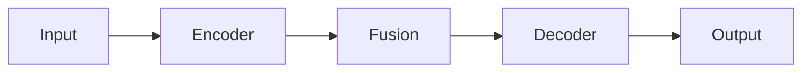

# PaperClaw Experiment AI — Full Experiment Execution Pipeline

Automate the complete experiment lifecycle: from remote server setup, through baseline reproduction and our method implementation, to polished experiment reports — all driven by a Proposal.md produced by the ideation skill.

## Core Principle

> **Reproduce first, innovate second, report thoroughly.**
>
> Every claimed number in the final report must be backed by a runnable script and a logged result.
> Every failure is an opportunity to learn — record it.
> Every claim in the Proposal must be proven by a dedicated experiment.

---

## Workflow Overview

```
Phase 0  Server Setup & Hardware Probe
  │
  ▼
Phase 1  Read Proposal → Detailed Experiment Plan
  │
  ▼
Phase 2  Baseline Reproduction (iterative until numbers match)
  │
  ▼
Phase 3  Our Method Implementation (iterative until beating baselines)
  │
  ▼
Phase 4  Completeness Check → Report Generation
```

All phases run on the **local machine** (where Claude Code is running).
Compute-heavy training/evaluation is executed on the **experiment server** via SSH.

---

## Resume Protocol

When starting a new session, check if `./experiment/state.md` exists:

1. **If exists** → Read state.md to determine current phase/step
2. **Read log.md** for recent events and context
3. **Check remote server** via SSH: is it reachable? Any running processes (`ps aux | grep python`)? Latest checkpoint?
4. **Resume** from the last incomplete step recorded in state.md
5. **If state.md says Phase 2/3** → also read comparison.md / ours.md to understand iteration history

If the user wants to restart a phase, they must explicitly say so.

### state.md Format

```markdown
---
updated: <timestamp>
---

# Experiment State

- **Current Phase**: <0-4>
- **Current Step**: <e.g., 2.3>
- **Status**: [running / blocked / waiting-for-user / complete]
- **Blocker**: <description or "none">
- **Last Action**: <brief description>
- **Server**: <connected / disconnected>

## Progress Tracking

- **Total Experiments**: <N> (baselines: <N>, ablations: <N>, claim-proofs: <N>, analysis: <N>)
- **Completed**: <N>
- **Remaining**: <N>
- **Current Job**: <description, e.g., "Training MethodA on Dataset1">
- **Job Started**: <timestamp>
- **Estimated Time Per Job**: <minutes>
- **Estimated Remaining Time**: <H hours M minutes>
```

**Update state.md** at:
- The start of every phase
- The start and end of every major step
- When a blocker is encountered or resolved
- When asking the user for input
- When a training job starts or finishes (update progress tracking fields)

### Progress Tracking & Remaining Time

**When a training job starts**, record the start timestamp in state.md under `Job Started`.

**When a training job finishes**, compute actual elapsed time and update `Estimated Time Per Job` with a running average:
```
avg = (previous_avg * completed_count + this_job_time) / (completed_count + 1)
```

**Estimated Remaining Time** formula:
```
remaining_time = remaining_experiments * avg_time_per_job
```

**When the user asks "how long left?" or "what's the progress?"**, read state.md and report:

```
📊 Experiment Progress
━━━━━━━━━━━━━━━━━━━━━
Phase: <current phase name>
Step:  <current step>

Progress: <completed>/<total> experiments complete
  ├── Baselines:   <X>/<N> done
  ├── Ablations:   <X>/<N> done
  ├── Claim proofs: <X>/<N> done
  └── Analysis:    <X>/<N> done

Current job: <description>
Running for: <elapsed time>

Avg time/job: ~<M> minutes
Est. remaining: ~<H>h <M>m
```

If no timing data is available yet (first job), report "Timing data not yet available."

### log.md Event Format

Append to `./experiment/log.md` at every significant event:

```markdown
### [<timestamp>] <Event Title>

**Phase**: <phase number>
**Type**: [milestone / decision / error / user-input / resume]
**Details**: <what happened>

---
```

**Log events for**: phase start/end, baseline reproduction complete, iteration start/end, errors, user decisions, session resume, git commits.

---

## Persistent State & Working Files

All internal files live under `./experiment/`:

| File | Type | Purpose |
|------|------|---------|
| `server.md` | Overwrite | Server connection info, hardware specs |
| `plan.md` | Overwrite | Detailed experiment plan (datasets, baselines, metrics, schedule) |
| `comparison.md` | Append-only | Baseline reproduction log (iterations, errors, fixes) |
| `ours.md` | Append-only | Our method implementation log (iterations, errors, fixes) |
| `state.md` | Overwrite | Current phase, sub-step, blockers |
| `log.md` | Append-only | Timestamped event log across all phases |
| `figures/` | Directory | Visualization outputs downloaded from server (PNG, 300dpi) |

Final outputs in project root:

| File | Format | Audience |
|------|--------|----------|
| `results.md` | Markdown | Running experiment result tables (updated throughout) |
| `Report.md` | Markdown | Detailed English report for paper writing |
| `Report_cn.md` | Markdown | Chinese translation of Report.md for paper writing |
| `Report.html` | HTML | Polished English report for user review |
| `Report_cn.html` | HTML | Polished Chinese report for user review |

---

## Phase 0: Server Setup & Hardware Probe

### Goal
Establish a reliable connection to the experiment server and record its capabilities.

### Steps

#### Step 0.1: Ask for Server Info

Prompt the user with `AskUserQuestion`:

```
Questions to ask (all in one prompt):
1. SSH host (e.g., user@hostname or IP)
2. SSH port (default 22)
3. Sudo password (if needed for package installation)
4. Working directory on the server (e.g., /home/user/experiments)
```

**SECURITY RULES**:
- Never store the sudo password in any file. Keep it only in session memory for the duration of this conversation. If you must reference it later, ask the user again.
- Never include sudo passwords, SSH keys, API tokens, or any credentials in log entries, comparison.md, ours.md, or any other file.
- When logging commands, redact any sensitive arguments (replace with `<REDACTED>`).

#### Step 0.2: Test SSH Connection

```bash
ssh -o ConnectTimeout=10 -o StrictHostKeyChecking=accept-new <user>@<host> -p <port> "echo 'Connection OK'"
```

If connection fails:
1. Report the error to the user
2. Ask for corrected credentials
3. Retry (max 3 attempts)

#### Step 0.3: Probe Hardware

Run on the remote server via SSH:

```bash
# GPU info
nvidia-smi --query-gpu=name,memory.total,driver_version --format=csv,noheader 2>/dev/null || echo "No NVIDIA GPU"

# CPU info
lscpu | grep -E "Model name|Socket|Core|Thread|CPU MHz"

# Memory
free -h | head -2

# Disk
df -h <working_directory>

# Python version
python3 --version 2>/dev/null

# CUDA version
nvcc --version 2>/dev/null || cat /usr/local/cuda/version.txt 2>/dev/null

# OS
cat /etc/os-release | head -4
```

#### Step 0.4: Check Working Directory

```bash
# Does it exist? Is it writable?
ssh <server> "test -d <workdir> && test -w <workdir> && echo 'OK' || echo 'FAIL'"

# Is it empty?
ssh <server> "ls -A <workdir> | head -5"
```

If the directory is **not empty**, show the user what's there and ask:
- "The directory is not empty. Should I proceed (existing files will be preserved) or choose a different directory?"

#### Step 0.5: Write server.md

Write `./experiment/server.md` with:

```markdown
---
created: <timestamp>
---

# Experiment Server

## Connection
- Host: <host>
- Port: <port>
- User: <user>
- Working Directory: <workdir>

## Hardware
### GPU
<gpu info table>

### CPU
<cpu info>

### Memory
<memory info>

### Storage
<disk info>

## Software Environment
- OS: <os>
- Python: <version>
- CUDA: <version>
- Driver: <version>

## Notes
<any user-confirmed notes about the directory state>
```

#### Step 0.6: Probe Local Hardware

Also detect and record the local machine's hardware:

```bash
# macOS specific
system_profiler SPHardwareDataType 2>/dev/null
sysctl -n machdep.cpu.brand_string 2>/dev/null
```

Append a "## Local Machine" section to `server.md`.

### Tool Usage
- `AskUserQuestion`: Gather server credentials
- `Bash`: SSH commands, hardware probing
- `Write`: Create server.md
- `TodoWrite`: Track setup progress

---

## Phase 1: Read Proposal → Experiment Plan

### Goal
Parse the Proposal.md and generate a comprehensive, actionable experiment plan.

### Prerequisites
- `./ideation/Proposal.md` must exist (standard output of paperclaw-ideation-AI)
- If not found, check `./Proposal.md` as fallback
- If still not found, ask the user for the path

### Steps

#### Step 1.1: Parse Proposal.md

Read and extract:
1. **Research question** and core claims
2. **Proposed method** architecture and key components
3. **Datasets** mentioned (name, source, size, task)
4. **Baseline methods** mentioned (name, paper, venue)
5. **Evaluation metrics** (accuracy, F1, BLEU, etc.)
6. **Ablation study** plans
7. **Analysis experiments** (visualization, case study, efficiency)

#### Step 1.2: Research Baseline Methods

For each baseline method mentioned in the Proposal:

1. **Search for the paper** using `WebSearch`
2. **Read the paper** (find PDF or project page)
3. **Extract reported results** on the same datasets/tasks we plan to use
4. **Find official code repository** (GitHub/GitLab)
5. **Check reproducibility**: Does the repo have clear instructions? Pre-trained models?

**Additionally**, for each baseline paper:
6. **Mine their comparison table** — what methods did *they* compare against?
7. **Mine their datasets** — what datasets did *they* use that we haven't included yet?
8. **Identify gaps**: Are there SOTA methods or widely-used datasets from their tables that are missing from our current plan?

**Augment the experiment plan** with:
- Any SOTA method (published ≤ 2 years ago at a top venue) that appears in multiple comparison tables but is not in our Proposal
- Any benchmark dataset that is widely used in the field (appears in ≥ 2 papers) but is not in our Proposal
- Flag augmented entries as `[Added]` in the tables so the user can review them

Build a **Baseline Reference Table**:

```markdown
| Method | Venue | Year | GitHub | Dataset1-Metric | Dataset2-Metric | Reproducibility | Source |
|--------|-------|------|--------|-----------------|-----------------|-----------------|--------|
| MethodA | NeurIPS'24 | 2024 | url | 85.3 | 72.1 | High (pretrained) | Proposal |
| MethodB | ICML'23 | 2023 | url | 83.7 | 70.5 | Medium (no pretrained) | Proposal |
| MethodC | ICLR'24 | 2024 | url | 86.1 | 73.4 | High | [Added] from MethodA table |
```

#### Step 1.3: Research Datasets

For each dataset:
1. **Find download source** (official site, HuggingFace, Kaggle, etc.)
2. **Verify availability** — is it publicly accessible? Does it need registration?
3. **Check size** — will it fit on the server?
4. **Note preprocessing** requirements

Build a **Dataset Reference Table**:

```markdown
| Dataset | Task | Size | Source | Download | Preprocessing |
|---------|------|------|--------|----------|---------------|
| DatasetA | Classification | 10GB | HuggingFace | Direct | Standard split |
```

#### Step 1.4: Design Experiment Matrix

Create a full experiment matrix.

**First, extract all explicit and implicit claims from Proposal.md.** For example:
- "Our method is more effective than baselines" → Main comparison
- "Component X is the key contributor" → Ablation study
- "Our method is more efficient" → Efficiency analysis
- "Our method captures long-range dependencies better" → Specific claim-proof experiment
- "Our method generalizes across domains" → Cross-domain experiment

Each claim must map to at least one dedicated experiment:

```markdown
## Main Experiments
| Experiment | Datasets | Methods | Metrics | Purpose |
|------------|----------|---------|---------|---------|
| Main comparison | D1, D2, D3 | All baselines + Ours | Acc, F1 | Core claim |

## Ablation Studies
| Experiment | Variants | Dataset | Purpose |
|------------|----------|---------|---------|
| Component ablation | -ModA, -ModB, -ModC | D1 | Component contribution |

## Claim-Proof Experiments
| Claim (from Proposal) | Experiment Design | Dataset | Metric | Expected Result |
|-----------------------|-------------------|---------|--------|-----------------|
| "captures long-range deps" | Compare attention span / receptive field vs. MethodA | D1 | Attention entropy, long-range accuracy | Ours shows broader attention |
| "generalizes to unseen domains" | Train on D1, test on D2 (zero-shot) | D2 | Acc drop vs. baseline | Smaller degradation |
| "more efficient" | Measure FLOPs, latency, params | D1 | FLOPs, ms/sample, #params | Ours lower than SOTA |

## Analysis Experiments
| Experiment | Type | Dataset | Purpose |
|------------|------|---------|---------|
| Efficiency | Time/Memory | D1 | Scalability claim |
| Visualization | t-SNE/Attention | D1 | Interpretability |
```

> **Rule**: Every non-trivial claim in the Proposal must have a corresponding row in the Claim-Proof table. If a claim cannot be tested experimentally, flag it in plan.md with a note.

#### Step 1.5: Write plan.md

Write `./experiment/plan.md` containing all the above tables plus:
- Estimated compute budget (GPU hours)
- Execution order and dependencies
- Risk assessment (what might fail and fallback plans)

#### Step 1.6: Initialize Git Repository

```bash
# On the remote server
ssh <server> "cd <workdir> && git init && git checkout -b main"
```

Create a `.gitignore` on the server:
```
__pycache__/
*.pyc
.venv/
data/
*.pt
*.pth
*.bin
wandb/
outputs/
logs/
*.egg-info/
.env
.env.*
*.pem
*.key
credentials*
*_secret*
*_token*
*.sqlite
*.db
```

Initial commit:
```bash
ssh <server> "cd <workdir> && git add .gitignore && git commit -m 'chore: initialize experiment repository'"
```

#### Step 1.7: Create results.md

Initialize `./results.md` with empty experiment tables (headers only, values TBD):

```markdown
# Experiment Results

> Auto-generated and maintained by paperclaw-experiment-AI.
> Last updated: <timestamp>

## Main Results

| Method | Dataset1-Metric1 | Dataset1-Metric2 | Dataset2-Metric1 | ... |
|--------|-------------------|-------------------|-------------------|-----|
| Baseline A (reported) | 85.3 | - | 72.1 | |
| Baseline A (reproduced) | - | - | - | |
| Baseline B (reported) | 83.7 | - | 70.5 | |
| Baseline B (reproduced) | - | - | - | |
| **Ours** | - | - | - | |

## Ablation Results
...

## Analysis Results
...
```

### Tool Usage
- `Read`: Parse Proposal.md
- `WebSearch`: Find papers, repos, datasets
- `WebFetch`: Read paper details, check repo README
- `Write`: Create plan.md, results.md
- `Bash`: Git init on server
- `TodoWrite`: Track planning progress

---

## Phase 2: Baseline Reproduction

### Goal
Reproduce all baseline methods and verify that results match reported numbers (within reasonable tolerance: ±2% relative or ±1 absolute point).

### Environment Setup

#### Step 2.0: Create Virtual Environment

```bash
ssh <server> "cd <workdir> && python3 -m venv .venv"
```

**CRITICAL RULE**: ALL subsequent Python commands MUST use the venv:
```bash
ssh <server> "cd <workdir> && source .venv/bin/activate && <python command>"
```

This includes:
- `pip install` → `source .venv/bin/activate && pip install`
- `python script.py` → `source .venv/bin/activate && python script.py`
- `pytest` → `source .venv/bin/activate && pytest`

Install common dependencies:
```bash
ssh <server> "cd <workdir> && source .venv/bin/activate && pip install torch torchvision torchaudio numpy scipy scikit-learn pandas matplotlib seaborn tqdm wandb"
```

#### Step 2.1: Download Datasets

For each dataset in plan.md:
1. Create `data/` directory on server
2. Download using the appropriate method (wget, huggingface-cli, kaggle, gdown, etc.)
3. Verify integrity (file size, sample count)
4. Record download details in comparison.md

```bash
ssh <server> "cd <workdir> && mkdir -p data/<dataset_name>"
# Dataset-specific download commands...
```

Git commit after datasets are ready:
```bash
ssh <server> "cd <workdir> && git add baselines/ ours/ configs/ scripts/ eval_baseline.py .gitignore README.md && git commit -m 'feat(data): download and verify datasets'"
```

### Iterative Baseline Reproduction Loop

For **each baseline method**, execute the following loop:

#### Step 2.2: Setup Baseline Code

Option A — **Use official repository**:
```bash
ssh <server> "cd <workdir> && git clone <repo_url> baselines/<method_name>"
ssh <server> "cd <workdir> && source .venv/bin/activate && cd baselines/<method_name> && pip install -r requirements.txt"
```

Option B — **Implement from paper** (if no code available):
- Write implementation based on paper description
- Save under `baselines/<method_name>/`

#### Step 2.3: Adapt and Run

1. Adapt the baseline code to use our datasets
2. Write a unified evaluation script (`eval_baseline.py`)
3. Run training/evaluation

```bash
ssh <server> "cd <workdir> && source .venv/bin/activate && python baselines/<method_name>/run.py --dataset <dataset>"
```

#### Step 2.4: Compare Results

Compare reproduced results against reported numbers from plan.md.

**Match criteria**: See `references/reproduction-guide.md` for per-metric tolerance thresholds (general rule: ±2% relative or ±1 absolute point).

**If results DO NOT match**:

```
┌─────────────────────────────────────┐
│  REPRODUCTION MISMATCH DETECTED     │
│                                     │
│  1. Log the discrepancy             │
│  2. Diagnose root cause             │
│  3. Apply fix                       │
│  4. Re-run                          │
│  5. If still failing after 5 tries, │
│     ask user for guidance           │
└─────────────────────────────────────┘
```

Common fixes to try:
1. **Hyperparameter mismatch** — Check paper appendix, supplementary material
2. **Data preprocessing** — Verify tokenization, normalization, split ratios
3. **Random seed** — Try the seed mentioned in the paper
4. **Framework version** — Check if specific PyTorch/TF version is required
5. **Pre-trained weights** — Use official checkpoints if available

#### Step 2.5: Log Each Iteration

Append to `./experiment/comparison.md`:

```markdown
## <Method Name> — Iteration <N>

**Date**: <timestamp>
**Status**: [Success / Partial / Failed]

### Configuration
- Command: `<full command>`
- Hyperparameters: <key params>
- Environment: <relevant versions>

### Results
| Dataset | Metric | Reported | Reproduced | Δ |
|---------|--------|----------|------------|---|
| D1 | Acc | 85.3 | 84.1 | -1.2 |

### Issues Encountered
- <Description of problem>

### Fix Applied
- <What was changed and why>

### Git Commit
- `<commit hash>`: `<commit message>`

---
```

#### Step 2.6: Update results.md

After each successful reproduction, update the "reproduced" rows in `./results.md`.

#### Step 2.7: Git Commit Milestones

Commit on the remote server after each major milestone:
- Each baseline successfully reproduced
- Dataset preparation complete
- Unified evaluation pipeline ready

```bash
ssh <server> "cd <workdir> && git add baselines/ ours/ configs/ scripts/ eval_baseline.py .gitignore README.md && git commit -m 'feat(baseline): reproduce <method_name> on <dataset> (Acc=XX.X)'"
```

### Completion Criteria

Phase 2 is complete when ALL baselines in plan.md have reproduced results within tolerance. If a baseline cannot be reproduced after 5 iterations, record the best achieved result and the gap, then ask the user whether to:
1. Accept the reproduced result as-is
2. Skip this baseline
3. Try a different approach

### Tool Usage
- `Bash`: SSH commands for all remote operations
- `Write` / `Edit`: Update comparison.md, results.md
- `Read`: Check plan.md for expected results
- `WebSearch`: Debug reproduction issues
- `TodoWrite`: Track per-baseline progress

---

## Phase 3: Our Method Implementation

### Goal
Implement the proposed method from Proposal.md, achieve state-of-the-art results on all datasets, and conduct ablation + analysis experiments.

### Steps

#### Step 3.1: Implement Core Method

Based on the method design in Proposal.md:

1. **Create method directory**:
   ```bash
   ssh <server> "cd <workdir> && mkdir -p ours/"
   ```

2. **Implement the model architecture**:
   - Follow the module structure from Proposal.md
   - Use PyTorch (or framework specified in Proposal)
   - Include type hints, docstrings
   - Keep files under 400 lines (split into submodules if needed)

3. **Write training script** (`ours/train.py`):
   - Config-driven (use argparse or Hydra)
   - Logging with tensorboard/wandb
   - Checkpoint saving (best + latest)
   - Reproducibility (seed setting)

4. **Write evaluation script** (`ours/eval.py`):
   - Consistent metrics with baselines
   - Output results in parseable format (JSON or CSV)

5. **Git commit**:
   ```bash
   ssh <server> "cd <workdir> && git add baselines/ ours/ configs/ scripts/ eval_baseline.py .gitignore README.md && git commit -m 'feat(ours): implement core method architecture'"
   ```

#### Step 3.2: Initial Training & Debugging

Run on each dataset:
```bash
ssh <server> "cd <workdir> && source .venv/bin/activate && python ours/train.py --dataset <dataset> --config <config>"
```

Debug common issues:
- Shape mismatches
- NaN/Inf in loss
- OOM (reduce batch size, use gradient accumulation)
- Training not converging (adjust lr, check data loading)

#### Step 3.3: Iterative Performance Improvement

**Target**: Beat ALL baselines on ALL datasets.

For each dataset where our method underperforms:

```
┌────────────────────────────────────────┐
│  PERFORMANCE GAP DETECTED              │
│                                        │
│  1. Analyze where the gap comes from   │
│  2. Hypothesize improvements           │
│  3. Implement and test                 │
│  4. Log the iteration                  │
│  5. Repeat until beating baselines     │
│  6. After 10 iterations without        │
│     progress, escalate to user         │
└────────────────────────────────────────┘
```

Improvement strategies (in order of priority):
1. **Hyperparameter tuning** — learning rate, batch size, warmup, weight decay
2. **Architecture refinement** — layer depth, hidden dimensions, activation functions
3. **Training strategy** — longer training, curriculum learning, data augmentation
4. **Loss function** — auxiliary losses, label smoothing, contrastive loss
5. **Ensemble/post-processing** — if allowed by the experimental setup

#### Step 3.4: Log Each Iteration

Append to `./experiment/ours.md`:

```markdown
## Iteration <N> — <Brief Description>

**Date**: <timestamp>
**Status**: [Improved / No Change / Regressed]

### Changes Made
- <What was modified and the hypothesis>

### Results
| Dataset | Metric | Previous | Current | Δ | vs Best Baseline |
|---------|--------|----------|---------|---|------------------|
| D1 | Acc | 84.5 | 86.2 | +1.7 | +0.9 |

### Analysis
- <Why did this work/not work>

### Git Commit
- `<commit hash>`: `<commit message>`

---
```

#### Step 3.5: Ablation Studies

Once our method beats all baselines, conduct ablation studies as defined in plan.md:

1. **Component ablation** — Remove each key component one at a time
2. **Hyperparameter sensitivity** — Vary key hyperparameters
3. **Module replacement** — Replace our components with alternatives

For each ablation:
```bash
ssh <server> "cd <workdir> && source .venv/bin/activate && python ours/train.py --ablation <variant> --dataset <dataset>"
```

Record results in ours.md and update results.md.

#### Step 3.5b: Multi-Seed Runs

Run the final best configuration with **3-5 different random seeds** (e.g., 42, 123, 456, 789, 1024):

```bash
for seed in 42 123 456 789 1024; do
  ssh <server> "cd <workdir> && source .venv/bin/activate && python ours/train.py --seed $seed --dataset <dataset>"
done
```

Report **mean ± std** in results.md. Update result table format:

```markdown
| Method | Dataset1-Metric (mean±std) | Dataset2-Metric (mean±std) |
|--------|----------------------------|----------------------------|
| **Ours** | **86.2±0.3** | **74.8±0.5** |
```

#### Step 3.5c: Claim-Proof Experiments

Run all claim-proof experiments defined in the Claim-Proof table from plan.md:

For each claim:
1. Design and implement the measurement/comparison code
2. Run the experiment
3. Check whether the result supports the claim
4. If the result **contradicts** the claim, this is critical — log it prominently in ours.md and escalate to the user immediately (do not attempt to hide negative results)

```bash
ssh <server> "cd <workdir> && source .venv/bin/activate && python ours/claim_proof.py --claim <claim_id>"
```

Record in ours.md:

```markdown
## Claim Proof: "<claim text>"

**Experiment**: <description>
**Result**: [Supported / Partially Supported / Contradicted]

| Metric | Ours | Baseline | Expected Direction | Pass? |
|--------|------|----------|-------------------|-------|
| <metric> | <val> | <val> | ↑ better | ✅/❌ |

**Conclusion**: <1-2 sentences interpreting the result>
```

Update results.md with a dedicated "Claim Verification" section.

#### Step 3.6: Analysis Experiments

Conduct analysis experiments from plan.md:

1. **Efficiency analysis** — Training time, inference time, memory usage, parameter count
2. **Visualization** — t-SNE, attention maps, feature distributions
3. **Case studies** — Qualitative examples showing where our method succeeds/fails
4. **Scalability** — Performance vs. data size, model size

Save visualization outputs:
```bash
ssh <server> "cd <workdir> && source .venv/bin/activate && python ours/analyze.py --type <analysis_type>"
# Download visualization files to local
scp <server>:<workdir>/results/figures/* ./experiment/figures/
```

#### Step 3.7: Update results.md

After completing all experiments:
- Fill in all "Ours" rows in main results
- Add ablation result tables
- Add analysis result tables
- Add figure references

#### Step 3.8: Git Commit

```bash
ssh <server> "cd <workdir> && git add baselines/ ours/ configs/ scripts/ eval_baseline.py .gitignore README.md && git commit -m 'feat(ours): complete all experiments — ours beats all baselines'"
```

### Completion Criteria

Phase 3 is complete when:
- [x] Our method beats all baselines on all datasets (main metrics)
- [x] All ablation studies are done
- [x] All analysis experiments are done
- [x] results.md is fully populated
- [x] ours.md has complete iteration history

### Tool Usage
- `Bash`: SSH commands for training/evaluation
- `Write` / `Edit`: Code implementation, update ours.md, results.md
- `Read`: Check Proposal.md for method design, plan.md for experiment list
- `TodoWrite`: Track experiment progress

---

## Phase 4: Completeness Check & Report Generation

### Goal
Verify all experiments are complete, then generate three report files.

### Step 4.1: Completeness Check

Read plan.md and verify against results.md:

```
Checklist:
□ All main comparison experiments have results
□ All baseline reproduced results are within tolerance
□ Our method beats all baselines (flag any exceptions)
□ All ablation studies completed
□ All claim-proof experiments completed (check Claim Verification section in results.md)
□ All analysis experiments completed
□ results.md is fully populated (no '-' or 'TBD' remaining)
□ comparison.md has complete iteration logs
□ ours.md has complete iteration logs
```

If any items are incomplete, **go back** to the relevant phase and complete them before proceeding.

### Step 4.2: Generate Report.md

This is the **detailed English report** for paper writing. It must be comprehensive.

```markdown
# Experiment Report

> Generated by paperclaw-experiment-AI
> Date: <timestamp>
> Proposal: <link to Proposal.md>

## Method Design

### Overview
<High-level description matching the Proposal.md method section>

Use Mermaid diagrams (` ```mermaid `) in Report.md and Report_cn.md for method architecture, training pipeline, and data flow. Prefer:
- `flowchart TD` for training/inference pipelines
- `graph LR` for module/architecture overviews
- `sequenceDiagram` for step-by-step algorithms

Example:


### Architecture
<Detailed architecture description with component names matching the code>

### Key Components
<For each key module/component>:
- **Component Name** (`ours/<file>.py:<class_name>`)
  - Purpose: <what it does>
  - Input/Output: <tensor shapes>
  - Key idea: <core innovation>

### Training Pipeline
<Training procedure, loss functions, optimization>

### Implementation Details
<Hyperparameters, augmentation, pre/post-processing>
- Code reference: `ours/train.py`

---

## Datasets

<For each dataset>:

### <Dataset Name>
- **Task**: <task description>
- **Size**: <number of samples, train/val/test split>
- **Source**: <URL>
- **Description**: <what the dataset contains, why it's relevant>
- **Citation**: <BibTeX key or full citation>
- **Preprocessing**: <any preprocessing applied>

---

## Comparison Methods

<For each baseline>:

### <Method Name>
- **Venue**: <conference/journal, year>
- **Core Idea**: <2-3 sentence summary of the approach>
- **Key Difference from Ours**: <what distinguishes it>
- **Citation**: <BibTeX key or full citation>
- **Code**: <GitHub URL>

---

## Experimental Results

### Experiment 1: Main Comparison
**Purpose**: <What this experiment evaluates — the core claim>

<Full result table from results.md>

**Analysis**:
- <Key observations>
- <Statistical significance if applicable>
- <Performance gain of our method vs. best baseline>

### Experiment 2: Ablation Study
**Purpose**: <What component contributions this reveals>

<Ablation table>

**Analysis**:
- <Which components matter most>
- <Interaction effects if any>

### Experiment 3: <Analysis Name>
**Purpose**: <What this analysis reveals>

<Results/figures>

**Analysis**:
- <Key insights>

... (repeat for all experiments in plan.md)

---

## Conclusion

### Performance Highlights
- <Metric improvements with exact numbers>
  - "Our method achieves XX.X% on Dataset1, outperforming the best baseline (MethodA) by +Y.Y%"
- <Consistency across datasets>

### Robustness
- <Ablation insights — no single component failure>
- <Stability across hyperparameters if tested>

### Efficiency
- <Training time comparison>
- <Inference speed comparison>
- <Parameter count comparison>

### Key Takeaways
1. <Most important finding>
2. <Second most important finding>
3. <Third most important finding>

---

## Execution Log

### Baseline Reproduction Summary

<For each baseline, summarize from comparison.md>:

#### <Method Name>
- **Iterations needed**: <N>
- **Key challenges**:
  1. <Problem → Solution>
  2. <Problem → Solution>
- **Final status**: <Matched / Approximate (within X%)>

### Our Method Development Summary

<Summarize from ours.md>:

- **Total iterations**: <N>
- **Key challenges**:
  1. <Problem → Solution>
  2. <Problem → Solution>
- **Performance trajectory**: <initial → final>
- **Most impactful change**: <description>

---

## Appendix

### Server Configuration
<From server.md>

### Software Environment
<pip freeze output, framework versions>

### Reproduction Commands
<Commands to reproduce key results>
```

### Step 4.3: Generate Report.html

Convert Report.md to a polished, styled HTML report. Use inline CSS for portability.

**Styling requirements**:
- Clean, academic style (similar to a paper supplementary)
- Responsive layout
- Sortable tables (basic JS)
- Collapsible sections for long content using `<details>`
- Syntax-highlighted code blocks
- Light color scheme with good typography
- Print-friendly

**Template**:
```html
<!DOCTYPE html>
<html lang="en">
<head>
  <meta charset="UTF-8">
  <meta name="viewport" content="width=device-width, initial-scale=1.0">
  <title>Experiment Report</title>
  <style>
    /* Academic clean style */
    body { font-family: 'Palatino', 'Georgia', serif; max-width: 960px; margin: 0 auto; padding: 2rem; line-height: 1.6; color: #333; }
    h1 { border-bottom: 2px solid #333; padding-bottom: 0.5rem; }
    h2 { color: #1a5276; border-bottom: 1px solid #ddd; padding-bottom: 0.3rem; margin-top: 2rem; }
    h3 { color: #2c3e50; }
    table { border-collapse: collapse; width: 100%; margin: 1rem 0; font-size: 0.9rem; }
    th, td { border: 1px solid #ddd; padding: 8px 12px; text-align: center; }
    th { background: #f5f6fa; font-weight: 600; }
    tr:nth-child(even) { background: #fafbfc; }
    tr:hover { background: #f0f4f8; }
    code { background: #f4f4f4; padding: 2px 6px; border-radius: 3px; font-size: 0.85em; }
    pre { background: #f8f9fa; border: 1px solid #e9ecef; border-radius: 4px; padding: 1rem; overflow-x: auto; }
    blockquote { border-left: 4px solid #3498db; margin: 1rem 0; padding: 0.5rem 1rem; background: #f8f9fa; }
    details { margin: 0.5rem 0; }
    summary { cursor: pointer; font-weight: 600; color: #2c3e50; }
    .highlight { background: #fff3cd; padding: 2px 4px; }
    .metric-up { color: #27ae60; font-weight: 600; }
    .metric-down { color: #e74c3c; font-weight: 600; }
    @media print { body { max-width: 100%; } details { open: true; } }
  </style>
</head>
<body>
  <!-- Rendered content from Report.md -->
</body>
</html>
```

### Step 4.4: Generate Report_cn.md

Generate a Chinese Markdown translation of Report.md. Keep:
- All numbers, method names, dataset names in English
- Table structures and section structure identical to Report.md
- Technical terms with English in parentheses where helpful, e.g., "消融实验 (Ablation Study)"
- All file/code paths unchanged

Save as `./Report_cn.md`.

> **Purpose**: Report_cn.md serves as the Chinese-language working document for paper writing. The user may call the paperclaw-ideation-AI skill to polish the Proposal.md experiments section based on this report.

### Step 4.5: Generate Report_cn.html

Translate Report.html content to Chinese. Keep:
- All numbers, method names, dataset names in English
- Table structures identical
- Section structure identical
- Technical terms with English in parentheses where helpful, e.g., "消融实验 (Ablation Study)"

Use the same HTML template/styling as Report.html, but with `lang="zh-CN"` and adjusted font:
```css
body { font-family: 'PingFang SC', 'Hiragino Sans GB', 'Microsoft YaHei', serif; }
```

### Step 4.6: Final Git Commit

```bash
# Local git commit for experiment working files
git add experiment/ results.md Report.md Report_cn.md Report.html Report_cn.html
git commit -m "feat(experiment): complete experiment pipeline — all phases done"
```

### Tool Usage
- `Read`: plan.md, results.md, comparison.md, ours.md, Proposal.md
- `Write`: Report.md, Report_cn.md, Report.html, Report_cn.html
- `Bash`: Git operations
- `TodoWrite`: Track report generation progress

---

## Auto-Pilot Decision Making

This skill operates autonomously by default. Decisions are logged to `./experiment/log.md`.

### When to Ask the User

**ALWAYS ask** (never auto-decide):
1. Server credentials and connection setup (Phase 0)
2. Baseline reproduction fails after 5 iterations
3. Our method cannot beat a baseline after 10 iterations
4. Non-empty working directory found on server
5. Dataset requires registration/login to download
6. Plan.md is ready for review before execution

**Auto-decide and log**:
1. Hyperparameter adjustments during reproduction
2. Bug fixes in baseline code
3. Architecture refinements in our method
4. Choice of optimization strategy
5. Git commit timing and messages

### Decision Log Format

Append to `./experiment/log.md`:

```markdown
### [<timestamp>] <Decision Title>

**Phase**: <phase number>
**Context**: <what led to this decision>
**Options considered**:
1. <option A>
2. <option B>
**Decision**: <chosen option>
**Rationale**: <why>

---
```

---

## SSH Command Execution Pattern

All remote commands MUST follow this pattern:

```bash
# Simple command
ssh -o ConnectTimeout=30 <user>@<host> -p <port> "cd <workdir> && <command>"

# Command needing venv
ssh -o ConnectTimeout=30 <user>@<host> -p <port> "cd <workdir> && source .venv/bin/activate && <command>"

# Long-running training (use nohup + background)
ssh -o ConnectTimeout=30 <user>@<host> -p <port> "cd <workdir> && source .venv/bin/activate && nohup python train.py > train.log 2>&1 &"

# Check training status
ssh <user>@<host> -p <port> "cd <workdir> && tail -50 train.log"

# File transfer (local ← server)
scp -P <port> <user>@<host>:<workdir>/results/* ./experiment/results/

# File transfer (local → server)
scp -P <port> ./ours/model.py <user>@<host>:<workdir>/ours/model.py
```

**Timeout handling**:
- For training commands, use `nohup` and poll the log file
- For short commands, use `ConnectTimeout=30`
- If SSH connection drops, retry 3 times before reporting to user

---

## Git Commit Strategy

### Remote Server Git (experiment code)

| Milestone | Commit Message |
|-----------|---------------|
| Init | `chore: initialize experiment repository` |
| Datasets ready | `feat(data): download and verify <dataset_name>` |
| Baseline reproduced | `feat(baseline): reproduce <method> (metric=XX.X)` |
| Our method initial | `feat(ours): implement core method architecture` |
| Our method improved | `feat(ours): improve <component> (+X.X on <dataset>)` |
| Ablation done | `feat(ablation): complete component ablation study` |
| Analysis done | `feat(analysis): complete <analysis_type> experiments` |
| All done | `feat: complete all experiments` |

### Local Git (working files)

Commit local working files at every major milestone to maintain a full history version of the experiment:

| Milestone | Commit Message |
|-----------|---------------|
| Plan ready | `docs(experiment): generate experiment plan` |
| Baseline reproduced | `docs(results): reproduce <method> on <dataset>` |
| Our method beats baseline | `docs(results): ours beats <method> on <dataset> (+X.X)` |
| Ablation done | `docs(results): complete ablation study` |
| Claim proof done | `docs(results): verify claim "<short claim>"` |
| Analysis done | `docs(results): complete <analysis_type> analysis` |
| Results updated | `docs(results): update results for <method/dataset>` |
| Report generated | `docs(report): generate experiment reports (EN + CN)` |

**Rule**: Never squash or amend local experiment commits. The git log is the full history of the experimental process, useful for tracing decisions and writing the paper's experiment section.

---

## Error Recovery

### SSH Connection Lost
1. Wait 30 seconds, retry
2. If retry fails, ask user to check server status
3. All training uses `nohup` so progress is preserved

### Training Crashes
1. Check error log: `tail -100 train.log`
2. Common fixes: reduce batch size, check data path, verify GPU availability
3. Resume from latest checkpoint if available

### Out of Disk Space
1. Check disk usage: `df -h && du -sh <workdir>/*`
2. Clean up: old checkpoints, cached data, wandb runs
3. If still insufficient, ask user for guidance

### Out of GPU Memory
1. Reduce batch size by half
2. Enable gradient accumulation to maintain effective batch size
3. Use mixed precision training (fp16/bf16)
4. If still OOM, use gradient checkpointing

---

## Key Interaction Principles

1. **Reproduce before innovate** — Never skip baseline reproduction
2. **Log everything** — Every iteration, every failure, every fix
3. **Git frequently** — Commit at every milestone for rollback safety; never squash local experiment commits
4. **Venv always** — Never install packages globally on the server
5. **Numbers must match** — Reproduced baselines within tolerance before proceeding
6. **Beat all baselines** — Our method must win on all datasets before reporting
7. **Prove every claim** — Every non-trivial claim in Proposal.md must have a dedicated claim-proof experiment
8. **Expand comparison coverage** — Mine baselines' own comparison tables to add SOTA methods and representative datasets
9. **Track progress** — Update state.md at every job boundary; report ETA when user asks
10. **Reports serve two audiences** — HTML for quick user review, MD (EN + CN) for paper writing
11. **Never store secrets** — Sudo password stays in session memory only
12. **Ask when stuck** — 5 iterations for baselines, 10 for our method, then escalate
13. **Download results locally** — Keep experiment/figures/ synced for reports

---

## Reference Files

- `references/domain.md` — Target venue standards and experiment expectations
- `references/reproduction-guide.md` — Common reproduction pitfalls and solutions
- `references/report-template.md` — Report section templates and writing style guide
