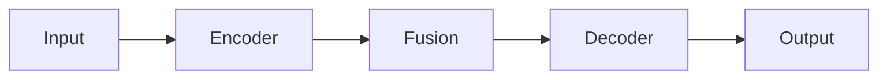

# Experiment Report Template

> This template defines the structure for `Report.md` generated by paperclaw-experiment-AI Phase 4.
> The strategist (opus) agent generates the report content; this file provides the skeleton.

---

## Header

```markdown
# Experiment Report

> Generated by paperclaw-experiment-AI
> Date: <timestamp>
> Proposal: <link to Proposal.md>
```

---

## Section 1: Method Design

### 1.1 Overview

High-level description matching the Proposal.md method section.

### 1.2 Architecture

Detailed architecture description with component names matching the code.

Include a Mermaid diagram for the method architecture. Prefer:
- `flowchart TD` for training/inference pipelines
- `graph LR` for module/architecture overviews
- `sequenceDiagram` for step-by-step algorithms

Example:


### 1.3 Key Components

For each key module/component:
- **Component Name** (`ours/<file>.py:<class_name>`)
  - Purpose: what it does
  - Input/Output: tensor shapes
  - Key idea: core innovation

### 1.4 Training Pipeline

Training procedure, loss functions, optimization details.

### 1.5 Implementation Details

Hyperparameters, augmentation, pre/post-processing.
- Code reference: `ours/train.py`

---

## Section 2: Datasets

For each dataset:

### <Dataset Name>
- **Task**: task description
- **Size**: number of samples, train/val/test split
- **Source**: URL
- **Description**: what the dataset contains, why it's relevant
- **Citation**: BibTeX key or full citation
- **Preprocessing**: any preprocessing applied

---

## Section 3: Comparison Methods

For each baseline:

### <Method Name>
- **Venue**: conference/journal, year
- **Core Idea**: 2-3 sentence summary
- **Key Difference from Ours**: what distinguishes it
- **Citation**: BibTeX key or full citation
- **Code**: GitHub URL

---

## Section 4: Experimental Results

### 4.1 Main Comparison

**Purpose**: What this experiment evaluates — the core claim.

Full result table from results.md.

**Analysis**:
- Key observations
- Statistical significance if applicable
- Performance gain of our method vs. best baseline

### 4.2 Ablation Study

**Purpose**: What component contributions this reveals.

Ablation table.

**Analysis**:
- Which components matter most
- Interaction effects if any

### 4.3 Claim Verification

For each claim from the Proposal:

| Claim | Experiment | Result | Verdict |
|-------|-----------|--------|---------|
| "captures long-range deps" | Attention span comparison | Ours 0.87 vs Baseline 0.62 | ✅ Supported |
| "more efficient" | FLOPs measurement | Ours 2.1G vs Baseline 3.5G | ✅ Supported |

If a claim is contradicted: `⚠️ CLAIM CONTRADICTION: [claim] — result shows [actual]`

### 4.4 Analysis Experiments

For each analysis experiment:

**Purpose**: What this analysis reveals.

Results/figures.

**Analysis**: Key insights.

---

## Section 5: Conclusion

### 5.1 Performance Highlights
- Metric improvements with exact numbers
  - "Our method achieves XX.X% on Dataset1, outperforming the best baseline (MethodA) by +Y.Y%"
- Consistency across datasets

### 5.2 Robustness
- Ablation insights — no single component failure
- Stability across hyperparameters if tested

### 5.3 Efficiency
- Training time comparison
- Inference speed comparison
- Parameter count comparison

### 5.4 Key Takeaways
1. Most important finding
2. Second most important finding
3. Third most important finding

---

## Section 6: Execution Log

### 6.1 Baseline Reproduction Summary

For each baseline (summarize from comparison.md):

#### <Method Name>
- **Iterations needed**: N
- **Key challenges**: Problem → Solution
- **Final status**: Matched / Approximate (within X%)

### 6.2 Our Method Development Summary

Summarize from ours.md:
- **Total iterations**: N
- **Key challenges**: Problem → Solution
- **Performance trajectory**: initial → final
- **Most impactful change**: description

---

## Section 7: Appendix

### 7.1 Server Configuration
From server.md.

### 7.2 Software Environment
pip freeze output, framework versions.

### 7.3 Reproduction Commands
Commands to reproduce key results.
