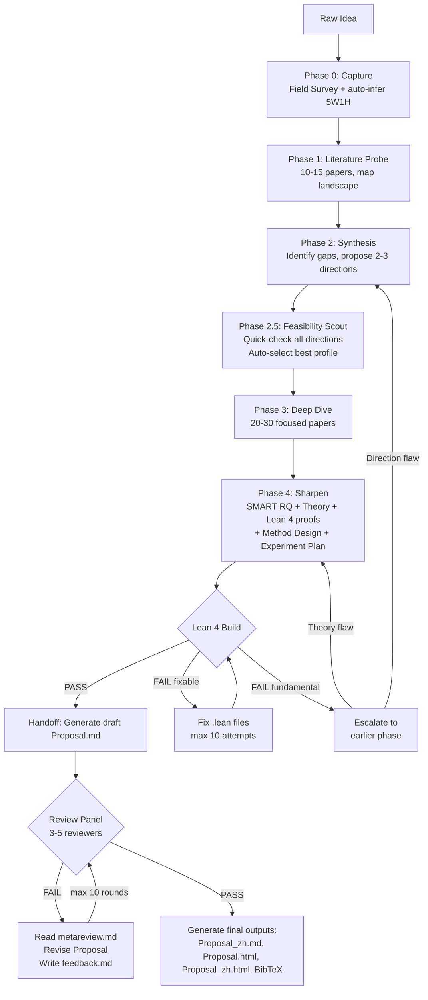

# PaperClaw Ideation AI — Iterative Research Idea Polishing Pipeline

An auto-pilot, literature-driven pipeline that takes a raw research spark and refines it through repeated cycles of search, synthesis, and autonomous decision-making until it reaches top-conference publication quality (target venues defined in `references/domain.md`).

## Core Principle

> **Maximize proposal quality under uncertainty.**
>
> You know the target conference's expectations from `references/domain.md` (reviewer priorities, common rejection reasons, what gets accepted), but you do NOT know the specific scoring rubric or pass/fail thresholds used by the independent review panel. Work as a real researcher would: make the proposal as strong as possible, then submit for external review. If the reviewers return qualitative feedback, iterate based on their concerns.
>
> The entire pipeline runs without user interaction. All decisions are made autonomously and logged to `./ideation/questions.md` for post-hoc user review. The user reviews the finished Proposal and can override any auto-decision by re-running.

---

## Agent Architecture

| Agent | Model | Role |
|-------|-------|------|
| `paperclaw-ideation-executor` | sonnet | Default workhorse — all web searches, literature collection, feasibility scouting, Lean 4 build execution, file management, HTML generation, Chinese translation, reference.bib |
| `paperclaw-ideation-strategist` | opus | High-judgment only — exactly 6 tasks |

### Strategist (opus) Triggers — exactly 6 tasks:

| Phase.Step | Task |
|-----------|------|
| 0.2-0.3 | Synthesize field survey → Background Briefing → 5W1H auto-inference |
| 2 (Task B1) | Gap analysis → propose 2-3 directions with trade-offs |
| 2.5 decision (Task B2) | Receive feasibility data from executor → auto-select best direction |
| 4.1-4.5 | SMART RQ + theoretical analysis + Lean 4 proof writing + method design + experiment plan |
| Handoff | Write complete Proposal.md draft (10 sections + appendices) |
| Revision | Interpret metareview feedback, revise Proposal.md, write feedback.md |

Everything else goes to the executor (sonnet).

**Flow:** The main session (this skill) is the **central dispatcher**. It drives a Phase state machine, dispatches executor and strategist as stateless single-task agents, outputs completion reports after every return, and syncs Tasks. Neither the executor nor the strategist spawns the other — the main session orchestrates all handoffs. The executor may escalate to the strategist for short, focused help on problems beyond its capability (see executor agent definition), but this is ad-hoc assistance, not a full task dispatch.

---

## Workflow Overview



Persist loop state to `./ideation/state.md` so the session can be resumed. All auto-decisions are logged to `./ideation/questions.md` for post-hoc review.

---

## Resume Protocol

When starting a new session, check if `./ideation/state.md` exists:

1. **If exists** → Read state.md to determine current phase and iteration
2. **Read papers.md** to know which papers have already been retrieved — do not re-search
3. **Read questions.md** to load all prior auto-decisions
4. **Resume** from the phase recorded in state.md, using these rules:

   | Phase in state.md | Action |
   |-------------------|--------|
   | `0`–`4` | Resume from that phase |
   | `review-pending` | Generate draft Proposal.md if missing, then invoke reviewing skill |
   | `revision-N` | Read `./ideation/reviews/iteration-N/metareview.md` and proceed with revision |
   | `user-revision` | Read `UserRevisionCycle` (C) and `UserRevisionRound` (R) from state.md; check `./ideation/reviews/user-C-R/` for `metareview.md` (review FAIL continuation) or `user_feedback.md` (fresh cycle entry); proceed with user-initiated revision |
   | `generating-outputs` | The reviewing skill already approved; go directly to **Research Proposal Output** section to generate `Proposal_zh.md`, `Proposal.html`, `Proposal_zh.html`, `reference.bib`. Do NOT re-invoke the reviewing skill. |
   | `Done` | If the user provides revision feedback in this invocation → enter **User-Initiated Revision Protocol**. Otherwise → report status and exit. |

5. **If review-pending, revision-N, or user-revision** → also read `./ideation/reviews/` for review history

If the user wants to restart a phase, they must explicitly say so.

### User Revision Protocol

When the user provides feedback on an existing Proposal (state = `Done` or any completed phase), this protocol handles all types of user-initiated changes — whether overriding auto-decisions or giving text-level revision feedback. Both follow the same flow: apply changes → re-run from affected phase → review loop → final outputs.

**Entry condition:** User invokes the skill with revision instructions, decision overrides, or feedback while state ≠ `revision-N`.

**Examples:**
```
"重新运行 ideation，修改决策 #2 为 Direction B"
"Re-run ideation, override decision #3: use contrastive learning instead"
"Section 5 的理论证明不够严谨，需要补充 convergence analysis"
"实验设计缺少 ablation study，请补充"
```

**State variables:**

| Variable | Meaning | Reset? |
|----------|---------|--------|
| `UserRevisionCycle` (C) | Which user-initiated revision cycle (1st, 2nd, …) | Never — increments each time user initiates a new revision |
| `UserRevisionRound` (R) | Which review round within the current cycle | Resets to 1 each new cycle; increments on each review FAIL |
| `UserRevisionBudget` (B) | Remaining review attempts in the current cycle | Resets to 3 each new cycle; decrements on each review FAIL |

**Directory rule:** `./ideation/reviews/user-C-R/` — e.g., `user-2-3/` = 2nd user revision, 3rd review round.

**Steps:**

1. Read current state.md — record existing `UserRevisionCycle` (default 0 if absent), set C = old + 1, R = 1, B = 3
2. Save user feedback verbatim to `./ideation/reviews/user-C-R/user_feedback.md`
3. Update state.md:
   - `Phase: user-revision`
   - `UserRevisionCycle: C`
   - `UserRevisionRound: R`
   - `UserRevisionBudget: B`
4. **Determine revision type and apply changes:**
   - **Decision override** (user references `questions.md` decision numbers or explicitly requests changing direction/method/dataset):
     1. Read `./ideation/questions.md` — load all prior auto-decisions
     2. Apply user overrides to the specified decision numbers
     3. Determine the **earliest affected phase** (e.g., overriding direction → Phase 2)
     4. Re-run from that phase forward, keeping unaffected prior decisions
     5. Regenerate `./Proposal.md`
   - **Text-level feedback** (user gives revision instructions on Proposal content):
     1. Invoke **Task E** (strategist revision task) using `./ideation/reviews/user-C-R/user_feedback.md` as feedback source. Mark it `Source: user-initiated` in the file header so the review orchestrator knows not to apply the 10-round hard stop.
     2. Task E determines which phases to revisit (see `references/iteration-loop.md`), re-runs from the earliest affected phase forward, and regenerates `./Proposal.md`
   - **If ambiguous** → use `AskUserQuestion` to clarify: "您希望修改 questions.md 中的自动决策（从受影响阶段重跑），还是对 Proposal 文本进行修改？"
5. Write `./ideation/reviews/user-C-R/feedback.md` documenting changes made
6. Set state to `Phase: review-pending` → main session enters the review loop (see Handoff & Review Loop)

**Review budget within this cycle:**

Each review attempt within this user-initiated cycle uses `UserRevisionBudget` (not the global `Iteration`):
- Review FAIL → set R = R+1, B = B-1 in state.md; metareview and aggregation are saved to `user-C-R/` (using the **old** R before increment); revision using metareview from that directory
- Review PASS → generate final outputs, set state to `Done`
- B reaches 0 → force generate final outputs with caveat note (same behavior as 10-round exhaustion)

**Directory naming:** Each review round gets its own `user-C-R/` directory. C identifies the cycle, R identifies the round within it. Both are readable directly from state.md on session restart — no derived counters.

```
Example: user initiates revision twice
  First cycle  (C=1, B=3→2): user-1-1/ → FAIL → user-1-1/metareview → revision → user-1-2/feedback → PASS → Done
  Second cycle (C=2, B=3→2→1→0): user-2-1/ → FAIL → user-2-1/metareview → user-2-2/feedback → FAIL → user-2-2/metareview → user-2-3/feedback → FAIL → Budget exhausted → Done (with caveat)
```

---

## Working Files

All internal files live under `./ideation/`:

| File | Type | Purpose |
|------|------|---------|
| `state.md` | Overwrite | Current phase, iteration, Lean 4 status |
| `log.md` | Append-only | Timestamped event log across all phases |
| `papers.md` | Append-only | Index of all papers ever retrieved |
| `literature.md` | Overwrite | Structured analysis notes from Phase 3 deep dive |
| `theory.md` | Overwrite | Problem formalization and theoretical analysis from Phase 4 |
| `questions.md` | Append-only | Auto-pilot decision log — source for Proposal Section 9 |
| `field-survey-results.md` | Overwrite | Raw field survey search results from Phase 0.1 |
| `feasibility.md` | Overwrite | Feasibility Comparison Table from Phase 2.5 |
| `reviews/` | Directory | Review panel records (managed by paperclaw-ideation-reviewing-AI) |
| `lean4/` | Directory | Lean 4 formal verification project |

Final outputs in project root (`./`):

| File | Format | Language |
|------|--------|----------|
| `Proposal.md` | Markdown | English |
| `Proposal_zh.md` | Markdown | Chinese |
| `Proposal.html` | HTML | English |
| `Proposal_zh.html` | HTML | Chinese |
| `reference.bib` | BibTeX | N/A |

**Update state.md** at: phase start, phase end, Lean 4 attempts, review handoff, revision start.

---

## Auto-Pilot Mode

This skill runs in **auto-pilot by default**: the entire pipeline executes without calling `AskUserQuestion`. Every decision point is handled autonomously and logged to `./ideation/questions.md`.

### Auto-Decision Priority

When choosing between options, apply this priority order:
1. **Feasibility** — can we actually execute this with available data, compute, and code?
2. **Significance** — does solving this matter to the community?
3. **Low risk** — avoid directions with concurrent work overlap or missing baselines
4. **Novelty** — prefer fresher angles, but not at the expense of feasibility

See **Appendix A** for the full auto-decision table showing what gets auto-decided at each phase.

---

## Tool Usage by Phase

| Phase | Tool | Purpose |
|-------|------|---------|
| Phase 0 | `WebSearch` | Field survey — dominant paradigms, key labs, breakthroughs, open problems |
| Phase 0 | (text output) | Background Briefing — educate user on field landscape |
| Phase 0 | `Write` | Auto-infer 5W1H, log decisions to `./ideation/questions.md` |
| Phase 1 | `WebSearch` | Search databases listed in `references/domain.md` for 10-15 papers |
| Phase 2 | `Write` | Log 2-3 proposed directions and trade-offs to `./ideation/questions.md` |
| Phase 2.5 | `WebSearch` | Feasibility Scout — quick-check all directions (always triggered) |
| Phase 2.5 | `Write` | Log feasibility comparison and auto-selected direction to `./ideation/questions.md` |
| Phase 3 | `WebSearch` | Deep search for 20-30 focused papers on the chosen direction |
| Phase 4 | `WebSearch` | Search for theoretical tools, proof techniques, and related formal analysis |
| Phase 4 | `Bash` | Install Lean 4 locally via elan (if not present); run `lake build` to verify proofs |
| Phase 4 | `Write` | Generate `.lean` files in `./ideation/lean4/`; log verification results to questions.md |
| Phase 4 | `Write` | Log SMART RQ and method design decisions to `./ideation/questions.md` |
| Handoff | `Write` | Generate draft `./Proposal.md`, update state to review-pending |
| Revision | `Read` | Read `./ideation/reviews/iteration-N/metareview.md` from review panel |
| Output | `Write` | Generate final `./Proposal.md`, `./Proposal_zh.md`, `./Proposal.html`, `./Proposal_zh.html`, `./reference.bib` (after review PASS) |
| Output | `WebSearch` | Search for official BibTeX entries (DBLP, Semantic Scholar) for `./reference.bib` |
| All | (Task sync) | Main session tracks phase progress via TaskCreate/TaskUpdate after every agent return |

**WebSearch best practices:**
- Construct queries using Boolean operators (see `references/literature-search-strategies.md`)
- Run 3-5 searches per phase with different keyword combinations
- Prioritize top-venue papers from the last 3 years
- Extract paper title, venue, year, and core claim from search results
- Record all papers found in `./ideation/papers.md` to avoid duplicate searches

---

## Phase 0: Capture the Spark

### Goal

Understand the raw idea well enough to search meaningfully. Do a field survey first, then present a background briefing, then auto-infer all 5W1H dimensions.

### Steps

#### Step 0.1: Field Survey (silent research, before any user interaction)

Before posing the first question, run 3-5 fast WebSearch queries to build a solid grasp of the field:
- What are the dominant paradigms and open problems in this area?
- Who are the key labs and recurring authors?
- What are the most-cited benchmarks or datasets?
- What recent breakthroughs or trend shifts have occurred (last 1-2 years)?
- What are the main unsolved challenges the community is actively working on?

Example search queries — see `references/domain.md` "Example Search Queries" section for domain-appropriate templates.

#### Step 0.2: Background Briefing (MUST present to user before auto-inference)

**This step is mandatory.** After completing the field survey, write and present a structured background briefing to the user. The briefing educates the user on the current state of the field and provides context for the auto-inferred decisions that follow. Write in the user's language.

```markdown
## Field Background Briefing: [Topic Area]

### Current Landscape
[2-3 paragraphs summarizing: What is this field about? What are the dominant approaches?
What has been achieved so far? Include specific method names, key papers, and performance
numbers where available.]

### Key Players & Venues
[Which research groups/labs are leading this area? Which conferences/journals publish
the most relevant work? List 3-5 key groups with their focus areas.]

### Recent Breakthroughs (Last 1-2 Years)
[What has changed recently? Any paradigm shifts, new datasets, new capabilities?
Highlight 2-3 specific papers or developments that reshaped the field.]

### Open Challenges & Active Debates
[What problems remain unsolved? Where does the community disagree?
List 3-5 concrete open questions, each with a brief explanation of why it matters.]

### Where Your Idea Fits (Initial Impression)
[Based on what you've shared so far, here's where your idea sits relative to the
landscape above. This is a preliminary assessment — we'll refine it together.]
```

**Quality requirements:** Must be substantive (specific paper names, method names, numbers, dates), 400-800 words, and explicitly connect the user's raw idea to the landscape. After presenting, proceed immediately to auto-inference.

#### Step 0.3: Auto-Infer 5W1H (no user interaction)

Infer all 5W1H dimensions from the raw idea + field survey results. For each dimension, synthesize the best answer from: (1) the user's raw idea text, (2) the field survey findings, (3) common sense about the research landscape.

| Dimension | Core Question | Auto-Inference Source |
|-----------|--------------|---------------------|
| **What** | What problem or phenomenon to study? | User's raw idea + field survey open problems |
| **Why** | Why does this problem matter? | Field survey: community interest, active debates, practical impact |
| **Who** | Target community and application users? | Infer from topic → most relevant top venue (see `references/domain.md`) |
| **When** | Timing context? | Field survey: recent breakthroughs, new capabilities, trending topics |
| **Where** | Domain or application scenario? | User's raw idea + field survey: standard benchmarks and datasets |
| **How** | Method or technical approach? | Field survey: dominant paradigms + identified gaps → most promising approach |

Mark each inference with a **confidence level** (High / Medium / Low). Prefer conservative, feasible choices when information is ambiguous.

**Log to `./ideation/questions.md`:** For each 5W1H dimension, record question, context, auto-inferred answer, reasoning, and confidence.

**Output:** A 1-paragraph idea summary presented to the user as text output, then auto-proceed to Phase 1.

### Completion Criteria

- [x] Field survey completed (3-5 WebSearches)
- [x] Background briefing presented to user
- [x] All 6 dimensions (What/Why/Who/When/Where/How) addressed with confidence levels
- [x] Summary is specific enough to generate meaningful search queries
- [x] Each auto-inference logged to `./ideation/questions.md`

---

## Phase 1: Literature Probe

### Goal

Map the existing landscape quickly. Coverage matters more than depth — do not go deep yet.

### Steps

**Search targets:**
- Databases and arXiv categories listed in `references/domain.md` (choose based on topic)
- Semantic Scholar for citation counts and influential papers
- Top-venue proceedings listed in `references/domain.md` (last 3 years)

**Search strategy:**
1. Extract 2-4 core concept pairs from Phase 0 summary
2. Build keyword variants (see `references/literature-search-strategies.md`)
3. Run 3-5 targeted searches; collect 10-15 most relevant papers
4. Skim abstracts and conclusions — do NOT read full papers at this stage

**Produce a Landscape Table:**

| Paper | Venue/Year | TLDR | Core Claim | Method | Key Limitation |
|-------|-----------|------|------------|--------|---------------|
| ... | ... | ... | ... | ... | ... |

Present this table to the user as Phase 1 output before continuing.

### Completion Criteria

- [x] Landscape table contains 10-15 papers (or 5-8 for niche topics — see `references/iteration-loop.md`)
- [x] Papers span the last 3 years and include recent SOTA
- [x] At least 2 different method families represented
- [x] Key limitations column filled for every paper

---

## Phase 2: Synthesis & Direction Proposals

### Goal

Identify gaps and propose 2-3 concrete research directions.

### Steps

**Gap analysis** (use `references/gap-analysis-guide.md`):
- Literature gaps: topics not yet studied
- Methodological gaps: common limitations across all existing methods
- Application gaps: theory-to-practice transfer opportunities
- Temporal gaps: new capabilities or demands not yet addressed

**Proposal format:** Always propose **exactly 2-3 directions** with explicit trade-offs. Lead with your recommended option and explain why.

```
Direction A: [Title]
  Core claim: ...
  Key insight: ...
  Why it could work: ...
  Main risk: ...
  Estimated novelty: High / Medium
  Estimated difficulty: Hard / Medium / Easy
  Feasibility signals: [known public datasets? reproducible baselines? compute estimate?]

Direction B: [Title]
  ...

Direction C: [Title]
  ...

My recommendation: Direction [X], because ...
```

Log the proposed directions and their trade-offs to `./ideation/questions.md`, then proceed to Phase 2.5.

### Completion Criteria

- [x] Exactly 2-3 directions proposed (not 1, not 4+)
- [x] Each direction has explicit trade-offs (risk vs. reward, novelty vs. feasibility)
- [x] Each direction includes feasibility signals (datasets, baselines, compute)
- [x] A clear recommendation given with reasoning
- [x] Gap analysis references specific papers from Phase 1 landscape table
- [x] All directions and trade-offs logged to `./ideation/questions.md`

---

## Phase 2.5: Feasibility Scout

### Goal

Quickly validate the feasibility of all 2-3 proposed directions before committing to the expensive Phase 3 deep-dive. Auto-select the direction with the best feasibility-significance profile.

**Trigger:** Always runs after Phase 2 in auto-pilot mode. This replaces the previous user choice step.

### Steps

**For each proposed direction, run 2-3 targeted WebSearches to check:**
1. **Dataset availability** — Are there public, commonly-used datasets for this direction? Are they accessible?
2. **Baseline reproducibility** — Do the key baseline papers have open-source code? Can results be reproduced?
3. **Concurrent work risk** — Are there very recent papers (< 3 months) that closely overlap this direction?
4. **Compute/resource fit** — Does this direction require resources beyond what is typical for the domain? (See `references/domain.md` "Resource Estimates" for thresholds.)

**Produce a Feasibility Comparison Table:**

```markdown
## Feasibility Scout Results

| Dimension | Direction A | Direction B | Direction C |
|-----------|------------|------------|------------|
| Public datasets | ✅ 3 datasets (X, Y, Z) | ⚠️ 1 dataset, proprietary | ✅ 2 datasets (X, Y) |
| Baselines with code | ✅ 4/5 have code | ❌ 1/5 have code | ✅ 3/5 have code |
| Concurrent work risk | ⚠️ 1 recent overlap | ✅ Low | ✅ Low |
| Compute feasibility | ✅ Within budget | ❌ Exceeds budget | ✅ Within budget |
| **Quick Score** | **★★★★☆** | **★★☆☆☆** | **★★★★☆** |

**Recommendation:** Direction [X], because it has the best feasibility profile: [specific reasoning].
**Runner-up:** Direction [Y] is also viable but carries risk in [dimension].
**Eliminated:** Direction [Z] has a critical blocker: [specific issue].
```

**Auto-select** the direction with the best feasibility profile, prioritizing: feasibility > significance > low concurrent-work risk > novelty. Log the full comparison table, selected direction, runner-up, and eliminated directions to `./ideation/questions.md`. Proceed directly to Phase 3.

**Cost budget:** ~6-9 WebSearches total (2-3 per direction).

### Completion Criteria

- [x] All proposed directions scouted (not just the recommended one)
- [x] Each feasibility dimension has specific evidence (paper names, dataset names, code links)
- [x] A clear recommendation given with reasoning tied to feasibility findings
- [x] Full comparison table and selection rationale logged to `./ideation/questions.md`

---

## Phase 3: Deep Dive

### Goal

Build a thorough literature foundation for the chosen direction.

### Steps

**Search targets:** 20-30 papers specifically on the chosen direction.

**Deliverables:**
1. **Comparison matrix** — methods, datasets, metrics, limitations side-by-side
2. **Gap card** — one paragraph precisely stating the gap this work will fill
3. **Baseline candidates** — 3-5 papers the proposed method must outperform

Save to `./ideation/literature.md`.

### Completion Criteria

- [x] 20-30 papers collected, focused specifically on the chosen direction
- [x] Comparison matrix covers methods, datasets, metrics, and limitations
- [x] Gap card is specific enough to directly inform a Related Work section
- [x] 3-5 baseline candidates identified with available code/reproducible results

---

## Phase 4: Sharpen the Research Question

### Goal

Produce a precise, SMART research question, a theoretical foundation with formal verification, and a detailed experimental plan.

### Steps

#### Step 4.1: SMART Research Question

Use `references/research-question-formulation.md`:
- **Specific**: name the method, task, and scenario explicitly
- **Measurable**: name the datasets and evaluation metrics
- **Achievable**: check resource and time feasibility
- **Relevant**: articulate academic and practical value
- **Time-bound**: estimate 3-month and 6-month milestones

#### Step 4.2: Problem Formalization & Theoretical Analysis

Formalize the research problem mathematically and build theoretical justification for the proposed approach. Save to `./ideation/theory.md`.

**Required content:**
1. **Problem formalization** — define the problem with precise mathematical notation (input space, output space, objective function, constraints)
2. **Mathematical model** — formulate the proposed approach as a formal optimization or learning problem
3. **Theoretical justification** — prove or argue why the proposed solution is superior to existing methods. Include any applicable:
   - Theorems with proofs (convergence guarantees, approximation bounds)
   - Generalization bounds (PAC-learning, Rademacher complexity, etc.)
   - Convergence rate analysis (optimization perspective)
   - Computational complexity analysis
   - Information-theoretic arguments (lower bounds, capacity)
4. **Key assumptions** — explicitly state all assumptions required for the theoretical results to hold

#### Step 4.3: Lean 4 Formal Verification

After generating `./ideation/theory.md`, formally verify key theoretical claims using Lean 4. This step creates a hard gate: if the core theorems cannot be machine-verified, the pipeline must fix the theory before proceeding.

##### 4.3.1 — Local Lean 4 Environment Setup

**Prefer system-level Lean 4 if available.** If `lean --version` and `lake --version` succeed, use system Lean 4 directly. Otherwise, install locally:

```bash
export ELAN_HOME="$(pwd)/ideation/lean4/.elan"
curl -sSf https://raw.githubusercontent.com/leanprover/elan/master/elan-init.sh | ELAN_HOME="$(pwd)/ideation/lean4/.elan" sh -s -- -y --default-toolchain none
export PATH="$(pwd)/ideation/lean4/.elan/bin:$PATH"
```

**Project initialization:**
```bash
mkdir -p ./ideation/lean4 && cd ./ideation/lean4
echo "leanprover/lean4:v4.18.0-rc1" > lean-toolchain
lake init IdeationProofs
```

If Mathlib is needed, add it to `lakefile.lean` and run `lake update && lake exe cache get`.

**On subsequent runs:** Check `./ideation/lean4/lakefile.lean` exists. If yes, just run `lake build`.

**If using local elan, all Bash commands MUST prefix with:**
```bash
export ELAN_HOME="$(pwd)/ideation/lean4/.elan" && export PATH="$(pwd)/ideation/lean4/.elan/bin:$PATH" &&
```

##### 4.3.2 — Identify Formalizable Claims

Scan `./ideation/theory.md` and classify each theoretical claim:

| Claim Type | Formalizable? | Example |
|-----------|--------------|---------|
| Convergence theorem | Yes | "Algorithm A converges at rate O(1/t)" |
| Approximation bound | Yes | "Error ≤ epsilon for all inputs in class C" |
| Algebraic property | Yes | "Operator T is a contraction mapping" |
| Complexity bound | Yes | "Algorithm runs in O(n log n)" |
| Generalization bound | Partially | PAC bounds — structure formalizable, constants may need sorry |
| Empirical claim | No | "Method X outperforms Y on dataset Z" |
| Intuitive argument | No | "This should work because..." |

**Rules:**
- Only formalize claims marked "Yes" or "Partially"
- For "Partially" formalizable: formalize structure, use `sorry` for empirical sub-goals, document why
- **Lean 4 verification is MANDATORY for all theoretical claims.** If theory.md contains ANY theorem, proposition, lemma, convergence claim, bound, or complexity claim, you MUST attempt formalization. The independent review panel will audit whether theoretical claims warranted formal verification.
- For purely empirical work with zero formalizable claims: log to questions.md that no formalizable claims exist, with evidence (list the claims in theory.md and explain why each is empirical/non-formalizable)

##### 4.3.3 — Generate Lean 4 Code

For each formalizable claim, create a `.lean` file in `./ideation/lean4/IdeationProofs/`:

**File naming:** `Theorem1.lean`, `Theorem2.lean`, etc. — one file per major theorem/proposition.

**Code structure:**
```lean
/-
  Theorem: [name from theory.md]
  Source: theory.md, Section [N]
  Claim (NL): [exact natural language statement from theory.md]
  Assumptions used: [list A1, A2, ... from theory.md that appear as hypotheses below]
-/
import Mathlib.Topology.MetricSpace.Basic  -- import as needed

-- Definitions (must match theory.md Section notation exactly)
def [relevant_definitions] := ...

-- Main theorem
theorem [theorem_name] : [formal_statement] := by
  [proof_tactics]
```

**Guidelines:**
- Import from Mathlib for standard math objects (metric spaces, norms, probability, measure theory)
- Prefer simple tactic proofs (`simp`, `ring`, `omega`, `linarith`, `norm_num`) over term-mode
- Every `sorry` must have a comment explaining why it cannot be proven at this stage AND its type label (see 4.3.5b)
- Register new files in `./ideation/lean4/IdeationProofs.lean` (root file that imports all modules)

**Mandatory self-audit after writing each `.lean` file (before compiling):**

Answer each question in writing (append to `./ideation/questions.md` under a "Lean Self-Audit" header). Fix any "no" or "problem" answers before proceeding to 4.3.4.

1. **Statement match** — Does the Lean `theorem` statement express exactly the same mathematical claim as the NL statement in `theory.md`? Does it prove the full general case, or only a special case / restricted version? If the Lean statement is weaker than the NL claim, fix it to match the full claim.

2. **Assumption honesty** — List every hypothesis in the Lean theorem (`h1 : ...`, `(hn : ...)`). Cross-reference with assumptions A1, A2, ... in `theory.md`. Any Lean hypothesis NOT present in the NL statement must be justified: is it a known mathematical prerequisite the NL proof implicitly uses (e.g., completeness for a fixed-point theorem, measurability for an expectation), or was it added to make the proof easier? If artificially added, remove it and strengthen the proof instead.

3. **Definition consistency** — Every `def` in the Lean file must match the corresponding notation in `theory.md`. If `theory.md` defines a loss function as `ℓ(x,y) = ‖x−y‖²`, the Lean `def` must encode exactly that, not a simplified proxy.

4. **sorry pre-classification** — For each `sorry` you plan to include, answer before writing it:
   - Which step of the NL proof does this sorry cover?
   - Is this step the central insight or key contribution of the theorem? If yes → **do not write sorry**, attempt to prove it.
   - Is this step a standard mathematical fact? Try `exact?`, `simp`, `linarith`, `norm_num` first. Sorry only if Mathlib lookup genuinely fails.
   - Is this step empirical (requires dataset statistics or experimental constants)? Sorry is acceptable — label `-- SORRY TYPE: Empirical`.
   - Is this step a known result not yet in Mathlib? Sorry is acceptable — label `-- SORRY TYPE: Library gap` with a reference to a textbook or paper.

**Rule:** Write the hardest proof steps first. Every sorry is a deliberate, classified decision — not a placeholder.

##### 4.3.4 — Compile and Check

```bash
export ELAN_HOME="$(pwd)/ideation/lean4/.elan" && export PATH="$(pwd)/ideation/lean4/.elan/bin:$PATH" && cd ./ideation/lean4 && lake build
```

**Bash timeout:** Use `run_in_background: true` for `lake build` so the build runs asynchronously — first-time Mathlib download can take 10–30 minutes, which exceeds the Bash tool's 600-second maximum. The executor will be notified when the build completes. For subsequent builds with a warm `.lake/` cache, a foreground Bash call with `timeout: 300000` (5 minutes) is acceptable — check for `.lake/packages/` existence to decide which mode to use.

##### 4.3.5 — Result Classification

| Result | Classification | Action |
|--------|---------------|--------|
| Build succeeds, no sorry | **FULL PASS** | Proceed to Step 4.4. Log success to questions.md. |
| Build succeeds, all sorries are Empirical / Library gap / Simplification type | **PARTIAL PASS** | Run sorry classification (4.3.5b) first. If all sorries pass classification, proceed to Step 4.4. |
| Build succeeds, but sorry covers a Core step | **CORE SORRY** | Do NOT accept as PARTIAL PASS. Attempt to prove the core step (see 4.3.5b). Counts toward retry limit. |
| Build succeeds, but Lean theorem statement is materially weaker than the NL claim | **FORMAL MISMATCH** | Do NOT accept. Fix the Lean statement to match the NL claim, then re-prove. Does NOT count toward retry limit (it is a formalization error, not a proof failure). |
| Build fails: type mismatch / tactic failure | **Proof Error** | Analyze error → retry (counts toward limit). |
| Build fails: unknown identifier / import error | **Syntax Error** | Fix imports/definitions → retry (does NOT count toward limit). |
| Build fails: timeout / OOM | **Resource Error** | Simplify theorem → retry (counts toward limit). |

##### 4.3.5b — sorry Classification and Mandatory Elimination

After every successful build with `sorry`, classify each sorry before accepting the result.

| Sorry Type | Definition | Acceptable? | Label |
|-----------|-----------|-------------|-------|
| **Empirical** | Sub-goal requires experimental data (dataset statistics, measured constants) | Yes | `-- SORRY TYPE: Empirical` |
| **Library gap** | Standard mathematical fact not yet in Mathlib; cite a reference | Yes | `-- SORRY TYPE: Library gap — [reference]` |
| **Simplification** | Tedious algebraic manipulation that is not the key insight; max 1–2 per file | Yes | `-- SORRY TYPE: Simplification` |
| **Core** | The central lemma that IS the paper's theoretical contribution | **No** | Must be proven |

**For each Core sorry, mandatory elimination attempt:**
1. Try up to 5 additional proof strategies (each counts toward the retry limit in 4.3.6)
2. Try decomposing into smaller intermediate lemmas and proving each
3. If still failing: determine whether the NL claim itself is too strong → if so, update `theory.md` to weaken the claim appropriately, then restart 4.3.3 for this theorem (triggers escalation check in 4.3.7)

**Acceptance rule:** PARTIAL PASS is valid only when every sorry is Empirical, Library gap, or Simplification. A single Core sorry is a proof failure.

##### 4.3.6 — Retry Logic

**Max retries:** 10 proof-error attempts per gate iteration. Track in `./ideation/state.md` as `Lean4Attempt: N`.

**On Proof Error (counts toward limit):**
1. Parse Lean 4 error — identify which theorem and proof step failed
2. Diagnose:
   - **Wrong proof strategy** → rewrite tactics, keep theorem statement
   - **Wrong theorem statement** → theory.md claim may be incorrect → update theory.md, regenerate .lean
   - **Missing lemma** → add intermediate lemma and retry
3. Log error, diagnosis, and fix plan to `./ideation/questions.md`
4. Retry from step 4.3.3

**On Syntax Error (does NOT count toward limit):** Fix and retry immediately.

**Early escalation (at any point):** If retries reveal the **approach itself is flawed** (not just a proof difficulty) — e.g., theorem statements keep changing across attempts — escalate immediately (see 4.3.7). This can happen at any retry count.

**After 10 failed attempts:**
- If theorem *statement* kept changing → theory may be unsound → **escalate** (see 4.3.7)
- If only proof *strategy* failed but statement seems correct → proceed to Step 4.4 with soundness penalty flag

##### 4.3.7 — Escalation (Fundamental Flaw Detected)

If retries reveal a **fundamental flaw** in the approach (not just proof difficulty):
1. Log to questions.md: "Lean 4 verification revealed fundamental flaw: [description]"
2. Set `Lean4Escalation: true` in `./ideation/state.md`
3. Do NOT proceed to Step 4.4. Instead loop back to:
   - **Phase 4 Step 4.2** — if formalization needs rethinking (weaken assumptions, change bounds)
   - **Phase 3** — if gap analysis needs revision (the approach itself is wrong)
   - **Phase 2** — if the direction is fundamentally unsound
4. This escalation is separate from the Gate loop-back — it happens within Phase 4 itself

#### Step 4.4: Method Design

Describe the proposed method in detail. This should be concrete enough to serve as a blueprint for implementation:
- Architecture or algorithm overview (with pseudocode or diagram if applicable)
- Key components and their roles
- Training/inference procedure
- How the method addresses the identified gap

#### Step 4.5: Experimental Plan

Design a comprehensive experimental plan:
- Datasets (with sizes, splits, preprocessing)
- Baselines to compare against (with citations)
- Evaluation metrics (primary and secondary)
- Experiments to conduct:
  - Main comparison with SOTA
  - Ablation studies (which components contribute how much)
  - Analysis experiments (visualization, case studies, sensitivity analysis)
- Expected results (what does "better" look like, quantitatively?)

### Completion Criteria

- [x] Research question satisfies all 5 SMART dimensions
- [x] Problem formally defined with mathematical notation
- [x] At least one theoretical result (theorem, bound, or formal argument) provided
- [x] Formalizable claims from theory.md identified and classified
- [x] Lean 4 project exists in `./ideation/lean4/` (or skip justified for purely empirical work)
- [x] All formalizable theorems have corresponding `.lean` files
- [x] Self-audit completed for each `.lean` file (statement match, assumption honesty, definition consistency, sorry pre-classification) — logged to questions.md
- [x] `lake build` passes (FULL PASS or PARTIAL PASS — no FORMAL MISMATCH, no CORE SORRY)
- [x] Every sorry classified by type (Empirical / Library gap / Simplification); no Core sorry remains
- [x] Every Lean 4 attempt logged to `./ideation/questions.md`
- [x] Method description names specific techniques with enough detail for implementation
- [x] At least 1 dataset and 1 metric named explicitly
- [x] Experimental plan includes main comparison, ablation, and analysis experiments
- [x] Expected result is quantifiable or clearly falsifiable

---

## Main Session Orchestration

### Architecture

The main session (this skill) is the **central dispatcher** for the entire ideation pipeline. It spawns executor and strategist agents as stateless single-task workers, collects their results, outputs completion reports to the user, and updates Tasks after every return. Neither the executor nor the strategist drives the pipeline — the main session orchestrates all handoffs.

### Dispatch Sequence

```
Phase 0.1  → Executor: field-survey
Phase 0.2  → Strategist: Task A (synthesis + 5W1H)
Phase 1    → Executor: literature-probe
Phase 2    → Strategist: Task B1 (gap analysis + directions)
Phase 2.5  → Executor: feasibility-scout
Phase 2.5  → Strategist: Task B2 (direction selection)
Phase 3    → Executor: deep-dive
Phase 4    → Strategist: Task C (RQ + theory + Lean 4 proofs + method + experiment)
Phase 4.3  → Executor: lean4-build
               └─ On proof error → Strategist: Task C retry → Executor: lean4-build (loop, max 10)
Handoff    → Strategist: Task D (write Proposal.md)
Review     → Invoke reviewing skill
               └─ On FAIL → Strategist: Task E (revision) → Review (loop)
               └─ On PASS → Executor: generate-outputs
Done
```

### Dispatch Rules

1. After **every** Agent() return, the main session:
   a. Reads the returned result
   b. Updates `./ideation/state.md` with current phase
   c. Appends to `./ideation/log.md` with timestamp
   d. Syncs Tasks (TaskCreate/TaskUpdate)
   e. Outputs a completion report to the user (see User-Facing Output below)
   f. Dispatches the next agent

2. Each agent receives **full context** in its prompt:
   - Current phase and step
   - Relevant working file contents (read before dispatching)
   - What the agent should produce and where to write it

3. Agents are stateless — they do NOT read state.md to decide what to do. The main session tells them exactly what to do.

### Dispatch Prompts

#### Phase 0.1 → Executor: field-survey
```
Task: field-survey
Idea: <user's raw idea>
Instructions: Run 3-5 WebSearch queries to map the field landscape.
Collect dominant paradigms, key labs, breakthroughs, open problems, benchmarks.
Write raw results to ./ideation/field-survey-results.md.
Do NOT synthesize — just collect.
```

#### Phase 0.2-0.3 → Strategist: Task A
```
Task: synthesis
Input: <field-survey-results.md content>
Raw Idea: <user's raw idea>
Instructions: Synthesize Background Briefing, auto-infer 5W1H, write
1-paragraph summary. Write decisions to ./ideation/questions.md.
Present the Background Briefing as text output.
```

#### Phase 1 → Executor: literature-probe
```
Task: literature-probe
Idea Summary: <1-paragraph from Task A>
5W1H: <inferred dimensions>
Instructions: Search 10-15 papers, build Landscape Table,
write to ./ideation/papers.md.
```

#### Phase 2 → Strategist: Task B1
```
Task: gap-analysis
Input: <papers.md content>
Instructions: Analyze gaps, propose 2-3 directions with trade-offs.
Write to ./ideation/questions.md.
```

#### Phase 2.5 → Executor: feasibility-scout
```
Task: feasibility-scout
Directions: <2-3 directions from Task B1>
Instructions: For each direction, check dataset availability, baseline
reproducibility, concurrent work risk. Build Feasibility Comparison Table.
Write to ./ideation/feasibility.md.
```

#### Phase 2.5 → Strategist: Task B2
```
Task: direction-selection
Input: <directions + feasibility.md content>
Instructions: Auto-select best direction. Log to ./ideation/questions.md.
```

#### Phase 3 → Executor: deep-dive
```
Task: deep-dive
Direction: <chosen direction>
Existing Papers: <papers.md content>
Instructions: Search 20-30 papers on chosen direction, build comparison
matrix, identify baselines. Write to ./ideation/literature.md,
append to ./ideation/papers.md.
```

#### Phase 4.1-4.5 → Strategist: Task C
```
Task: research-sharpening
Input: <literature.md, theory.md (if exists), questions.md>
Direction: <chosen direction>
Instructions: SMART RQ, problem formalization, theoretical analysis,
Lean 4 proofs, method design, experiment plan.
Write to: ./ideation/theory.md, ./ideation/lean4/IdeationProofs/*.lean,
./ideation/questions.md.
```

#### Phase 4.3 → Executor: lean4-build
```
Task: lean4-build
Instructions: Set up Lean 4 env if needed. Run lake build.
Classify result: FULL PASS / PARTIAL PASS / Proof Error / Syntax Error.
On Syntax Error: fix and retry (does not count toward limit).
Return build result and error output (if any).
```

#### Lean 4 Retry Loop (main session logic)
```
If lean4-build returns Proof Error:
  1. Increment Lean4Attempt in state.md
  2. Dispatch Strategist: lean4-fix (NOT a full Task C re-run)
  3. Dispatch Executor: lean4-build again
  4. Repeat up to Lean4Attempt=10
  5. If still failing: set Lean4Escalation=true, log to questions.md, continue
```

**Lean 4 fix dispatch prompt (strategist):**
```
Task: lean4-fix (narrow scope — do NOT redo RQ, method design, or experiment plan)
Attempt: <N>/10
Build Error: <full lake build error output>
Current .lean files: <list of files and their content>
theory.md: <relevant section>
Instructions: Analyze the Lean 4 build error. Diagnose whether the issue is
a wrong proof strategy, wrong theorem statement, or missing lemma.
Fix ONLY the affected .lean files. Do NOT modify theory.md unless the theorem
statement itself is wrong. Return a summary of what was changed.
```

#### Handoff → Strategist: Task D
```
Task: write-proposal
Input: <all working files: theory.md, literature.md, papers.md,
questions.md, log.md, lean4 source + build logs>
Instructions: Write complete ./Proposal.md (10 sections + appendices).
Proposal must be completely self-contained.
```

**CRITICAL: Proposal.md is the ONLY document the review panel sees.** Reviewers cannot access `./ideation/theory.md`, `./ideation/lean4/`, `./ideation/literature.md`, or any working files. The Proposal must be **completely self-contained** with full theory, complete proofs, full Lean 4 source code, and comprehensive literature analysis. Do NOT summarize or abbreviate — include everything the reviewers need to evaluate the proposal's quality.

After Task D returns, the main session:
1. Writes `./ideation/state.md` with `Phase: review-pending`
2. Appends to `./ideation/log.md`: "Phase 4 complete. Proposal draft generated. Handing off to review panel."
3. Enters the Review Loop below.

#### Review Loop (main session logic)
```
LOOP:
  1. Invoke paperclaw-ideation-reviewing-AI skill
     → Returns GATE: PASS | FAIL | USER-REVISION-FAIL | FORCE-PROCEED

  2. Parse the gate result:
     - GATE: PASS →
         Dispatch Executor: generate-outputs
         Update state.md: Phase: Done
         EXIT LOOP

     - GATE: FAIL | iteration=N | metareview=<path> →
         Dispatch Strategist: Task E (revision)
           prompt includes: metareview path, current Proposal.md, all working files
         After return: set state to review-pending
         CONTINUE LOOP

     - GATE: USER-REVISION-FAIL | cycle=C | round=R | metareview=<path> →
         Dispatch Strategist: Task E (revision)
           prompt includes: metareview path, user feedback path
         After return: set state to review-pending
         CONTINUE LOOP

     - GATE: FORCE-PROCEED | reason=<reason> →
         Dispatch Executor: generate-outputs (with caveat note)
         Update state.md: Phase: Done
         EXIT LOOP
```

#### Executor: generate-outputs
```
Task: generate-outputs
Input: <Proposal.md content>
Instructions: Generate Proposal_zh.md, Proposal.html, Proposal_zh.html,
reference.bib. Do NOT alter Proposal.md. Follow rendering rules in
Research Proposal Output section. Validate all 5 output files exist.
```

### User-Facing Output (Completion Reports)

After **every** agent return, the main session outputs a structured completion report. The user must never be left wondering what just happened.

**Output Rules:**
1. Output IMMEDIATELY after each Agent() return — before any next dispatch
2. Use English
3. Keep concise — key facts only
4. Include "Action:" line showing what happens next

**Template 1 — Phase Completed:**
```
━━━━━━━━━━━━━━━━━━━━━━━━━━━━━━━━━━━
IDEATION PROGRESS — Phase <N> Complete
━━━━━━━━━━━━━━━━━━━━━━━━━━━━━━━━━━━
Result: <one-line summary of what was produced>
Key Finding: <one-line highlight>
Action: <what the main session will dispatch next>
━━━━━━━━━━━━━━━━━━━━━━━━━━━━━━━━━━━
```

**Template 2 — Review Result:**
```
━━━━━━━━━━━━━━━━━━━━━━━━━━━━━━━━━━━
REVIEW RESULT — Iteration <N>
━━━━━━━━━━━━━━━━━━━━━━━━━━━━━━━━━━━
Gate: PASS | FAIL
Key Concerns:
  1. <concern 1>
  2. <concern 2>
Action: <starting revision / generating outputs>
━━━━━━━━━━━━━━━━━━━━━━━━━━━━━━━━━━━
```

**Template 3 — Revision Completed:**
```
━━━━━━━━━━━━━━━━━━━━━━━━━━━━━━━━━━━
REVISION COMPLETE — Iteration <N>
━━━━━━━━━━━━━━━━━━━━━━━━━━━━━━━━━━━
Changes: <summary of what changed>
Phases Revisited: <which phases>
Action: Re-submitting to review panel...
━━━━━━━━━━━━━━━━━━━━━━━━━━━━━━━━━━━
```

**Template 4 — Pipeline Complete:**
```
━━━━━━━━━━━━━━━━━━━━━━━━━━━━━━━━━━━
IDEATION COMPLETE
━━━━━━━━━━━━━━━━━━━━━━━━━━━━━━━━━━━
Review: PASS (iteration <N>)
Output Files:
  - Proposal.md       — English proposal
  - Proposal_zh.md    — Chinese translation
  - Proposal.html     — Styled HTML
  - Proposal_zh.html  — Chinese HTML
  - reference.bib     — BibTeX references
Total iterations: <N> | Papers cited: <M>
━━━━━━━━━━━━━━━━━━━━━━━━━━━━━━━━━━━
```

### Task Sync

The main session maintains a `paperclaw-ideation` task updated after every agent return:

```
Phase 2.5: Direction Selection (6/12 steps done)
 ✅ Field survey: 5 searches, landscape mapped
 ✅ Synthesis: Background Briefing ready, 5W1H inferred
 ✅ Literature probe: 12 papers collected
 ✅ Gap analysis: 3 directions proposed
 ✅ Feasibility scout: all directions checked
 🔄 Direction selection: strategist deciding...
 ⏳ Deep dive (20-30 papers)
 ⏳ Research sharpening (RQ + theory + Lean 4)
 ⏳ Lean 4 build
 ⏳ Proposal writing
 ⏳ Review
 ⏳ Final outputs
Next: strategist selecting direction
```

---

## Research Proposal Output

Generated after the independent review panel signals PASS (or after max iterations with caveat). The initial draft `./Proposal.md` is generated at the end of Phase 4 for review; the final CN/HTML/BibTeX files are generated only after the review panel approves.

**Five output files:**

| File | Format | Language | Purpose |
|------|--------|----------|---------|
| `./Proposal.md` | Markdown | English | Source of truth, version-controlled |
| `./Proposal_zh.md` | Markdown | Chinese | Chinese translation for local reading and paper writing |
| `./Proposal.html` | HTML | English | Readable standalone document with styling |
| `./Proposal_zh.html` | HTML | Chinese | Chinese translation for local collaboration |
| `./reference.bib` | BibTeX | N/A | BibTeX entries for all cited papers |

`Proposal_zh.md` is a direct Chinese translation of `Proposal.md`. Keep all method names, dataset names, mathematical notation, and citations in English. Use parenthetical English for key technical terms, e.g., "消融实验 (Ablation Study)". All five Proposal files share the same 10-section structure (Sections 1-8 are content; Section 9 is the auto-pilot decision log; Section 10 is the reference list).

### reference.bib Generation

After generating the three Proposal files, produce `./reference.bib`:

1. Search for the official BibTeX entry (from the venue website, DBLP, or Semantic Scholar)
2. If the official entry cannot be found via search, construct one from `./ideation/papers.md`:
   ```bibtex
   @inproceedings{AuthorYear,
     title     = {Paper Title},
     author    = {Author1 and Author2 and ...},
     booktitle = {Venue Full Name},
     year      = {Year},
     note      = {BibTeX auto-generated -- verify before submission}
   }
   ```
3. Use consistent cite keys: first author's surname + year (e.g., `Kwon2020`, `Hottung2022`)
4. Mark auto-generated entries with `note = {BibTeX auto-generated}` so the user knows to verify

See `<ref-dir>/proposal-structure.md` for the full Proposal structure template (Sections 1-10) and `<ref-dir>/html-rendering-rules.md` for HTML rendering rules.

---

## Appendix

### A. Auto-Decision Table

| Decision Point | Original Behavior | Auto-Pilot Behavior |
|---------------|-------------------|---------------------|
| Phase 0 Q&A | Ask user 5W1H one-by-one | Auto-infer from raw idea + field survey |
| Phase 0 summary confirmation | Wait for user OK | Auto-proceed, log to questions.md |
| Phase 2 direction choice | AskUserQuestion with options | Always trigger Phase 2.5 Feasibility Scout |
| Phase 2.5 confirmation | Wait for user to confirm recommendation | Auto-select best feasibility profile |
| Phase 4 RQ/method confirmation | AskUserQuestion | Auto-proceed, log to questions.md |
| Phase 4 Lean 4 verification | N/A (new) | Auto-retry on failure (max 10), auto-escalate if fundamental flaw |
| Proposal handoff | N/A | Generate draft Proposal.md, set state to review-pending, await external review |
| Revision from feedback | N/A | Read qualitative feedback from review panel, iterate on weakest areas |

### B. Persistent Mental Frameworks

These two frameworks apply at **every phase**, not just Phase 0. Revisit them actively after each new piece of evidence (a paper, reviewer feedback, a feasibility finding).

#### 5W1H — Continuously Updated

The 5W1H is not a one-time questionnaire. Treat it as a living model of the idea that gets sharper with each iteration:

| Dimension | What to re-examine after new evidence |
|-----------|--------------------------------------|
| **What** | Is the problem statement still precise? Did new papers reveal a better framing? |
| **Why** | Is the motivation still the strongest available? Did we find a more compelling failure case? |
| **Who** | Has the target community or application user changed with the chosen direction? |
| **When** | Is there new concurrent work that changes the timing? |
| **Where** | Has the domain or application scenario become more or less promising? |
| **How** | Is the method intuition still the best fit given what we now know from the literature? |

If any dimension weakens after new evidence, flag it explicitly and address it before moving to the next phase.

#### First Principles Thinking — Always On

At every decision point, strip away assumptions and reason from fundamentals:

1. **Decompose the problem** — break the research question into its most basic components. What is the core tension or trade-off that makes this hard?
2. **Challenge inherited assumptions** — question every "everyone does it this way" claim. Why does the field use this method? Is the reason still valid?
3. **Rebuild from scratch** — given only the fundamental constraints (data, compute, physics, math), what is the most natural solution? Compare it to what the field actually does.
4. **Identify the real bottleneck** — what is the single constraint that, if removed, would make this problem trivial? That constraint is often the most valuable thing to attack.
5. **Avoid analogy-driven reasoning** — "this worked in domain X so it should work here" is a hypothesis, not a justification. Ground every claim in first principles before committing to a direction.

### C. Proposal Structure Template

> See `references/proposal-structure.md` for the full 10-section Proposal template with detailed generation instructions for each section, citation conventions, Lean 4 verification requirements, and Proposal appendix sections (Review Panel Summary, Timeline, Risks & Mitigations).

### D. HTML Rendering Rules

> See `references/html-rendering-rules.md` for collapsible section rules (proofs, Lean 4 code), CSS styling, KaTeX/Mermaid rendering, and Markdown vs. HTML differences.

### E. File Templates

> See `references/file-templates.md` for complete format templates of state.md, log.md, papers.md, and questions.md.

### F. Tool Reference

| Tool | Primary Use |
|------|-------------|
| `WebSearch` | Literature search, field survey, baseline research, BibTeX lookup |
| `Write` / `Edit` | All working files, Proposal files, Lean 4 code |
| `Read` | Metareview, state.md, papers.md, existing working files |
| `Bash` | Lean 4 installation and `lake build` |
| `TaskCreate` / `TaskUpdate` | Main session tracks phase progress (never used by executor/strategist) |

---

## Key Interaction Principles

1. **Auto-pilot by default** — run the full pipeline without user interaction
2. **Log every auto-decision** — every decision recorded in `./ideation/questions.md` with question, context, auto-choice, reasoning, and confidence
3. **Always propose 2-3 options internally** — never commit to one path without considering alternatives; log all options even if only one is chosen
4. **Literature first, speculation second** — every claim must be grounded in papers
5. **First principles always on** — at every decision point, decompose to fundamentals, challenge inherited assumptions (see Appendix B)
6. **5W1H is a living model** — revisit all six dimensions after every new piece of evidence, not just in Phase 0 (see Appendix B)
7. **Hand off to review** — after generating draft Proposal.md, invoke the reviewing skill immediately. You know the conference bar from domain.md but not the scoring mechanics.
8. **Feasibility-first selection** — when choosing between options, prioritize feasibility > significance > low risk > novelty
9. **YAGNI for scope** — cut any claim or experiment that is not needed to demonstrate the core insight
10. **Resume from state** — always check `./ideation/state.md` and `./ideation/questions.md` before starting; append to `./ideation/log.md` after every phase
11. **Language matching** — detect the language of the user's message and use that language for all working documents (state.md, log.md, literature.md, theory.md, questions.md) and conversational output. Proposal files follow fixed language rules: Proposal.md/Proposal.html = English; Proposal_zh.md/Proposal_zh.html = Chinese; reference.bib = language-neutral.
12. **Override support** — when re-invoked with override instructions, read `./ideation/questions.md`, apply overrides, and re-run from the earliest affected phase

---

## Reference Files

These files are co-located with this skill. Try paths in order until one succeeds:
- **Project install:** `.claude/skills/paperclaw-ideation-AI/references/`
- **Global install:** `~/.claude/skills/paperclaw-ideation-AI/references/`

Load on demand:
- `<ref-dir>/domain.md` — **domain configuration** (target venues, databases, resource estimates, domain examples). Replace this file to adapt the skill for a different research domain.
- `<ref-dir>/proposal-template.md` — **Proposal.md structure skeleton** (10-section template with appendices). The authoritative structure for generated Proposals.
- `<ref-dir>/proposal-structure.md` — **full Proposal generation instructions** (detailed content guidance for all 10 sections, citation conventions, Lean 4 verification requirements, appendix sections)
- `<ref-dir>/html-rendering-rules.md` — **HTML rendering rules** (collapsible sections, CSS styling, KaTeX/Mermaid, Markdown vs. HTML differences)
- `<ref-dir>/file-templates.md` — **working file format templates** (state.md, log.md, papers.md, questions.md)
- `<ref-dir>/proposal-html-template.html` — **HTML/CSS template** for Proposal.html / Proposal_zh.html (KaTeX math, Mermaid diagrams, collapsible proofs/Lean 4 code).
- `<ref-dir>/iteration-loop.md` — detailed loop logic and loop-back decision tree
- `<ref-dir>/gap-analysis-guide.md` — 5 gap types, analysis dimensions, examples
- `<ref-dir>/5w1h-framework.md` — 5W1H framework for Phase 0
- `<ref-dir>/literature-search-strategies.md` — keyword construction and database search tips
- `<ref-dir>/research-question-formulation.md` — SMART criteria, question types, evaluation
