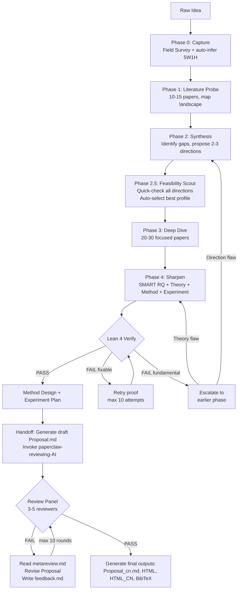

# PaperClaw Ideation AI — Iterative Research Idea Polishing Pipeline

An auto-pilot, literature-driven pipeline that takes a raw research spark and refines it through repeated cycles of search, synthesis, and autonomous decision-making until it reaches top-conference publication quality (target venues defined in `references/domain.md`).

## Core Principle

> **Maximize proposal quality under uncertainty.**
>
> You know the target conference's expectations from `references/domain.md` (reviewer priorities, common rejection reasons, what gets accepted), but you do NOT know the specific scoring rubric or pass/fail thresholds used by the independent review panel. Work as a real researcher would: make the proposal as strong as possible, then submit for external review. If the reviewers return qualitative feedback, iterate based on their concerns.
>
> The entire pipeline runs without user interaction. All decisions are made autonomously and logged to `./ideation/questions.md` for post-hoc user review. The user reviews the finished Proposal and can override any auto-decision by re-running.

---

## Workflow Overview



Persist loop state to `./ideation/state.md` so the session can be resumed. All auto-decisions are logged to `./ideation/questions.md` for post-hoc review.

---

## Resume Protocol

When starting a new session, check if `./ideation/state.md` exists:

1. **If exists** → Read state.md to determine current phase and iteration
2. **Read papers.md** to know which papers have already been retrieved — do not re-search
3. **Read questions.md** to load all prior auto-decisions
4. **Resume** from the phase recorded in state.md
5. **If review-pending or revision-N** → also read `./ideation/reviews/` for review history

If the user wants to restart a phase, they must explicitly say so.

### Override Protocol

After reviewing the Proposal and `./ideation/questions.md`, the user can re-invoke this skill with override instructions:

```
"重新运行 ideation，修改决策 #2 为 Direction B"
"Re-run ideation, override decision #3: use contrastive learning instead"
```

1. Read `./ideation/questions.md` — load all prior auto-decisions
2. Apply user overrides to the specified decision numbers
3. Determine the **earliest affected phase** (e.g., overriding direction → Phase 2)
4. Re-run from that phase forward, keeping unaffected prior decisions
5. Regenerate all Proposal files with updated Section 9

---

## Working Files

All internal files live under `./ideation/`:

| File | Type | Purpose |
|------|------|---------|
| `state.md` | Overwrite | Current phase, iteration, Lean 4 status |
| `log.md` | Append-only | Timestamped event log across all phases |
| `papers.md` | Append-only | Index of all papers ever retrieved |
| `literature.md` | Overwrite | Structured analysis notes from Phase 3 deep dive |
| `theory.md` | Overwrite | Problem formalization and theoretical analysis from Phase 4 |
| `questions.md` | Append-only | Auto-pilot decision log — source for Proposal Section 9 |
| `reviews/` | Directory | Review panel records (managed by paperclaw-reviewing-AI) |
| `lean4/` | Directory | Lean 4 formal verification project |

Final outputs in project root (`./`):

| File | Format | Language |
|------|--------|----------|
| `Proposal.md` | Markdown | English |
| `Proposal_cn.md` | Markdown | Chinese |
| `Proposal.html` | HTML | English |
| `Proposal_cn.html` | HTML | Chinese |
| `reference.bib` | BibTeX | N/A |

**Update state.md** at: phase start, phase end, Lean 4 attempts, review handoff, revision start.

---

## Auto-Pilot Mode

This skill runs in **auto-pilot by default**: the entire pipeline executes without calling `AskUserQuestion`. Every decision point is handled autonomously and logged to `./ideation/questions.md`.

### Auto-Decision Priority

When choosing between options, apply this priority order:
1. **Feasibility** — can we actually execute this with available data, compute, and code?
2. **Significance** — does solving this matter to the community?
3. **Low risk** — avoid directions with concurrent work overlap or missing baselines
4. **Novelty** — prefer fresher angles, but not at the expense of feasibility

See **Appendix A** for the full auto-decision table showing what gets auto-decided at each phase.

---

## Tool Usage by Phase

| Phase | Tool | Purpose |
|-------|------|---------|
| Phase 0 | `WebSearch` | Field survey — dominant paradigms, key labs, breakthroughs, open problems |
| Phase 0 | (text output) | Background Briefing — educate user on field landscape |
| Phase 0 | `Write` | Auto-infer 5W1H, log decisions to `./ideation/questions.md` |
| Phase 1 | `WebSearch` | Search databases listed in `references/domain.md` for 10-15 papers |
| Phase 2 | `Write` | Log 2-3 proposed directions and trade-offs to `./ideation/questions.md` |
| Phase 2.5 | `WebSearch` | Feasibility Scout — quick-check all directions (always triggered) |
| Phase 2.5 | `Write` | Log feasibility comparison and auto-selected direction to `./ideation/questions.md` |
| Phase 3 | `WebSearch` | Deep search for 20-30 focused papers on the chosen direction |
| Phase 4 | `WebSearch` | Search for theoretical tools, proof techniques, and related formal analysis |
| Phase 4 | `Bash` | Install Lean 4 locally via elan (if not present); run `lake build` to verify proofs |
| Phase 4 | `Write` | Generate `.lean` files in `./ideation/lean4/`; log verification results to questions.md |
| Phase 4 | `Write` | Log SMART RQ and method design decisions to `./ideation/questions.md` |
| Handoff | `Write` | Generate draft `./Proposal.md`, update state to review-pending |
| Revision | `Read` | Read `./ideation/reviews/iteration-N/metareview.md` from review panel |
| Output | `Write` | Generate final `./Proposal.md`, `./Proposal_cn.md`, `./Proposal.html`, `./Proposal_cn.html`, `./reference.bib` (after review PASS) |
| Output | `WebSearch` | Search for official BibTeX entries (DBLP, Semantic Scholar) for `./reference.bib` |
| All | `TodoWrite` | Track current phase and progress within each phase |

**WebSearch best practices:**
- Construct queries using Boolean operators (see `references/literature-search-strategies.md`)
- Run 3-5 searches per phase with different keyword combinations
- Prioritize top-venue papers from the last 3 years
- Extract paper title, venue, year, and core claim from search results
- Record all papers found in `./ideation/papers.md` to avoid duplicate searches

---

## Phase 0: Capture the Spark

### Goal

Understand the raw idea well enough to search meaningfully. Do a field survey first, then present a background briefing, then auto-infer all 5W1H dimensions.

### Steps

#### Step 0.1: Field Survey (silent research, before any user interaction)

Before posing the first question, run 3-5 fast WebSearch queries to build a solid grasp of the field:
- What are the dominant paradigms and open problems in this area?
- Who are the key labs and recurring authors?
- What are the most-cited benchmarks or datasets?
- What recent breakthroughs or trend shifts have occurred (last 1-2 years)?
- What are the main unsolved challenges the community is actively working on?

Example search queries — see `references/domain.md` "Example Search Queries" section for domain-appropriate templates.

#### Step 0.2: Background Briefing (MUST present to user before auto-inference)

**This step is mandatory.** After completing the field survey, write and present a structured background briefing to the user. The briefing educates the user on the current state of the field and provides context for the auto-inferred decisions that follow. Write in the user's language.

```markdown
## 🔍 Field Background Briefing: [Topic Area]

### Current Landscape
[2-3 paragraphs summarizing: What is this field about? What are the dominant approaches?
What has been achieved so far? Include specific method names, key papers, and performance
numbers where available.]

### Key Players & Venues
[Which research groups/labs are leading this area? Which conferences/journals publish
the most relevant work? List 3-5 key groups with their focus areas.]

### Recent Breakthroughs (Last 1-2 Years)
[What has changed recently? Any paradigm shifts, new datasets, new capabilities?
Highlight 2-3 specific papers or developments that reshaped the field.]

### Open Challenges & Active Debates
[What problems remain unsolved? Where does the community disagree?
List 3-5 concrete open questions, each with a brief explanation of why it matters.]

### Where Your Idea Fits (Initial Impression)
[Based on what you've shared so far, here's where your idea sits relative to the
landscape above. This is a preliminary assessment — we'll refine it together.]
```

**Quality requirements:** Must be substantive (specific paper names, method names, numbers, dates), 400-800 words, and explicitly connect the user's raw idea to the landscape. After presenting, proceed immediately to auto-inference.

#### Step 0.3: Auto-Infer 5W1H (no user interaction)

Infer all 5W1H dimensions from the raw idea + field survey results. For each dimension, synthesize the best answer from: (1) the user's raw idea text, (2) the field survey findings, (3) common sense about the research landscape.

| Dimension | Core Question | Auto-Inference Source |
|-----------|--------------|---------------------|
| **What** | What problem or phenomenon to study? | User's raw idea + field survey open problems |
| **Why** | Why does this problem matter? | Field survey: community interest, active debates, practical impact |
| **Who** | Target community and application users? | Infer from topic → most relevant top venue (see `references/domain.md`) |
| **When** | Timing context? | Field survey: recent breakthroughs, new capabilities, trending topics |
| **Where** | Domain or application scenario? | User's raw idea + field survey: standard benchmarks and datasets |
| **How** | Method or technical approach? | Field survey: dominant paradigms + identified gaps → most promising approach |

Mark each inference with a **confidence level** (High / Medium / Low). Prefer conservative, feasible choices when information is ambiguous.

**Log to `./ideation/questions.md`:** For each 5W1H dimension, record question, context, auto-inferred answer, reasoning, and confidence.

**Output:** A 1-paragraph idea summary presented to the user as text output, then auto-proceed to Phase 1.

### Completion Criteria

- [x] Field survey completed (3-5 WebSearches)
- [x] Background briefing presented to user
- [x] All 6 dimensions (What/Why/Who/When/Where/How) addressed with confidence levels
- [x] Summary is specific enough to generate meaningful search queries
- [x] Each auto-inference logged to `./ideation/questions.md`

---

## Phase 1: Literature Probe

### Goal

Map the existing landscape quickly. Coverage matters more than depth — do not go deep yet.

### Steps

**Search targets:**
- Databases and arXiv categories listed in `references/domain.md` (choose based on topic)
- Semantic Scholar for citation counts and influential papers
- Top-venue proceedings listed in `references/domain.md` (last 3 years)

**Search strategy:**
1. Extract 2-4 core concept pairs from Phase 0 summary
2. Build keyword variants (see `references/literature-search-strategies.md`)
3. Run 3-5 targeted searches; collect 10-15 most relevant papers
4. Skim abstracts and conclusions — do NOT read full papers at this stage

**Produce a Landscape Table:**

| Paper | Venue/Year | TLDR | Core Claim | Method | Key Limitation |
|-------|-----------|------|------------|--------|---------------|
| ... | ... | ... | ... | ... | ... |

Present this table to the user as Phase 1 output before continuing.

### Completion Criteria

- [x] Landscape table contains 10-15 papers (or 5-8 for niche topics — see `references/iteration-loop.md`)
- [x] Papers span the last 3 years and include recent SOTA
- [x] At least 2 different method families represented
- [x] Key limitations column filled for every paper

---

## Phase 2: Synthesis & Direction Proposals

### Goal

Identify gaps and propose 2-3 concrete research directions.

### Steps

**Gap analysis** (use `references/gap-analysis-guide.md`):
- Literature gaps: topics not yet studied
- Methodological gaps: common limitations across all existing methods
- Application gaps: theory-to-practice transfer opportunities
- Temporal gaps: new capabilities or demands not yet addressed

**Proposal format:** Always propose **exactly 2-3 directions** with explicit trade-offs. Lead with your recommended option and explain why.

```
Direction A: [Title]
  Core claim: ...
  Key insight: ...
  Why it could work: ...
  Main risk: ...
  Estimated novelty: High / Medium
  Estimated difficulty: Hard / Medium / Easy
  Feasibility signals: [known public datasets? reproducible baselines? compute estimate?]

Direction B: [Title]
  ...

Direction C: [Title]
  ...

My recommendation: Direction [X], because ...
```

Log the proposed directions and their trade-offs to `./ideation/questions.md`, then proceed to Phase 2.5.

### Completion Criteria

- [x] Exactly 2-3 directions proposed (not 1, not 4+)
- [x] Each direction has explicit trade-offs (risk vs. reward, novelty vs. feasibility)
- [x] Each direction includes feasibility signals (datasets, baselines, compute)
- [x] A clear recommendation given with reasoning
- [x] Gap analysis references specific papers from Phase 1 landscape table
- [x] All directions and trade-offs logged to `./ideation/questions.md`

---

## Phase 2.5: Feasibility Scout

### Goal

Quickly validate the feasibility of all 2-3 proposed directions before committing to the expensive Phase 3 deep-dive. Auto-select the direction with the best feasibility-significance profile.

**Trigger:** Always runs after Phase 2 in auto-pilot mode. This replaces the previous user choice step.

### Steps

**For each proposed direction, run 2-3 targeted WebSearches to check:**
1. **Dataset availability** — Are there public, commonly-used datasets for this direction? Are they accessible?
2. **Baseline reproducibility** — Do the key baseline papers have open-source code? Can results be reproduced?
3. **Concurrent work risk** — Are there very recent papers (< 3 months) that closely overlap this direction?
4. **Compute/resource fit** — Does this direction require resources beyond what is typical for the domain? (See `references/domain.md` "Resource Estimates" for thresholds.)

**Produce a Feasibility Comparison Table:**

```markdown
## Feasibility Scout Results

| Dimension | Direction A | Direction B | Direction C |
|-----------|------------|------------|------------|
| Public datasets | ✅ 3 datasets (X, Y, Z) | ⚠️ 1 dataset, proprietary | ✅ 2 datasets (X, Y) |
| Baselines with code | ✅ 4/5 have code | ❌ 1/5 have code | ✅ 3/5 have code |
| Concurrent work risk | ⚠️ 1 recent overlap | ✅ Low | ✅ Low |
| Compute feasibility | ✅ Within budget | ❌ Exceeds budget | ✅ Within budget |
| **Quick Score** | **★★★★☆** | **★★☆☆☆** | **★★★★☆** |

**Recommendation:** Direction [X], because it has the best feasibility profile: [specific reasoning].
**Runner-up:** Direction [Y] is also viable but carries risk in [dimension].
**Eliminated:** Direction [Z] has a critical blocker: [specific issue].
```

**Auto-select** the direction with the best feasibility profile, prioritizing: feasibility > significance > low concurrent-work risk > novelty. Log the full comparison table, selected direction, runner-up, and eliminated directions to `./ideation/questions.md`. Proceed directly to Phase 3.

**Cost budget:** ~6-9 WebSearches total (2-3 per direction).

### Completion Criteria

- [x] All proposed directions scouted (not just the recommended one)
- [x] Each feasibility dimension has specific evidence (paper names, dataset names, code links)
- [x] A clear recommendation given with reasoning tied to feasibility findings
- [x] Full comparison table and selection rationale logged to `./ideation/questions.md`

---

## Phase 3: Deep Dive

### Goal

Build a thorough literature foundation for the chosen direction.

### Steps

**Search targets:** 20-30 papers specifically on the chosen direction.

**Deliverables:**
1. **Comparison matrix** — methods, datasets, metrics, limitations side-by-side
2. **Gap card** — one paragraph precisely stating the gap this work will fill
3. **Baseline candidates** — 3-5 papers the proposed method must outperform

Save to `./ideation/literature.md`.

### Completion Criteria

- [x] 20-30 papers collected, focused specifically on the chosen direction
- [x] Comparison matrix covers methods, datasets, metrics, and limitations
- [x] Gap card is specific enough to directly inform a Related Work section
- [x] 3-5 baseline candidates identified with available code/reproducible results

---

## Phase 4: Sharpen the Research Question

### Goal

Produce a precise, SMART research question, a theoretical foundation with formal verification, and a detailed experimental plan.

### Steps

#### Step 4.1: SMART Research Question

Use `references/research-question-formulation.md`:
- **Specific**: name the method, task, and scenario explicitly
- **Measurable**: name the datasets and evaluation metrics
- **Achievable**: check resource and time feasibility
- **Relevant**: articulate academic and practical value
- **Time-bound**: estimate 3-month and 6-month milestones

#### Step 4.2: Problem Formalization & Theoretical Analysis

Formalize the research problem mathematically and build theoretical justification for the proposed approach. Save to `./ideation/theory.md`.

**Required content:**
1. **Problem formalization** — define the problem with precise mathematical notation (input space, output space, objective function, constraints)
2. **Mathematical model** — formulate the proposed approach as a formal optimization or learning problem
3. **Theoretical justification** — prove or argue why the proposed solution is superior to existing methods. Include any applicable:
   - Theorems with proofs (convergence guarantees, approximation bounds)
   - Generalization bounds (PAC-learning, Rademacher complexity, etc.)
   - Convergence rate analysis (optimization perspective)
   - Computational complexity analysis
   - Information-theoretic arguments (lower bounds, capacity)
4. **Key assumptions** — explicitly state all assumptions required for the theoretical results to hold

#### Step 4.3: Lean 4 Formal Verification

After generating `./ideation/theory.md`, formally verify key theoretical claims using Lean 4. This step creates a hard gate: if the core theorems cannot be machine-verified, the pipeline must fix the theory before proceeding.

##### 4.3.1 — Local Lean 4 Environment Setup

**Prefer system-level Lean 4 if available.** If `lean --version` and `lake --version` succeed, use system Lean 4 directly. Otherwise, install locally:

```bash
export ELAN_HOME="$(pwd)/ideation/lean4/.elan"
curl -sSf https://raw.githubusercontent.com/leanprover/elan/master/elan-init.sh | ELAN_HOME="$(pwd)/ideation/lean4/.elan" sh -s -- -y --default-toolchain none
export PATH="$(pwd)/ideation/lean4/.elan/bin:$PATH"
```

**Project initialization:**
```bash
mkdir -p ./ideation/lean4 && cd ./ideation/lean4
echo "leanprover/lean4:v4.18.0-rc1" > lean-toolchain
lake init IdeationProofs
```

If Mathlib is needed, add it to `lakefile.lean` and run `lake update && lake exe cache get`.

**On subsequent runs:** Check `./ideation/lean4/lakefile.lean` exists. If yes, just run `lake build`.

**If using local elan, all Bash commands MUST prefix with:**
```bash
export ELAN_HOME="$(pwd)/ideation/lean4/.elan" && export PATH="$(pwd)/ideation/lean4/.elan/bin:$PATH" &&
```

##### 4.3.2 — Identify Formalizable Claims

Scan `./ideation/theory.md` and classify each theoretical claim:

| Claim Type | Formalizable? | Example |
|-----------|--------------|---------|
| Convergence theorem | Yes | "Algorithm A converges at rate O(1/t)" |
| Approximation bound | Yes | "Error ≤ epsilon for all inputs in class C" |
| Algebraic property | Yes | "Operator T is a contraction mapping" |
| Complexity bound | Yes | "Algorithm runs in O(n log n)" |
| Generalization bound | Partially | PAC bounds — structure formalizable, constants may need sorry |
| Empirical claim | No | "Method X outperforms Y on dataset Z" |
| Intuitive argument | No | "This should work because..." |

**Rules:**
- Only formalize claims marked "Yes" or "Partially"
- For "Partially" formalizable: formalize structure, use `sorry` for empirical sub-goals, document why
- **Lean 4 verification is MANDATORY for all theoretical claims.** If theory.md contains ANY theorem, proposition, lemma, convergence claim, bound, or complexity claim, you MUST attempt formalization. The independent review panel will audit whether theoretical claims warranted formal verification.
- For purely empirical work with zero formalizable claims: log to questions.md that no formalizable claims exist, with evidence (list the claims in theory.md and explain why each is empirical/non-formalizable)

##### 4.3.3 — Generate Lean 4 Code

For each formalizable claim, create a `.lean` file in `./ideation/lean4/IdeationProofs/`:

**File naming:** `Theorem1.lean`, `Theorem2.lean`, etc. — one file per major theorem/proposition.

**Code structure:**
```lean
/-
  Theorem: [name from theory.md]
  Source: theory.md, Section [N]
  Claim: [natural language statement]
-/
import Mathlib.Topology.MetricSpace.Basic  -- import as needed

-- Definitions
def [relevant_definitions] := ...

-- Main theorem
theorem [theorem_name] : [formal_statement] := by
  [proof_tactics]
```

**Guidelines:**
- Import from Mathlib for standard math objects (metric spaces, norms, probability, measure theory)
- Prefer simple tactic proofs (`simp`, `ring`, `omega`, `linarith`, `norm_num`) over term-mode
- Every `sorry` must have a comment explaining why it cannot be proven at this stage
- Register new files in `./ideation/lean4/IdeationProofs.lean` (root file that imports all modules)

##### 4.3.4 — Compile and Check

```bash
export ELAN_HOME="$(pwd)/ideation/lean4/.elan" && export PATH="$(pwd)/ideation/lean4/.elan/bin:$PATH" && cd ./ideation/lean4 && lake build
```

**Bash timeout:** 300000ms (5 minutes). First build with Mathlib can be slow.

##### 4.3.5 — Result Classification

| Result | Classification | Action |
|--------|---------------|--------|
| Build succeeds, no sorry | **FULL PASS** | Proceed to Step 4.4. Log success to questions.md. |
| Build succeeds, sorry on empirical sub-goals only | **PARTIAL PASS** | Proceed to Step 4.4. Log sorry'd items to questions.md. |
| Build fails: type mismatch / tactic failure | **Proof Error** | Analyze error → retry (counts toward limit). |
| Build fails: unknown identifier / import error | **Syntax Error** | Fix imports/definitions → retry (does NOT count toward limit). |
| Build fails: timeout / OOM | **Resource Error** | Simplify theorem → retry (counts toward limit). |

##### 4.3.6 — Retry Logic

**Max retries:** 10 proof-error attempts per gate iteration. Track in `./ideation/state.md` as `Lean4Attempt: N`.

**On Proof Error (counts toward limit):**
1. Parse Lean 4 error — identify which theorem and proof step failed
2. Diagnose:
   - **Wrong proof strategy** → rewrite tactics, keep theorem statement
   - **Wrong theorem statement** → theory.md claim may be incorrect → update theory.md, regenerate .lean
   - **Missing lemma** → add intermediate lemma and retry
3. Log error, diagnosis, and fix plan to `./ideation/questions.md`
4. Retry from step 4.3.3

**On Syntax Error (does NOT count toward limit):** Fix and retry immediately.

**Early escalation (at any point):** If retries reveal the **approach itself is flawed** (not just a proof difficulty) — e.g., theorem statements keep changing across attempts — escalate immediately (see 4.3.7). This can happen at any retry count.

**After 10 failed attempts:**
- If theorem *statement* kept changing → theory may be unsound → **escalate** (see 4.3.7)
- If only proof *strategy* failed but statement seems correct → proceed to Step 4.4 with soundness penalty flag

##### 4.3.7 — Escalation (Fundamental Flaw Detected)

If retries reveal a **fundamental flaw** in the approach (not just proof difficulty):
1. Log to questions.md: "Lean 4 verification revealed fundamental flaw: [description]"
2. Set `Lean4Escalation: true` in `./ideation/state.md`
3. Do NOT proceed to Step 4.4. Instead loop back to:
   - **Phase 4 Step 4.2** — if formalization needs rethinking (weaken assumptions, change bounds)
   - **Phase 3** — if gap analysis needs revision (the approach itself is wrong)
   - **Phase 2** — if the direction is fundamentally unsound
4. This escalation is separate from the Gate loop-back — it happens within Phase 4 itself

#### Step 4.4: Method Design

Describe the proposed method in detail. This should be concrete enough to serve as a blueprint for implementation:
- Architecture or algorithm overview (with pseudocode or diagram if applicable)
- Key components and their roles
- Training/inference procedure
- How the method addresses the identified gap

#### Step 4.5: Experimental Plan

Design a comprehensive experimental plan:
- Datasets (with sizes, splits, preprocessing)
- Baselines to compare against (with citations)
- Evaluation metrics (primary and secondary)
- Experiments to conduct:
  - Main comparison with SOTA
  - Ablation studies (which components contribute how much)
  - Analysis experiments (visualization, case studies, sensitivity analysis)
- Expected results (what does "better" look like, quantitatively?)

### Completion Criteria

- [x] Research question satisfies all 5 SMART dimensions
- [x] Problem formally defined with mathematical notation
- [x] At least one theoretical result (theorem, bound, or formal argument) provided
- [x] Formalizable claims from theory.md identified and classified
- [x] Lean 4 project exists in `./ideation/lean4/` (or skip justified for purely empirical work)
- [x] All formalizable theorems have corresponding `.lean` files
- [x] `lake build` passes (full or partial pass with documented sorry items)
- [x] Every Lean 4 attempt logged to `./ideation/questions.md`
- [x] Method description names specific techniques with enough detail for implementation
- [x] At least 1 dataset and 1 metric named explicitly
- [x] Experimental plan includes main comparison, ablation, and analysis experiments
- [x] Expected result is quantifiable or clearly falsifiable

---

## Handoff & Review Loop

### Proposal Handoff

After Phase 4 is complete, generate `./Proposal.md` (draft version) and hand off to the independent review panel.

**CRITICAL: Proposal.md is the ONLY document the review panel sees.** Reviewers cannot access `./ideation/theory.md`, `./ideation/lean4/`, `./ideation/literature.md`, or any working files. The Proposal must be **completely self-contained** with full theory, complete proofs, full Lean 4 source code, and comprehensive literature analysis. Do NOT summarize or abbreviate — include everything the reviewers need to evaluate the proposal's quality.

1. Write `./ideation/state.md` with `Phase: review-pending`
2. Append to `./ideation/log.md`: "Phase 4 complete. Proposal draft generated. Handing off to review panel."
3. Output: "Draft Proposal generated. Submitting to independent review panel."
4. **MANDATORY: Invoke the `paperclaw-reviewing-AI` skill immediately.** Do NOT evaluate the proposal yourself. Do NOT score it on any dimensions. The reviewing skill reads `./ideation/state.md`, detects `Phase: review-pending`, and takes over.

> **This step is non-negotiable.** The ideation pipeline is incomplete without review. If the reviewing skill is not invoked here, the proposal will never be scored or approved.

### Final Output Generation (invoked by reviewing skill after PASS)

When invoked by the reviewing skill with an instruction to generate final output files (after review PASS or force-proceed), skip all phases and go directly to the **Research Proposal Output** section below. Read `./Proposal.md` and generate:
- `./Proposal_cn.md` — Chinese translation
- `./Proposal.html` — English, styled HTML with KaTeX
- `./Proposal_cn.html` — Chinese, styled HTML with KaTeX
- `./reference.bib` — BibTeX entries for all cited papers

Do NOT alter `./Proposal.md`. Follow the rendering rules in the Research Proposal Output section exactly.

### Revision from Reviewer Feedback

If the review panel signals revision via `./ideation/state.md` (`Phase: revision-N`), the feedback is at `./ideation/reviews/iteration-N/metareview.md`:

1. Read `./ideation/reviews/iteration-N/metareview.md` carefully — focus on the **Primary Concerns**, **Specific Suggestions**, and **Questions to Address in Revision** sections. The metareview should contain only qualitative feedback (no numeric scores). If any numeric scores appear, disregard them — they should not be present.
2. Identify the primary concerns raised by reviewers
3. For each concern, determine which phase to revisit (see `references/iteration-loop.md` for the feedback-to-phase mapping)
4. Re-run from the earliest affected phase forward
5. Regenerate `./Proposal.md` draft
6. **Write `./ideation/reviews/iteration-N/feedback.md`** documenting the changes made:

```markdown
# Revision Feedback — Iteration N

## Changes Made to Proposal.md

### Concern 1: [concern title from metareview]
**What was changed:** [specific section/content modified]
**How it addresses the concern:** [explanation]

### Concern 2: [concern title]
**What was changed:** ...
**How it addresses the concern:** ...

## Phases Revisited
- [Phase X]: [reason — which concern required it]

## Unresolved Concerns (if any)
- [concern]: [why it could not be fully addressed and what was done instead]
```

7. Set state to `Phase: review-pending` and invoke `paperclaw-reviewing-AI` again for the next review round.

The review panel controls the iteration count and pass/fail decision — you simply respond to their feedback and resubmit.

---

## Research Proposal Output

Generated after the independent review panel signals PASS (or after max iterations with caveat). The initial draft `./Proposal.md` is generated at the end of Phase 4 for review; the final CN/HTML/BibTeX files are generated only after the review panel approves.

**Five output files:**

| File | Format | Language | Purpose |
|------|--------|----------|---------|
| `./Proposal.md` | Markdown | English | Source of truth, version-controlled |
| `./Proposal_cn.md` | Markdown | Chinese | Chinese translation for local reading and paper writing |
| `./Proposal.html` | HTML | English | Readable standalone document with styling |
| `./Proposal_cn.html` | HTML | Chinese | Chinese translation for local collaboration |
| `./reference.bib` | BibTeX | N/A | BibTeX entries for all cited papers |

`Proposal_cn.md` is a direct Chinese translation of `Proposal.md`. Keep all method names, dataset names, mathematical notation, and citations in English. Use parenthetical English for key technical terms, e.g., "消融实验 (Ablation Study)". All five Proposal files share the same 10-section structure (Sections 1-8 are content; Section 9 is the auto-pilot decision log; Section 10 is the reference list).

### reference.bib Generation

After generating the three Proposal files, produce `./reference.bib`:

1. Search for the official BibTeX entry (from the venue website, DBLP, or Semantic Scholar)
2. If the official entry cannot be found via search, construct one from `./ideation/papers.md`:
   ```bibtex
   @inproceedings{AuthorYear,
     title     = {Paper Title},
     author    = {Author1 and Author2 and ...},
     booktitle = {Venue Full Name},
     year      = {Year},
     note      = {BibTeX auto-generated -- verify before submission}
   }
   ```
3. Use consistent cite keys: first author's surname + year (e.g., `Kwon2020`, `Hottung2022`)
4. Mark auto-generated entries with `note = {BibTeX auto-generated}` so the user knows to verify

See **Appendix C** for the full Proposal structure template (Sections 1-10) and **Appendix D** for HTML rendering rules.

---

## Appendix

### A. Auto-Decision Table

| Decision Point | Original Behavior | Auto-Pilot Behavior |
|---------------|-------------------|---------------------|
| Phase 0 Q&A | Ask user 5W1H one-by-one | Auto-infer from raw idea + field survey |
| Phase 0 summary confirmation | Wait for user OK | Auto-proceed, log to questions.md |
| Phase 2 direction choice | AskUserQuestion with options | Always trigger Phase 2.5 Feasibility Scout |
| Phase 2.5 confirmation | Wait for user to confirm recommendation | Auto-select best feasibility profile |
| Phase 4 RQ/method confirmation | AskUserQuestion | Auto-proceed, log to questions.md |
| Phase 4 Lean 4 verification | N/A (new) | Auto-retry on failure (max 10), auto-escalate if fundamental flaw |
| Proposal handoff | N/A | Generate draft Proposal.md, set state to review-pending, await external review |
| Revision from feedback | N/A | Read qualitative feedback from review panel, iterate on weakest areas |

### B. Persistent Mental Frameworks

These two frameworks apply at **every phase**, not just Phase 0. Revisit them actively after each new piece of evidence (a paper, reviewer feedback, a feasibility finding).

#### 5W1H — Continuously Updated

The 5W1H is not a one-time questionnaire. Treat it as a living model of the idea that gets sharper with each iteration:

| Dimension | What to re-examine after new evidence |
|-----------|--------------------------------------|
| **What** | Is the problem statement still precise? Did new papers reveal a better framing? |
| **Why** | Is the motivation still the strongest available? Did we find a more compelling failure case? |
| **Who** | Has the target community or application user changed with the chosen direction? |
| **When** | Is there new concurrent work that changes the timing? |
| **Where** | Has the domain or application scenario become more or less promising? |
| **How** | Is the method intuition still the best fit given what we now know from the literature? |

If any dimension weakens after new evidence, flag it explicitly and address it before moving to the next phase.

#### First Principles Thinking — Always On

At every decision point, strip away assumptions and reason from fundamentals:

1. **Decompose the problem** — break the research question into its most basic components. What is the core tension or trade-off that makes this hard?
2. **Challenge inherited assumptions** — question every "everyone does it this way" claim. Why does the field use this method? Is the reason still valid?
3. **Rebuild from scratch** — given only the fundamental constraints (data, compute, physics, math), what is the most natural solution? Compare it to what the field actually does.
4. **Identify the real bottleneck** — what is the single constraint that, if removed, would make this problem trivial? That constraint is often the most valuable thing to attack.
5. **Avoid analogy-driven reasoning** — "this worked in domain X so it should work here" is a hypothesis, not a justification. Ground every claim in first principles before committing to a direction.

### C. Proposal Structure Template

**Citation convention:** All sections use in-text citations as "[N]" referencing the numbered list in Section 10. Every paper mentioned by name MUST have a corresponding entry in Section 10 and in `./reference.bib`.

```markdown
# Research Proposal: [Title]

## 1. Research Background
[Why this problem matters. Describe the real-world or scientific significance of the
problem. Include the broader context: what application domains are affected, what
consequences arise from the current limitations, and why now is the right time to
address this. Ground every claim in literature. Target: 2-3 paragraphs.]

## 2. Research Problem
[Formal problem definition. Start with an intuitive description, then formalize:
- Define the input space, output space, and objective
- State the problem mathematically (optimization, learning, inference)
- Clarify what "solving" this problem means — what constitutes success
- Highlight the key technical challenges that make this problem hard
Target: 1-2 paragraphs of intuition + formal mathematical definition.]

## 3. Related Work
[Structured survey organized by method category. For EACH category, produce a
dedicated table — do NOT use prose paragraphs.

### 3.1 [Category Name 1]
| Venue/Year | Paper | Technical Summary | Gap for Our Problem |
|-----------|-------|-------------------|---------------------|
| ... | ... | 1-2 sentences: what they do, how | What limitation remains relevant to our research question |

### 3.2 [Category Name 2]
| Venue/Year | Paper | Technical Summary | Gap for Our Problem |
|-----------|-------|-------------------|---------------------|
| ... | ... | ... | ... |

(Repeat for 2-4 method categories, 3-8 papers per table.)

### Research Gap Summary
[One paragraph synthesizing the gaps from all tables into the specific niche
this proposal fills. This paragraph should make it crystal clear why existing
methods are insufficient and what opportunity remains.]

Reference specific papers from ./ideation/papers.md and ./ideation/literature.md.
Use in-text citations as "[N]" referencing the numbered list in Section 10.]

## 4. Theoretical Analysis

**CRITICAL: Proposal.md is the ONLY material the review panel sees.** They cannot access
`./ideation/theory.md`, `./ideation/lean4/`, or any working files. Therefore, Section 4
must be **completely self-contained** — every definition, every proof step, every Lean 4
source file must be fully embedded here. Do NOT summarize or abbreviate. Completeness
is more important than brevity in this section.

### 4.1 Why This Theory Is Needed
[1-2 paragraphs explaining:
- What specific limitation of existing methods this theory addresses
- Why a theoretical foundation (not just empirical results) is necessary
- How the theoretical results prove the method's superiority or correctness,
  or demonstrate that existing methods are provably insufficient
- What would go wrong without this theoretical grounding
This subsection bridges Sections 2-3 (problems/gaps) and the formal results below.]

### 4.2 Mathematical Foundation
[Problem formalization with precise notation. This must be rigorous and complete:
- Define ALL notation used in subsequent proofs (variable names, spaces, operators)
- Define the input space, output space, and objective function formally
- State all constraints and assumptions explicitly
- Provide the formal mathematical model of the proposed solution
- Include key definitions (Definition 1, Definition 2, ...) that proofs depend on
- If the method introduces new mathematical objects, define them precisely here

Target: complete enough that a reviewer can follow every proof below without
needing any external reference.]

### 4.3 Main Theoretical Results
[For EACH theorem/proposition, provide ALL of the following in full:

**Theorem N: [Name]**

- **Assumptions:** List every assumption required (numbered A1, A2, ... for
  cross-referencing). State whether each assumption is standard or novel.

- **Statement:** Formal mathematical statement with all variables defined.
  Self-contained — a reader should understand this without reading prior sections.

- **Proof Outline:** 3-5 step high-level proof strategy (always visible in all formats).

- **Detailed Proof:** Complete, step-by-step proof with ALL intermediate steps
  justified. Do NOT skip steps or write "it is easy to see that..." — every
  derivation must be explicit. Include:
  - Key lemmas (stated and proved inline if not standalone)
  - All algebraic manipulations shown
  - References to which assumptions are used at each step
  - Connections to known results (with citations)
  In Proposal.md: inline, fully expanded.
  In HTML files: inside a collapsible `<details>` block, default collapsed.

- **Lean 4 Verification:** This subsection must include:
  1. **Status:** FULL PASS / PARTIAL PASS (with sorry count) / FAIL (with explanation)
  2. **Complete Lean 4 source code:** The FULL `.lean` file content, not a summary.
     Include all imports, definitions, and proof terms. In Proposal.md: as a fenced
     ```lean code block. In HTML: inside a collapsible `<details>` block.
  3. **Verification log:** The `lake build` output (success or error messages)
  4. **Sorry items** (if any): List each `sorry` with an explanation of why it
     could not be discharged and what it would require
  5. **Gap analysis** (if PARTIAL/FAIL): What the gap between the paper proof and
     the Lean proof tells us about the claim's robustness

- **Implications:** What this result means for the proposed method; how it addresses
  a specific gap from Section 3. What would change in the method design if this
  result did not hold.

Explicitly state all assumptions required for each result.
Source: copy FULL content from ./ideation/theory.md + ./ideation/lean4/
Target: 1-3 theorems/propositions with COMPLETE proofs and COMPLETE Lean 4 code.]

### 4.4 Verification Summary

| Theorem | Formalizable? | Lean 4 Status | Sorry Count | Key Insight |
|---------|--------------|---------------|-------------|-------------|
| Theorem 1: [Name] | Yes/Partially | PASS/PARTIAL/FAIL | N | [what verification revealed] |
| ... | ... | ... | ... | ... |

[If any claims were not formalized in Lean 4, explain WHY for each one
(e.g., requires dependent types not yet in Mathlib, involves probabilistic
reasoning beyond current Lean 4 libraries, etc.). The review panel will
independently assess whether the justification is valid.]

## 5. Proposed Method

### 5.1 Overview
[High-level overview: algorithm flow or architecture diagram.
Use Mermaid diagrams for flowcharts, architecture overviews, and pipeline diagrams.
Pseudocode for the core algorithm.]

### 5.2 Component Details
[For EACH key component or design choice, provide ALL of the following:
1. **What**: Technical description of the component
2. **Why this design**: What specific problem or limitation motivated this choice
   (reference specific papers/methods from Section 3 that have this limitation)
3. **Why not alternatives**: What simpler or more obvious approaches were considered
   and why they are insufficient
4. **Advantage**: What concrete benefit this design provides (theoretical guarantee,
   efficiency gain, robustness property, etc.)]

### 5.3 Training / Inference Procedure
[Step-by-step procedure with enough detail for implementation.
Key hyperparameters and their roles.]

### 5.4 Design Rationale Summary
| Component | Addresses Limitation Of | Advantage Over Alternative |
|-----------|------------------------|---------------------------|
| [component 1] | [method X from Section 3] lacks... | [concrete advantage] |
| [component 2] | [method Y from Section 3] fails when... | [concrete advantage] |
| ... | ... | ... |

Target: 4-7 paragraphs + pseudocode + rationale table.]

## 6. Experimental Design
[Comprehensive experiment plan.

### 6.1 Datasets
| Dataset | Domain | Size | Split | Source |
|---------|--------|------|-------|--------|

### 6.2 Baselines
| Method | Venue/Year | Why included |
|--------|-----------|--------------|

### 6.3 Evaluation Metrics
- Primary: ...
- Secondary: ...

### 6.4 Experiments
| Experiment | Purpose | Expected Finding |
|-----------|---------|-----------------|
| Main comparison | Compare against SOTA | ... |
| Ablation study | Validate each component | ... |
| Sensitivity analysis | Robustness to hyperparameters | ... |
| Case study / Visualization | Qualitative understanding | ... |

### 6.5 Expected Results
[Quantitative predictions for main experiments. What margins of improvement
are expected and why?]

## 7. Conclusion
[Highlight the key contributions and expected impact.
- Technical highlights (what is novel about the method)
- Expected experimental highlights (what results will be eye-catching)
- Broader impact and potential applications
- Limitations and future work
Target: 2-3 paragraphs, written to be compelling and memorable.]

## 8. Revision History
[Chronological record of major changes from project inception to final proposal.
Source: ./ideation/log.md

| Date | Iteration | Change Type | What Changed | Why | Outcome |
|------|-----------|-------------|-------------|-----|---------|
| YYYY-MM-DD | N | Direction pivot / Scope change / Method revision / ... | [description] | [reason] | [result] |
]

## 9. Alternative Directions & Auto-Decisions
[This section is generated from ./ideation/questions.md. It provides full
transparency into every autonomous decision made during the ideation process.

**IMPORTANT:** The Context column is MANDATORY and must NOT be summarized or truncated.
It is the user's primary way to evaluate whether auto-decisions were well-founded and
to identify alternative exploration directions.]

### Decision Log

| # | Phase | Question | Context (Background + Options + Evidence) | Auto-Choice | Reasoning | Confidence |
|---|-------|----------|------------------------------------------|-------------|-----------|------------|
| 1 | Phase 0 | What problem? | [field survey findings: key papers, open challenges, gaps identified] | [choice] | [why] | High/Med/Low |
| 2 | Phase 0 | Why important? | [field survey findings on community interest, practical impact] | [choice] | [why] | High/Med/Low |
| ... | ... | ... | ... | ... | ... | ... |
| N | Phase 2.5 | Direction | **Options:** A: [title] (★★★★★) / B: [title] (★★★☆☆) / C: [title] (★★☆☆☆). **Evidence:** [feasibility scout summary] | Direction X | [why] | High |

**Generation rule:** When generating Section 9, read `./ideation/questions.md` entry by entry.
For each decision, the Context column MUST contain:
- For Phase 0 decisions: the field survey findings that informed the inference
- For Phase 2/2.5 decisions: ALL proposed options with their feasibility scores
- For Phase 4 decisions: the theoretical claims, Lean 4 results, and error analyses
- For Gate decisions: the full score card with per-dimension justifications

### Explored but Not Chosen

#### Direction [Y]: [Title]
- Core claim: ...
- Feasibility profile: ...
- Why not chosen: ...
- Under what conditions it becomes better: ...

#### Direction [Z]: [Title]
- ...

### How to Override
To modify any decision, re-invoke this skill with instructions like:
- "重新运行 ideation，修改决策 #N 为 [你的选择]"
- "Re-run ideation, override decision #N: [your choice]"

The pipeline will re-run from the earliest affected phase forward.

## 10. References
[Complete numbered reference list of all papers cited in the proposal.
Every paper mentioned by name in Sections 1-7 MUST appear here.

Format: numbered list, sorted by first author surname.

[1] Author(s). "Paper Title." Venue, Year.
[2] Author(s). "Paper Title." Venue, Year.
...

In-text citations throughout Sections 1-7 should use "[N]" format referencing
this list (e.g., "POMO [3] exploits solution symmetries...").

Source: ./ideation/papers.md and ./ideation/literature.md]
```

**Proposal Appendix sections (inside Proposal.md):**

```markdown
### Appendix A. Review Panel Summary
[Populated by the review-gate orchestrator after review passes. Contains aggregated
reviewer feedback themes and final decision. The ideation model does not generate
this section — it is filled in by the orchestrator.]

### Appendix B. Timeline
- Month 1-2: ...
- Month 3-4: ...
- Month 5-6: ...

### Appendix C. Risks & Mitigations
| Risk | Likelihood | Impact | Mitigation |
|------|-----------|--------|------------|
```

### D. HTML Rendering Rules

The HTML files (`Proposal.html` and `Proposal_cn.html`) must include basic CSS styling (clean typography, section numbering, table borders, math rendering via KaTeX CDN) for readability.

#### Collapsible Sections

Use `<details>` and `<summary>` elements for:

1. **Detailed proofs** (Section 4): Each theorem's detailed proof wrapped in a collapsible block. Proof outline remains visible. Default: **collapsed**.
   ```html
   <details>
   <summary>Detailed Proof of Theorem N</summary>
   <div class="proof">[Full proof content with KaTeX math]</div>
   </details>
   ```

2. **Lean 4 verification code** (Section 4): `.lean` source for each theorem in a collapsible block. Default: **collapsed**.
   ```html
   <details>
   <summary>Lean 4 Verification Code — Theorem N</summary>
   <pre><code class="language-lean">[Lean 4 source from ./ideation/lean4/IdeationProofs/]</code></pre>
   <p><strong>Status:</strong> [FULL PASS / PARTIAL PASS (sorry items: ...) / FAIL]</p>
   </details>
   ```

3. **CSS for collapsible sections** (add to the `<style>` block):
   ```css
   details { margin: 1em 0; border: 1px solid #ddd; border-radius: 6px; padding: 0.5em 1em; }
   details[open] { background: #fafafa; }
   summary { cursor: pointer; font-weight: bold; color: #2c3e50; padding: 0.3em 0; }
   summary:hover { color: #3498db; }
   .proof { margin-top: 0.5em; padding-left: 1em; border-left: 3px solid #3498db; }
   ```

#### Markdown vs. HTML Differences

The Markdown file (`Proposal.md`) includes everything inline with no collapsing:
- **Proof outlines:** always visible
- **Detailed proofs:** fully expanded inline, every step shown
- **Lean 4 source code:** complete `.lean` file content in fenced ```lean blocks (NOT summaries — the FULL source)
- **Verification logs:** `lake build` output included
- **Sorry analysis:** each `sorry` item explained if any exist

This is critical because Proposal.md is the ONLY material the review panel receives.

### E. File Templates

#### state.md — Current Snapshot

Overwrite this file after every phase transition.

```markdown
# Ideation State

**Idea:** [one-line summary]
**Phase:** [0 / 1 / 2 / 2.5 / 3 / 4 / review-pending / revision-N / Done]
**Iteration:** [N]
**Direction:** [chosen direction title, or "TBD"]
**Lean4Status:** [not_started / in_progress / pass / partial_pass / fail]
**Lean4Attempt:** [0-10]
**Next Action:** [what to do when this session resumes]
**Updated:** [YYYY-MM-DD]
```

#### log.md — Append-Only History

Append one entry per completed phase or gate check. Never overwrite. Source for Proposal Section 8.

```markdown
# Ideation Log

## [YYYY-MM-DD] Iteration N — Phase X

**Summary:** [one sentence describing what was done this phase]

### Literature / Directions Explored
- [paper or direction title]: [key finding or trade-off]
- ...

### Problems Identified
- [problem 1]: [why it's a problem]
- [problem 2]: ...

### Key Decisions & Changes
[Record every significant change — direction pivots, scope adjustments, method revisions,
problem reframing. This feeds Section 8 (Revision History) of the final proposal.]

| Change Type | What Changed | Why | Outcome |
|-------------|-------------|-----|---------|
| [Direction pivot / Scope change / Method revision / Problem reframing / ...] | [description] | [reason] | [result] |

### Handoff / Revision (if this was a review handoff or revision)
**Action:** [Handed off draft Proposal to review panel / Received reviewer feedback / Final Proposal generated]
**Reviewer Feedback Themes:** [list of qualitative concerns from ./ideation/reviews/iteration-N/metareview.md, if revising]
**Decision:** [what was chosen — which phases to revisit, or "proceed to final"]

---
```

#### papers.md — Append-Only Paper Index

Append new papers as they are found. Never overwrite existing entries.

```markdown
# Papers Index

## Phase 1: Literature Probe

| Paper | Venue/Year | TLDR | Core Claim | Method | Key Limitation |
|-------|-----------|------|------------|--------|---------------|
| ... | ... | ... | ... | ... | ... |

## Phase 3: Deep Dive

| Paper | Venue/Year | TLDR | Core Claim | Method | Key Limitation |
|-------|-----------|------|------------|--------|---------------|
| ... | ... | ... | ... | ... | ... |
```

#### questions.md — Auto-Pilot Decision Log

Append new decisions as they are made. Never overwrite existing entries. Source for Proposal Section 9.

```markdown
# Auto-Pilot Decision Log

## Decision #1 — Phase 0: Problem Definition (What)
**Question:** What specific problem does this research address?
**Context:** [field survey findings relevant to this dimension]
**Auto-Choice:** [inferred answer]
**Reasoning:** [why this inference, based on what evidence]
**Confidence:** High / Medium / Low

---

## Decision #2 — Phase 0: Motivation (Why)
**Question:** Why does this problem matter?
**Context:** [field survey findings on community interest, practical impact]
**Auto-Choice:** [inferred answer]
**Reasoning:** [why]
**Confidence:** High / Medium / Low

---

## Decision #N — Phase 2.5: Research Direction
**Question:** Which research direction to pursue?
**Options:**
- A: [title + one-line summary + feasibility score]
- B: [title + one-line summary + feasibility score]
- C: [title + one-line summary + feasibility score]
**Context:** [Feasibility Comparison Table summary]
**Auto-Choice:** Direction [X]
**Reasoning:** [Best feasibility profile because: datasets available, baselines reproducible, low concurrent risk]
**Confidence:** High

---

## Decision #L — Phase 4: Lean 4 Verification (Attempt M/10)
**Question:** Do the key theoretical claims formally verify in Lean 4?
**Formalizable Claims:** [list of claims identified from theory.md, with classification: Yes/Partially/No for each]
**Claims Not Formalized:** [list any claims classified as "No" with explanation why each is empirical/non-formalizable]
**Result:** [FULL PASS / PARTIAL PASS / FAIL: error description]
**Sorry Items:** [list with justification, or "none"]
**Error Analysis:** [for failures: what went wrong, diagnosis, planned fix]
**Auto-Choice:** [Proceed to Step 4.4 / Retry with fix / Escalate to Phase N]
**Reasoning:** [why this choice]
**Confidence:** High / Medium / Low

---

## Decision #M — Handoff: Draft Proposal Submitted
**Question:** Is the draft Proposal ready for external review?
**Context:** [Summary of what was completed in Phases 0-4]
**Auto-Choice:** Submit to review panel
**Reasoning:** [Phase 4 checklist items completed]
**Confidence:** High
```

### F. Tool Reference

| Tool | Primary Use |
|------|-------------|
| `WebSearch` | Literature search, field survey, baseline research, BibTeX lookup |
| `Write` / `Edit` | All working files, Proposal files, Lean 4 code |
| `Read` | Metareview, state.md, papers.md, existing working files |
| `Bash` | Lean 4 installation and `lake build` |
| `TodoWrite` | Phase/step progress tracking |

---

## Key Interaction Principles

1. **Auto-pilot by default** — run the full pipeline without user interaction
2. **Log every auto-decision** — every decision recorded in `./ideation/questions.md` with question, context, auto-choice, reasoning, and confidence
3. **Always propose 2-3 options internally** — never commit to one path without considering alternatives; log all options even if only one is chosen
4. **Literature first, speculation second** — every claim must be grounded in papers
5. **First principles always on** — at every decision point, decompose to fundamentals, challenge inherited assumptions (see Appendix B)
6. **5W1H is a living model** — revisit all six dimensions after every new piece of evidence, not just in Phase 0 (see Appendix B)
7. **Hand off to review** — after generating draft Proposal.md, invoke the reviewing skill immediately. You know the conference bar from domain.md but not the scoring mechanics.
8. **Feasibility-first selection** — when choosing between options, prioritize feasibility > significance > low risk > novelty
9. **YAGNI for scope** — cut any claim or experiment that is not needed to demonstrate the core insight
10. **Resume from state** — always check `./ideation/state.md` and `./ideation/questions.md` before starting; append to `./ideation/log.md` after every phase
11. **Language matching** — detect the language of the user's message and use that language for all working documents (state.md, log.md, literature.md, theory.md, questions.md) and conversational output. Proposal files follow fixed language rules: Proposal.md/Proposal.html = English; Proposal_cn.md/Proposal_cn.html = Chinese; reference.bib = language-neutral.
12. **Override support** — when re-invoked with override instructions, read `./ideation/questions.md`, apply overrides, and re-run from the earliest affected phase

---

## Reference Files

Load on demand:
- `references/domain.md` — **domain configuration** (target venues, databases, resource estimates, domain examples). Replace this file to adapt the skill for a different research domain.
- `references/iteration-loop.md` — detailed loop logic and loop-back decision tree
- `references/gap-analysis-guide.md` — 5 gap types, analysis dimensions, examples
- `references/5w1h-framework.md` — 5W1H framework for Phase 0
- `references/literature-search-strategies.md` — keyword construction and database search tips
- `references/research-question-formulation.md` — SMART criteria, question types, evaluation
