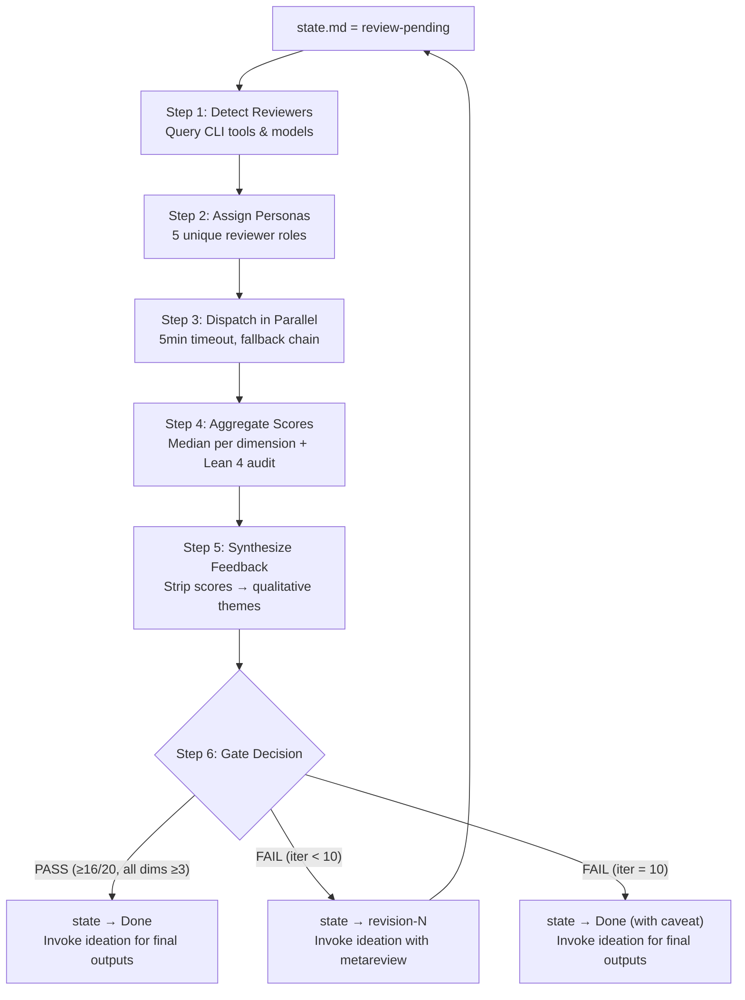

# PaperClaw Reviewing AI — Independent Review Gate Orchestrator

Manage the independent, multi-model review panel for research proposals. Triggered when the ideation model completes Phase 4 and sets `./ideation/state.md` to `Phase: review-pending`.

## Core Principle

> **Evaluate independently, synthesize fairly, communicate qualitatively.**
>
> Reviewers must evaluate only what is written in Proposal.md — no access to working files.
> The orchestrator aggregates scores transparently but enforces a strict information barrier:
> the ideation model never sees numeric scores, dimension labels, or threshold language.
> The gate decision is communicated exclusively via `state.md`.

---

## Agent Architecture

| Agent | Model | Role |
|-------|-------|------|
| `paperclaw-ideation-review-orchestrator` | sonnet | Default workhorse — full 6-step orchestration: CLI detection, reviewer dispatch, score aggregation, Lean 4 audit, metareview synthesis, gate decision |
| `paperclaw-ideation-reviewer` | opus | R1 Claude review only — independent proposal evaluation |

### How it works

When this skill is triggered (state.md = review-pending), invoke `paperclaw-ideation-review-orchestrator` as the main agent. The orchestrator runs all 6 steps and spawns `paperclaw-ideation-reviewer` (opus) for the R1 Claude review. External reviewers (R2-R5) are dispatched via codex/opencode CLI. The orchestrator handles score aggregation, metareview synthesis (with strict information barrier), and the pass/fail gate.

---

## Workflow Overview



---

## Trigger Condition

Read `./ideation/state.md`. If `Phase: review-pending`, begin the review process.

---

## Working Files

All review artifacts live under `./ideation/reviews/iteration-N/`:

| File | Type | Purpose |
|------|------|---------|
| `RX-[family].md` | Per-reviewer | Individual review (scores + commentary) |
| `aggregation.md` | Per-iteration | Score aggregation, Lean 4 audit, split decisions (orchestrator only) |
| `metareview.md` | Per-iteration | Qualitative feedback (no scores) — ideation reads this |
| `feedback.md` | Per-iteration | What changes ideation made in response (written by ideation after revision) |

---

## Step 1: Detect Available Reviewers & Models

### Goal

Detect available AI CLI tools, query model lists at runtime, and select the best model from each family.

### Steps

#### 1.1: Check Tool Availability

```bash
command -v codex &>/dev/null && echo "codex available"
command -v opencode &>/dev/null && echo "opencode available"
# Claude Code is always available via Agent tool
```

#### 1.2: Query Available Models

**Never hardcode model names.** Always query at runtime:

```bash
cat ~/.codex/config.toml 2>/dev/null | grep '^model' | head -1
opencode models 2>/dev/null
```

#### 1.3: Select Best Model Per Family

Parse the `opencode models` output and pick the **highest version** model for each family:

| Family | Selection Rule | Provider Prefix |
|--------|---------------|-----------------|
| GPT | Highest versioned non-mini GPT | `openai/`, `github-copilot/` |
| Gemini | Highest versioned `gemini-*-pro*` | `github-copilot/` |
| DeepSeek | Prefer `deepseek-reasoner`, fallback `deepseek-chat` | `deepseek/` |
| Kimi | Highest versioned `k*` model | `kimi-for-coding/` |

For codex (GPT): use the model from `~/.codex/config.toml` as default.

#### 1.4: Assemble the Reviewer Panel

| Priority | Reviewer | Tool | Model Source |
|----------|----------|------|-------------|
| 1 | R1 (Claude) | Agent tool (`paperclaw-ideation-reviewer`) | Always available |
| 2 | R2 (GPT) | `codex exec` | `~/.codex/config.toml` |
| 3 | R3 (Gemini) | `opencode run -m <model>` | `opencode models` |
| 4 | R4 (DeepSeek) | `opencode run -m <model>` | `opencode models` |
| 5 | R5 (Kimi) | `opencode run -m <model>` | `opencode models` |

**Minimum 3 reviewers required.** If fewer than 3 external families are available, use Claude with different personas to fill gaps (see Step 3 fallback).

### Completion Criteria

- [x] Available CLI tools detected
- [x] Best model per family selected
- [x] At least 3 reviewer slots filled

---

## Step 2: Assign Reviewer Personas

### Goal

Maximize review diversity by assigning each reviewer a unique evaluation perspective.

### Persona Assignment

| Reviewer | Persona | Focus |
|----------|---------|-------|
| R1 (Claude) | Theory-focused senior researcher | Theoretical rigor, proofs, Lean 4 audit |
| R2 (GPT) | Applied ML researcher | Practical impact, experimental design, reproducibility |
| R3 (Gemini) | Methodical novelty assessor | Novelty, related work positioning, contribution clarity |
| R4 (DeepSeek) | Devil's advocate | Edge cases, failure modes, unsupported assumptions |
| R5 (Kimi) | Breadth reviewer | Cross-disciplinary connections, broader impact |

---

## Step 3: Dispatch Reviewers in Parallel

### Goal

Run all reviewers simultaneously, collect at least 3 valid reviews within timeout.

### Steps

#### Prompt Construction (before dispatching any reviewer)

Before dispatching reviewers, construct the **base review prompt** that will be embedded in every reviewer's instructions. This is critical because external tools (codex, opencode) cannot access skill reference files.

1. Read the full scoring rubric from `<ref-dir>/conference-readiness.md` (Scoring Rubric section — all 4 dimensions with score descriptions and Lean 4 penalty rules)
2. Read the standardized output format from `<ref-dir>/review-protocol.md` (Standardized Review Output Format section)
3. Assemble `BASE_PROMPT`:

```
You are a research proposal reviewer assigned the following persona: [PERSONA_DESCRIPTION]

=== SCORING RUBRIC ===
Score each dimension 1–5 based on these criteria:

[PASTE FULL NOVELTY RUBRIC FROM conference-readiness.md]

[PASTE FULL SIGNIFICANCE RUBRIC]

[PASTE FULL TECHNICAL SOUNDNESS RUBRIC — including Lean 4 penalty rules]
  IMPORTANT: Lean 4 verification is EXPECTED. Full verification does not add points.
  Missing or incomplete verification (including sorry items) LOWERS Technical Soundness.

[PASTE FULL EXPERIMENTAL FEASIBILITY RUBRIC]

=== OUTPUT FORMAT ===
[PASTE FULL OUTPUT FORMAT FROM review-protocol.md — Standardized Review Output Format section]

=== INSTRUCTIONS ===
- Read ONLY ./Proposal.md — do NOT read ./ideation/ or any other files
- WebSearch is permitted sparingly to verify cited baselines or concurrent work
- Write your review to: [REVIEW_FILE_PATH]
```

4. For each reviewer, substitute `[PERSONA_DESCRIPTION]` with the persona from Step 2 and `[REVIEW_FILE_PATH]` with the expected output path.

All reviewers run simultaneously with this embedded prompt. **Timeout: 5 minutes per external reviewer.**

#### Claude Reviewer (R1)

Launch via Agent tool with `paperclaw-ideation-reviewer` agent. Pass the persona and constructed prompt as part of the agent prompt.

#### Codex CLI Reviewer (R2 — GPT)

```bash
timeout 300 codex exec \
  -c 'sandbox_permissions=["disk-full-read-access"]' \
  "[BASE_PROMPT with R2 persona substituted. Write review to ./ideation/reviews/iteration-N/R2-gpt.md]"
```

#### OpenCode Reviewers (R3, R4, R5)

```bash
timeout 300 opencode run \
  -m <selected-provider/model> \
  "[BASE_PROMPT with RX persona substituted. Write review to ./ideation/reviews/iteration-N/RX-<family>.md]"
```

#### Fallback Chain

When an external reviewer fails (error, timeout, model not found):

```
codex (GPT) → opencode (same family) → opencode (any available family) → Claude persona
```

**Claude persona fallback:** Launch a `paperclaw-ideation-reviewer` agent with the specific persona instructions. Tag the review file with `[Claude-fallback]`.

#### Failure Handling

After dispatching all reviewers in parallel (via background Bash with `run_in_background`):
1. Wait for each reviewer (up to 5 min)
2. Check if the expected review file exists and is non-empty
3. If missing: log failure reason, trigger next fallback in chain
4. Continue until at least 3 valid reviews are collected

Save each review to `./ideation/reviews/iteration-N/RX-[family].md`.

### Completion Criteria

- [x] At least 3 valid review files collected
- [x] Each review follows the standardized output format
- [x] Failed reviewers logged with fallback chain resolution

---

## Step 4: Aggregate Scores

### Goal

Compute median scores per dimension, apply Lean 4 adjustments, and determine pass/fail.

### Steps

#### 4.1: Parse and Aggregate

1. Parse each review's `### Scores` section (Novelty, Significance, Soundness, Feasibility)
2. For each dimension, compute the **median** across all reviewers
3. Sum medians for the total

#### 4.2: Lean 4 Verification Audit (orchestrator-level)

The orchestrator independently audits Lean 4 status — this is separate from what reviewers assess in Proposal.md Section 4.

1. Read `./ideation/theory.md` — classify claims as formalizable or not
2. Check `./ideation/lean4/` for corresponding `.lean` files
3. Check `lake build` results if available
4. Apply Soundness adjustments per the table in `references/review-protocol.md`

> **Why dual assessment?** Reviewers evaluate the theory as presented in Proposal.md (self-contained). The orchestrator verifies against source files in `./ideation/` to catch any copy errors. If discrepancies exist, flag in the aggregation report.

#### 4.3: Pass Condition

- Median total >= **16/20** AND no median dimension < **3**

#### 4.4: Split Decision Detection

If any dimension has reviewer disagreement > 2 points, flag as "split decision" in the aggregation report.

Write the full aggregation report (with scores) to `./ideation/reviews/iteration-N/aggregation.md`.

### Completion Criteria

- [x] Median scores computed for all 4 dimensions
- [x] Lean 4 audit completed with Soundness adjustment applied
- [x] Split decisions flagged
- [x] Aggregation report written

---

## Step 5: Synthesize Feedback

### Goal

Convert reviewer commentary into qualitative improvement guidance while enforcing the information barrier.

### Steps

**This is the critical information barrier step.** Strip ALL of the following:
- Numeric scores (1-5, X/20)
- Rubric dimension names as scoring labels
- Pass/fail threshold language
- Any reference to the scoring rubric itself
- Individual reviewer identities or model names

**Transform weaknesses into qualitative themes:**

| Reviewer wrote | Feedback becomes |
|---------------|-----------------|
| "Novelty: 2/5 — overlaps with [Paper X]" | "Reviewers noted significant overlap with [Paper X] and questioned differentiation" |
| "Soundness: 2/5 — lacks pseudocode" | "Method description was flagged as insufficiently detailed for reproduction" |
| "Feasibility: 2/5 — compute unrealistic" | "Several reviewers questioned compute budget realism" |

**Group concerns by theme** (not by reviewer or dimension).

Write to `./ideation/reviews/iteration-N/metareview.md` using the format in `references/review-protocol.md` "Metareview Format" section.

> **No gate result in metareview.** The gate decision is communicated exclusively via `state.md`. The metareview must remain score-free and decision-free.

### Completion Criteria

- [x] Metareview contains zero numeric scores, zero dimension labels, zero threshold language
- [x] Concerns grouped by theme, not by reviewer or dimension
- [x] Follows the format in `references/review-protocol.md`

---

## Step 6: Gate Decision

### Goal

Determine pass/fail, update state, and invoke the ideation skill for next action.

### PASS (median total >= 16, no median dim < 3)

1. Write aggregation report to `./ideation/reviews/iteration-N/aggregation.md`
2. Update `./ideation/state.md`: `Phase: generating-outputs` (NOT `Done` yet — output generation must complete before marking Done)
3. **Invoke the ideation skill** via the Skill tool with this instruction:
   > "The review panel has issued a PASS. Read `./Proposal.md` and generate the four final output files: `./Proposal_cn.md`, `./Proposal.html`, `./Proposal_cn.html`, and `./reference.bib`. Follow the HTML rendering rules in the Research Proposal Output section exactly. Do not alter `./Proposal.md`."
4. **Validate outputs** — verify all 5 files exist and are non-empty:
   ```bash
   for f in ./Proposal.md ./Proposal_cn.md ./Proposal.html ./Proposal_cn.html ./reference.bib; do
     test -s "$f" && echo "OK: $f" || echo "MISSING: $f"
   done
   ```
5. If any file is missing: re-issue generation instruction for that specific file. Retry up to 2 times.
6. Update `./ideation/state.md`: `Phase: Done` — only after all output files are validated.

### FAIL (below threshold, iteration < 10)

Let **N** = current `Iteration` value read from `./ideation/state.md` **before making any changes**. All subsequent file paths and state updates use this saved value of N.

1. Write metareview to `./ideation/reviews/iteration-N/metareview.md` (qualitative only) — using N saved above
2. Write aggregation report to `./ideation/reviews/iteration-N/aggregation.md` (scores, for orchestrator record) — using N saved above
3. Update `./ideation/state.md`: set `Phase: revision-N` and `Iteration: N+1` — where N is the value saved above
4. **Invoke the ideation skill** via the Skill tool with this instruction (substitute the actual value of N):
   > "Review panel feedback for iteration N is at `./ideation/reviews/iteration-N/metareview.md`. Read the Primary Concerns, Specific Suggestions, and Questions sections. Revise `./Proposal.md` to address these concerns, then write `./ideation/reviews/iteration-N/feedback.md` documenting what changes you made and which concerns each change addresses. After writing feedback.md, set state to `Phase: review-pending`."
5. If N+1 > 10: force-proceed instead (see below)

### Force-Proceed (after 10 iterations)

1. Add caveat to metareview: "The review panel did not reach consensus after 10 rounds. Remaining concerns: [list]"
2. Update `./ideation/state.md`: `Phase: generating-outputs` (NOT `Done` yet — same pattern as PASS)
3. **Invoke the ideation skill** via the Skill tool with:
   > "The review panel has exhausted 10 revision rounds without consensus. Read `./Proposal.md` and generate the four final output files: `./Proposal_cn.md`, `./Proposal.html`, `./Proposal_cn.html`, and `./reference.bib`. In Section 9, add a new subsection `### Review Panel Notes` immediately before the `### Decision Log` subsection, containing: 'NOTE: This proposal did not pass the review gate after 10 rounds. Remaining reviewer concerns: [list from metareview].' This subsection must be visually distinct from the auto-pilot decision log entries."
4. **Validate outputs** (same check as PASS step 4). Retry up to 2 times if any file is missing.
5. Update `./ideation/state.md`: `Phase: Done` — only after all output files are validated.

### Completion Criteria

- [x] state.md updated with correct phase
- [x] Aggregation report written
- [x] Metareview written (FAIL/Force-Proceed only)
- [x] Ideation skill invoked via Skill tool with correct instruction
- [x] Output files validated (PASS/Force-Proceed only)

---

## Key Interaction Principles

1. **Independence** — reviewers evaluate Proposal.md only, never working files
2. **Information barrier** — metareview must contain zero scores, zero dimension names, zero threshold language
3. **Minimum panel** — at least 3 valid reviews before aggregation
4. **Median aggregation** — robust to outliers; for even N, take the lower middle value
5. **Dual Lean 4 audit** — reviewers assess from Proposal.md; orchestrator verifies from source files
6. **State-driven communication** — gate result communicated only via state.md, never in metareview
7. **Fallback resilience** — follow the fallback chain until 3 reviews are collected
8. **Cross-invocation via Skill tool** — all ideation invocations must use the Skill tool explicitly

---

## Reference Files

These files are co-located with this skill. Try paths in order until one succeeds:
- **Project install:** `.claude/skills/paperclaw-ideation-reviewing-AI/references/`
- **Global install:** `~/.claude/skills/paperclaw-ideation-reviewing-AI/references/`

Load on demand:
- `<ref-dir>/conference-readiness.md` — scoring rubric with dimension definitions and Lean 4 penalty rules
- `<ref-dir>/review-protocol.md` — aggregation rules, Soundness adjustment table, feedback synthesis templates, standardized review output format
- `<ref-dir>/domain.md` — venue-specific calibration and reviewer priorities
