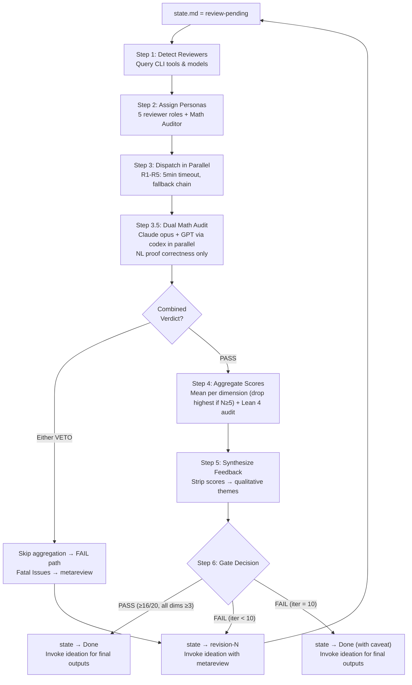

# PaperClaw Reviewing AI — Independent Review Gate Orchestrator

Manage the independent, multi-model review panel for research proposals. Triggered when the ideation model completes Phase 4 and sets `./ideation/state.md` to `Phase: review-pending`.

## Core Principle

> **Evaluate independently, synthesize fairly, communicate qualitatively.**
>
> Reviewers must evaluate only what is written in Proposal.md — no access to working files.
> The orchestrator aggregates scores transparently but enforces a strict information barrier:
> the ideation model never sees numeric scores, dimension labels, or threshold language.
> The gate decision is communicated exclusively via `state.md`.

---

## Agent Architecture

| Agent | Model | Role |
|-------|-------|------|
| `paperclaw-ideation-review-orchestrator` | sonnet | Default workhorse — full 6-step orchestration: CLI detection, reviewer dispatch, score aggregation, Lean 4 audit, metareview synthesis, gate decision |
| `paperclaw-ideation-reviewer` | opus | R1 Claude review only — independent proposal evaluation |

### How it works

When this skill is triggered (state.md = review-pending), invoke `paperclaw-ideation-review-orchestrator` as the main agent. The orchestrator runs all 6 steps and spawns `paperclaw-ideation-reviewer` (opus) for the R1 Claude review. External reviewers (R2-R5) are dispatched via codex/opencode CLI. The orchestrator handles score aggregation, metareview synthesis (with strict information barrier), and the pass/fail gate.

---

## Workflow Overview



---

## Trigger Condition

Read `./ideation/state.md`. If `Phase: review-pending`, begin the review process.

---

## Working Files

All review artifacts live under `./ideation/reviews/iteration-N/`:

| File | Type | Purpose |
|------|------|---------|
| `RX-[family].md` | Per-reviewer | Individual review (scores + commentary) |
| `math-audit-claude.md` | Per-iteration | Math correctness audit by Claude opus (orchestrator only) |
| `math-audit-gpt.md` | Per-iteration | Math correctness audit by GPT via codex (orchestrator only) |
| `aggregation.md` | Per-iteration | Score aggregation, Lean 4 audit, split decisions, combined math audit verdict (orchestrator only) |
| `metareview.md` | Per-iteration | Qualitative feedback (no scores) — ideation reads this |
| `feedback.md` | Per-iteration | What changes ideation made in response (written by ideation after revision) |

---

## Step 1: Detect Available Reviewers & Models

### Goal

Detect available AI CLI tools, query model lists at runtime, and select the best model from each family.

### Steps

#### 1.1: Check Tool Availability

```bash
command -v codex &>/dev/null && echo "codex available"
command -v opencode &>/dev/null && echo "opencode available"
# Claude Code is always available via Agent tool
```

#### 1.2: Query Available Models

**Never hardcode model names.** Always query at runtime:

```bash
cat ~/.codex/config.toml 2>/dev/null | grep '^model' | head -1
opencode models 2>/dev/null
```

#### 1.3: Select Best Model Per Family

Parse the `opencode models` output and pick the **highest version** model for each family:

| Family | Selection Rule | Provider Prefix |
|--------|---------------|-----------------|
| GPT | Highest versioned non-mini GPT | `openai/`, `github-copilot/` |
| Gemini | Highest versioned `gemini-*-pro*` | `github-copilot/` |
| DeepSeek | Prefer `deepseek-reasoner`, fallback `deepseek-chat` | `deepseek/` |
| Kimi | Highest versioned `k*` model | `kimi-for-coding/` |

For codex (GPT): use the model from `~/.codex/config.toml` as default.

#### 1.4: Assemble the Reviewer Panel

| Priority | Reviewer | Tool | Model Source |
|----------|----------|------|-------------|
| 1 | R1 (Claude) | Agent tool (`paperclaw-ideation-reviewer`) | Always available |
| 2 | R2 (GPT) | `codex exec` | `~/.codex/config.toml` |
| 3 | R3 (Gemini) | `opencode run -m <model>` | `opencode models` |
| 4 | R4 (DeepSeek) | `opencode run -m <model>` | `opencode models` |
| 5 | R5 (Kimi) | `opencode run -m <model>` | `opencode models` |

**Minimum 3 reviewers required.** If fewer than 3 external families are available, use Claude with different personas to fill gaps (see Step 3 fallback).

### Completion Criteria

- [x] Available CLI tools detected
- [x] Best model per family selected
- [x] At least 3 reviewer slots filled

---

## Step 2: Assign Reviewer Personas

### Goal

Maximize review diversity by assigning each reviewer a unique evaluation perspective.

### Persona Assignment

| Reviewer | Persona | Focus |
|----------|---------|-------|
| R1 (Claude) | Theory-focused senior researcher | Theoretical rigor, proofs, Lean 4 audit |
| R2 (GPT) | Applied ML researcher | Practical impact, experimental design, reproducibility |
| R3 (Gemini) | Methodical novelty assessor | Novelty, related work positioning, contribution clarity |
| R4 (DeepSeek) | Devil's advocate | Edge cases, failure modes, unsupported assumptions |
| R5 (Kimi) | Breadth reviewer | Cross-disciplinary connections, broader impact |
| Math Auditor Claude | Mathematical correctness specialist (Claude opus) — NL proof correctness only, co-veto power |
| Math Auditor GPT | Mathematical correctness specialist (GPT via codex) — NL proof correctness only, co-veto power |

---

## Step 3: Dispatch Reviewers in Parallel

### Goal

Run all reviewers simultaneously, collect at least 3 valid reviews within timeout.

### Steps

#### Prompt Construction (before dispatching any reviewer)

Before dispatching reviewers, construct the **base review prompt** that will be embedded in every reviewer's instructions. This is critical because external tools (codex, opencode) cannot access skill reference files.

1. Read the full scoring rubric from `<ref-dir>/conference-readiness.md` (Scoring Rubric section — all 4 dimensions with score descriptions and Lean 4 penalty rules)
2. Read the standardized output format from `<ref-dir>/review-protocol.md` (Standardized Review Output Format section)
3. Assemble `BASE_PROMPT`:

```
You are a research proposal reviewer assigned the following persona: [PERSONA_DESCRIPTION]

=== SCORING RUBRIC ===
Score each dimension 1–5 based on these criteria:

[PASTE FULL NOVELTY RUBRIC FROM conference-readiness.md]

[PASTE FULL SIGNIFICANCE RUBRIC]

[PASTE FULL TECHNICAL SOUNDNESS RUBRIC — including Lean 4 penalty rules]
  IMPORTANT: Lean 4 verification is EXPECTED. Full verification does not add points.
  Missing or incomplete verification (including sorry items) LOWERS Technical Soundness.

[PASTE FULL EXPERIMENTAL FEASIBILITY RUBRIC]

=== OUTPUT FORMAT ===
[PASTE FULL OUTPUT FORMAT FROM review-protocol.md — Standardized Review Output Format section]

=== INSTRUCTIONS ===
- Read ONLY ./Proposal.md — do NOT read ./ideation/ or any other files
- WebSearch is permitted sparingly to verify cited baselines or concurrent work
- Write your review to: [REVIEW_FILE_PATH]
```

4. For each reviewer, substitute `[PERSONA_DESCRIPTION]` with the persona from Step 2 and `[REVIEW_FILE_PATH]` with the expected output path.

All reviewers run simultaneously with this embedded prompt. **Timeout: 5 minutes per external reviewer.**

#### Claude Reviewer (R1)

Launch via Agent tool with `paperclaw-ideation-reviewer` agent. Pass the persona and constructed prompt as part of the agent prompt.

#### Codex CLI Reviewer (R2 — GPT)

```bash
timeout 300 codex exec \
  -c 'sandbox_permissions=["disk-full-read-access"]' \
  "[BASE_PROMPT with R2 persona substituted. Write review to ./ideation/reviews/iteration-N/R2-gpt.md]"
```

#### OpenCode Reviewers (R3, R4, R5)

```bash
timeout 300 opencode run \
  -m <selected-provider/model> \
  "[BASE_PROMPT with RX persona substituted. Write review to ./ideation/reviews/iteration-N/RX-<family>.md]"
```

#### Fallback Chain

When an external reviewer fails (error, timeout, model not found):

```
codex (GPT) → opencode (same family) → opencode (any available family) → Claude persona
```

**Claude persona fallback:** Launch a `paperclaw-ideation-reviewer` agent with the specific persona instructions. Tag the review file with `[Claude-fallback]`.

#### Failure Handling

After dispatching all reviewers in parallel (via background Bash with `run_in_background`):
1. Wait for each reviewer (up to 5 min)
2. Check if the expected review file exists and is non-empty
3. If missing: log failure reason, trigger next fallback in chain
4. Continue until at least 3 valid reviews are collected

Save each review to `./ideation/reviews/iteration-N/RX-[family].md`.

### Completion Criteria

- [x] At least 3 valid review files collected
- [x] Each review follows the standardized output format
- [x] Failed reviewers logged with fallback chain resolution

---

## Step 3.5: Dual Math Expert Audit

### Goal

Run two independent mathematical correctness reviews of the NL proofs in Proposal.md — one from Claude (opus) and one from GPT (via codex) — in parallel with the regular reviewer panel. Both auditors operate independently with no access to each other's output. This step runs concurrently with Step 3 — dispatch all at the same time.

### Steps

#### 3.5.1: Dispatch Both Math Auditors

Launch **both** auditors simultaneously with R1-R5 (all with `run_in_background: true`):

**Claude Auditor** — via Agent tool:
```
Agent(
  subagent_type="paperclaw-math-auditor",
  run_in_background=true,
  prompt="Read ./Proposal.md Section 4. Evaluate mathematical correctness of all theorems and NL proofs. Write your audit to ./ideation/reviews/iteration-N/math-audit-claude.md following the output format in your instructions."
)
```

**GPT Auditor** — via codex CLI (use the model from `~/.codex/config.toml`):
```bash
timeout 300 codex exec \
  -c 'sandbox_permissions=["disk-full-read-access","disk-write-access"]' \
  "You are an independent mathematical expert. Read ONLY ./Proposal.md Section 4 (Theoretical Analysis). Evaluate mathematical correctness of all theorems and natural-language proofs.

For each theorem/lemma, assess: (1) Is the statement well-formed and non-trivial? (2) Is each proof step logically justified with no invalid steps? (3) Does the proof establish the stated conclusion (not a weaker version)?

Issue VETO if ANY of the following: a theorem is mathematically false under its stated assumptions; a proof step is logically invalid (not just informal); the proof proves a materially different claim than stated; a critical assumption was silently used but not declared AND this makes the result significantly weaker.
Issue PASS if all theorems are sound, even if proofs are informal or sketched. Reserve VETO for clear mathematical errors only. When in doubt: PASS with concerns.

Write your audit to ./ideation/reviews/iteration-N/math-audit-gpt.md in this exact format:
# Math Audit — Iteration N
## Verdict: PASS / VETO
[One paragraph summary]
## Theorem-by-Theorem Analysis
### Theorem X: [Name]
**Statement assessment:** [well-formed and non-trivial / trivial / ill-formed / false]
**Proof assessment:** [sound / has gap / incorrect]
- Step [X]: [finding]
**Overall verdict for this theorem:** PASS / CONCERN / FATAL
## Summary
### Fatal Issues (cause VETO)
- [precise description, which theorem, which step]
### Non-fatal Concerns
- [minor gaps or imprecisions]
## Revision Guidance (if VETO)
[Specific actionable guidance]"
```

**Timeouts:** 5 minutes each. If an auditor fails or times out, log the failure (do not block on it).

#### 3.5.2: Await Results

After all reviewers and both math auditors have completed or timed out:
- Read `./ideation/reviews/iteration-N/math-audit-claude.md` (if exists)
- Read `./ideation/reviews/iteration-N/math-audit-gpt.md` (if exists)

#### 3.5.3: Combine Verdicts

Apply the following combination logic:

| Claude | GPT | Combined Verdict |
|--------|-----|-----------------|
| VETO | VETO | **VETO** — both agree |
| VETO | PASS | **VETO** — Claude flagged errors (log GPT disagreement as note) |
| PASS | VETO | **VETO** — GPT flagged errors (log Claude disagreement as note) |
| PASS | PASS | **PASS** |
| VETO | missing | **VETO** — Claude result used, warn GPT unavailable |
| PASS | missing | **PASS** — warn GPT unavailable in aggregation.md |
| missing | VETO | **VETO** — GPT result used, warn Claude auditor failed |
| missing | PASS | **PASS** — warn Claude auditor failed in aggregation.md |
| missing | missing | **PASS** (warn: both auditors failed, treat as PASS) |

**Rationale: any VETO = combined VETO.** Math errors must be caught conservatively; a single auditor detecting a real error is sufficient to block the proposal.

#### 3.5.4: Apply Veto Gate

1. **If combined verdict is VETO:**
   - Do NOT proceed to Step 4 score aggregation
   - Write `aggregation.md` with: `Gate: VETO by math audit — score aggregation skipped`, which auditor(s) issued VETO, and the Fatal Issues list
   - Translate Fatal Issues into qualitative metareview language (strip "VETO", "math auditor", mechanism language — present as "Reviewers identified mathematical errors in the theoretical analysis: ...")
   - Merge Fatal Issues from all auditors that issued VETO
   - Include Non-fatal Concerns from all available audits as additional concerns
   - Proceed directly to Step 5 (synthesize metareview) then Step 6 FAIL path
2. **If combined verdict is PASS:**
   - Include Non-fatal Concerns from ALL available audit files as additional concerns in Step 5
   - Proceed normally to Step 4

### Completion Criteria

- [x] Both math audit files attempted in parallel (or failures logged)
- [x] Combined verdict computed per combination table
- [x] Veto gate checked before score aggregation
- [x] If VETO: aggregation skipped, fatal issues from all vetoing auditors translated to metareview

---

## Step 4: Aggregate Scores

### Goal

Compute mean scores per dimension, apply Lean 4 adjustments, and determine pass/fail.

### Steps

#### 4.1: Parse and Aggregate

1. Parse each review's `### Scores` section (Novelty, Significance, Soundness, Feasibility)
2. If N >= 5 reviewers, **drop the highest score** per dimension before averaging (stricter evaluation)
3. Compute the **mean** of the (remaining) scores per dimension, rounded to one decimal place
4. Sum means for the total

#### 4.2: Lean 4 Verification Audit (orchestrator-level)

The orchestrator independently audits Lean 4 status — this is separate from what reviewers assess in Proposal.md Section 4.

1. Read `./ideation/theory.md` — classify claims as formalizable or not
2. Check `./ideation/lean4/` for corresponding `.lean` files
3. Check `lake build` results if available
4. Apply Soundness adjustments per the table in `references/review-protocol.md`

> **Why dual assessment?** Reviewers evaluate the theory as presented in Proposal.md (self-contained). The orchestrator verifies against source files in `./ideation/` to catch any copy errors. If discrepancies exist, flag in the aggregation report.

#### 4.3: Pass Condition

- Mean total >= **16.0/20** AND no mean dimension < **3.0**

#### 4.4: Split Decision Detection

If any dimension has reviewer disagreement > 2 points, flag as "split decision" in the aggregation report.

Write the full aggregation report (with scores) to `./ideation/reviews/iteration-N/aggregation.md`.

### Completion Criteria

- [x] Mean scores computed for all 4 dimensions
- [x] Lean 4 audit completed with Soundness adjustment applied
- [x] Split decisions flagged
- [x] Aggregation report written

---

## Step 5: Synthesize Feedback

### Goal

Convert reviewer commentary into qualitative improvement guidance while enforcing the information barrier.

### Steps

**This is the critical information barrier step.** Strip ALL of the following:
- Numeric scores (1-5, X/20)
- Rubric dimension names as scoring labels
- Pass/fail threshold language
- Any reference to the scoring rubric itself
- Individual reviewer identities or model names

**Transform weaknesses into qualitative themes:**

| Reviewer wrote | Feedback becomes |
|---------------|-----------------|
| "Novelty: 2/5 — overlaps with [Paper X]" | "Reviewers noted significant overlap with [Paper X] and questioned differentiation" |
| "Soundness: 2/5 — lacks pseudocode" | "Method description was flagged as insufficiently detailed for reproduction" |
| "Feasibility: 2/5 — compute unrealistic" | "Several reviewers questioned compute budget realism" |

**Group concerns by theme** (not by reviewer or dimension).

Write to `./ideation/reviews/iteration-N/metareview.md` using the format in `references/review-protocol.md` "Metareview Format" section.

> **No gate result in metareview.** The gate decision is communicated exclusively via `state.md`. The metareview must remain score-free and decision-free.

### Completion Criteria

- [x] Metareview contains zero numeric scores, zero dimension labels, zero threshold language
- [x] Concerns grouped by theme, not by reviewer or dimension
- [x] Follows the format in `references/review-protocol.md`

---

## Step 6: Gate Decision

### Goal

Determine pass/fail, update state, and **return a structured gate result to the caller**. The caller (main session skill) is responsible for orchestrating the next action.

**IMPORTANT: Do NOT invoke any skill from this step. Write files, update state, then return a structured gate result.**

### PASS (mean total >= 16.0, no mean dim < 3.0)

1. Write aggregation report to `./ideation/reviews/iteration-N/aggregation.md`
2. Update `./ideation/state.md`: `Phase: generating-outputs`
3. **Return** `GATE: PASS` to caller

### FAIL (below threshold)

First, check `./ideation/state.md` to determine which review cycle this is:

- **If `UserRevisionCycle` field is present** → this is a **user-initiated revision cycle**. Follow the **User-Revision FAIL** path below.
- **Otherwise** → this is the **original review loop**. Follow the **Standard FAIL** path below.

#### Standard FAIL (original review loop, iteration < 10)

Let **N** = current `Iteration` value read from `./ideation/state.md` **before making any changes**. All subsequent file paths and state updates use this saved value of N.

1. Write metareview to `./ideation/reviews/iteration-N/metareview.md` (qualitative only) — using N saved above
2. Write aggregation report to `./ideation/reviews/iteration-N/aggregation.md` (scores, for orchestrator record) — using N saved above
3. Update `./ideation/state.md`: set `Phase: revision-N` and `Iteration: N+1` — where N is the value saved above
4. **Return** `GATE: FAIL | iteration=N | metareview=./ideation/reviews/iteration-N/metareview.md` to caller
5. If N+1 > 10: force-proceed instead (see Standard Force-Proceed below)

#### User-Revision FAIL (user-initiated revision cycle)

Read **C** = `UserRevisionCycle`, **R** = `UserRevisionRound`, **B** = `UserRevisionBudget` from `./ideation/state.md` before making any changes.

1. Write metareview to `./ideation/reviews/user-C-R/metareview.md` (qualitative only) — using C and R saved above
2. Write aggregation report to `./ideation/reviews/user-C-R/aggregation.md` (scores, for orchestrator record)
3. Set R_new = R+1, B_new = B-1
4. Update `./ideation/state.md`: set `Phase: user-revision`, `UserRevisionRound: R_new`, `UserRevisionBudget: B_new`
5. If B_new == 0: force-proceed (see User-Revision Force-Proceed below)
6. Otherwise, **return** `GATE: USER-REVISION-FAIL | cycle=C | round=R | metareview=./ideation/reviews/user-C-R/metareview.md` to caller

### Standard Force-Proceed (after 10 iterations)

1. Add caveat to metareview: "The review panel did not reach consensus after 10 rounds. Remaining concerns: [list]"
2. Update `./ideation/state.md`: `Phase: generating-outputs`
3. **Return** `GATE: FORCE-PROCEED | reason=10-round-exhaustion` to caller

### User-Revision Force-Proceed (UserRevisionBudget exhausted)

1. Add caveat to metareview in `./ideation/reviews/user-C-R/metareview.md`: "The user-initiated revision panel did not reach consensus after 3 rounds. Remaining concerns: [list]"
2. Update `./ideation/state.md`: `Phase: generating-outputs`
3. **Return** `GATE: FORCE-PROCEED | reason=user-budget-exhaustion` to caller

### Completion Criteria

- [x] state.md updated with correct phase
- [x] Aggregation report written
- [x] Metareview written (FAIL/Force-Proceed only)
- [x] Gate result returned to caller (NOT skill invocation)

---

## Key Interaction Principles

1. **Independence** — reviewers evaluate Proposal.md only, never working files
2. **Information barrier** — metareview must contain zero scores, zero dimension names, zero threshold language, zero veto mechanism language
3. **Minimum panel** — at least 3 valid reviews before aggregation
4. **Mean aggregation** — uses all reviewer signal; if N >= 5, drop the highest score per dimension for stricter evaluation
5. **Dual Lean 4 audit** — reviewers assess from Proposal.md; orchestrator verifies from source files
6. **Dual math expert veto** — Claude (opus) and GPT math auditors run in parallel; if EITHER issues VETO, score aggregation is bypassed and FAIL is triggered; if one auditor is unavailable, the other's verdict is used alone (with warning)
7. **State-driven communication** — gate result communicated only via state.md, never in metareview
8. **Fallback resilience** — follow the fallback chain until 3 reviews are collected
9. **Cross-invocation via Skill tool** — all ideation invocations must use the Skill tool explicitly

---

## Reference Files

These files are co-located with this skill. Try paths in order until one succeeds:
- **Project install:** `.claude/skills/paperclaw-ideation-reviewing-AI/references/`
- **Global install:** `~/.claude/skills/paperclaw-ideation-reviewing-AI/references/`

Load on demand:
- `<ref-dir>/conference-readiness.md` — scoring rubric with dimension definitions and Lean 4 penalty rules
- `<ref-dir>/review-protocol.md` — aggregation rules, Soundness adjustment table, feedback synthesis templates, standardized review output format
- `<ref-dir>/domain.md` — venue-specific calibration and reviewer priorities
